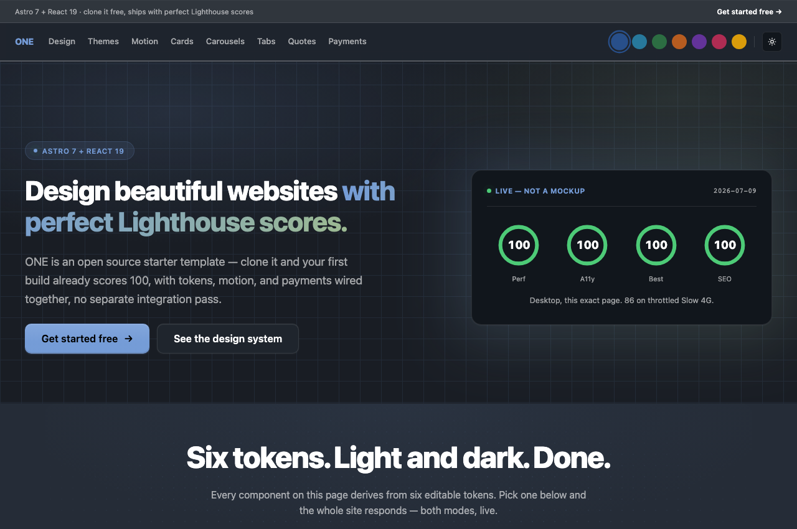
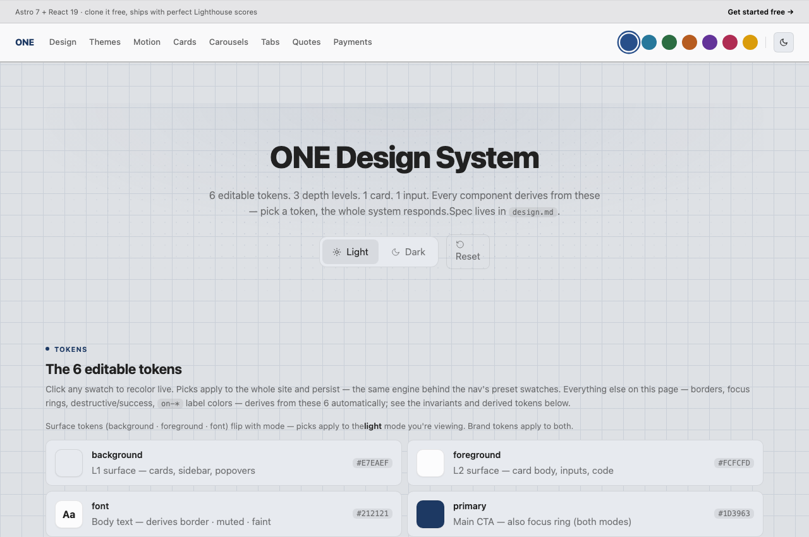
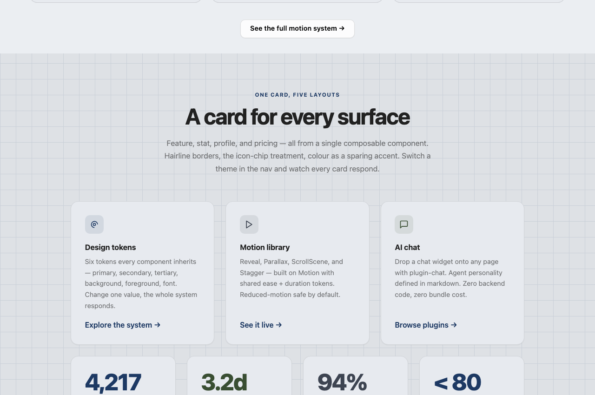

<h1 align="center">ONE</h1>

<p align="center">
  <strong>Sell anything in seconds. No merchant account, no custody, no monthly fee.</strong><br>
  A complete website that takes real money on day one.<br>
  Astro 7 · React 19 · shadcn/ui · Tailwind 4 · free hosting on Cloudflare's edge
</p>

<p align="center">
  <a href="https://github.com/one-ie/one/stargazers"></a>
  <a href="https://github.com/one-ie/one/actions/workflows/ci.yml"></a>
  <a href="LICENSE"></a>
  <a href="https://www.npmjs.com/package/@oneie/cli"></a>
  <a href="https://www.npmjs.com/package/@oneie/frontend"></a>
</p>

Every other starter template hands you a blog and a contact form. This one hands
you a checkout.

Clone it and both payment rails are already wired. **Crypto links** across Sui,
Ethereum, Solana and Bitcoin, with no merchant account to open, no API key to
request, no approval to wait for and nobody holding your money in between.
**Cards** through real Stripe Elements, live on your own Stripe account the
moment you add two environment variables. Neither needs a backend of your own.
Neither charges a platform fee or a monthly fee.

**4 chains per link · No custody, ever · $0 monthly fees · 2 env vars for cards.**

**Free forever. Yours to sell and resell at any price you set.** One obligation:
keep the ONE brand, logo and link in your deployed product. That is the entire
catch, and it is [stated here](#free-forever-and-yours-to-sell) rather than left
in a file for you to find.

![The ONE payments page in light mode. The headline reads "Two rails to get paid. Both live, right here." The copy below reads: four chains, no account, no custody. Cards are real Stripe Elements that go live with your key. Try both below, nothing on this page is a mockup. Four checks read: No custody ever, Signed server-side, Cards by Stripe, Zero config to start. Beneath them is a working "Create a payment link" card with an Amount (USD) field set to 25, a "For" field placeholdered "Invoice, service, product…", currency chips for SUI, ETH, SOL and BTC, and a Create link button. The footnote reads: Real, signed, live against pay.one.ie — not a mock.](.github/assets/01-payments-create-link.png)

---

## From clone to a payment link

**1. Get the code.**

```bash
git clone https://github.com/one-ie/one my-app
cd my-app && bun install
```

Prefer one command to a clone? The scaffold pulls the same shape, `.claude/` and
`.mcp.json` included:

```bash
npx oneie create node my-app
```

**2. Mint a wallet.** `one wallet keygen` runs fully offline. It never touches the
network, and only the four public addresses ever leave it:

```bash
npm install -g @oneie/cli
one wallet keygen                 # prints once, copy the four addresses
```

Paste them into `site/.dev.vars` (see [`.dev.vars.example`](site/.dev.vars.example)):

```
WALLET_SUI_ADDRESS=
WALLET_EVM_ADDRESS=
WALLET_SOL_ADDRESS=
WALLET_BTC_ADDRESS=
```

Do this before you start the dev server. `.dev.vars` is read once at startup, so
if the server is already running, restart it.

**3. Start it, and take money.**

```bash
cd site && bun run dev            # → http://localhost:4321
```

Better Auth and Cloudflare D1 give you sessions and data locally from the first
run, so nothing so far needs a key, an account or a card. Those four addresses are
now the treasury on every link this site creates. Use the form at `/payments`, or
POST to your own route:

```bash
curl -X POST http://localhost:4321/api/pay/link \
  -H 'Content-Type: application/json' \
  -d '{"amountCents": 2500, "product": "Consulting hour"}'

# → { "url": "https://pay.one.ie/l/…", "qr": "…" }
```

The buyer opens the URL, picks a chain, and signs. Funds land in your addresses.
There is no middle account, so there is nothing to withdraw and nothing to
reconcile. Settlement is the transaction.

**Next:** the [step-by-step tutorial](docs/tutorial.md) walks from empty folder to
deployed site, including your first colour change, your first post, your first
product and the build gate. About 20 minutes.

---

## Contents

- [Two rails, zero custody](#two-rails-zero-custody)
- [Free forever, and yours to sell](#free-forever-and-yours-to-sell)
- [Free hosting](#free-hosting)
- [Two ways to run it](#two-ways-to-run-it)
- [What's in the box](#whats-in-the-box)
- [Brand it](#brand-it)
- [Sell something from the catalog](#sell-something-from-the-catalog)
- [Components](#components)
- [Performance](#performance)
- [The `one` CLI](#the-one-cli)
- [Tell it once: the story layer](#tell-it-once-the-story-layer)
- [Plugins](#plugins)
- [AI-ready](#ai-ready)
- [The ONE Licence](#the-one-licence)

---

## Two rails, zero custody

### Crypto

Links are minted and signed by [pay.one.ie](https://pay.one.ie), which returns a
URL and a QR code. Your clone never holds a key for this and never proxies a
payment. `site/src/pages/api/pay/link.ts` is one short route: it resolves the price
server-side, attaches your wallet addresses as the treasuries, and returns the
link. It works with no `ONE_API_KEY` at all, because it never touches the ONE
backend.

The price is resolved from the catalog or the plan table, never from the request
body, so a buyer cannot set the amount they are charged. Ad-hoc amounts and
catalog products read from separate fields, which means a free-text description
can never collide with a product slug and hijack a price.

| | |
|---|---|
| Setup | Four addresses from one offline command |
| Custody | Never. Peer to peer |
| Chargebacks | None. The transaction is final |
| Fees | Network gas. No platform fee, no monthly fee |
| Chains | Sui · Ethereum · Solana · Bitcoin |

### Card

![The card rail on the ONE payments page in light mode. A badge reads "CARD · YOUR STRIPE KEY" above the headline "And a card form you'd want to fill in." The copy reads: Real Stripe Elements dressed as a card — tilts to your cursor, guides you field to field, and settles straight to your own Stripe account. It goes live the moment you add two env vars; until then it's an honest preview. Three checks read: PCI stays with Stripe, we never see a digit · Fail-closed without your keys · Cards, wallets, and Link out of the box. On the right sits a "Pay by card" panel badged "LIVE · TEST MODE" with the line: Fill the card to pay $25.00 in seconds — test mode, so no real charge. Use 4242 4242 4242 4242, any future date, any CVC. Below it a rendered credit card in dark navy carries the ONE wordmark, a gold chip, a contactless symbol, a card-number field reading 1234 5678 9012 3456, and Name on card, MM, YY and CVC fields. Tab chips read Card, Name, Expiry and CVC above a "Start — enter card number" button and the footnote "Secured by Stripe · Test mode — no real charge". Under the panel: Funds settle straight to your own Stripe account — this starter never touches them.](.github/assets/08-card-form.png)

Real Stripe Elements, wired end to end.
[`/api/pay/create-intent`](site/src/pages/api/pay/create-intent.ts) mints
PaymentIntents through the Stripe SDK.
[`/api/pay/webhook`](site/src/pages/api/pay/webhook.ts) verifies every event's
signature with `constructEventAsync` and SubtleCrypto before it trusts a byte,
and returns 400 on anything it cannot verify.

Both fail closed. Without `STRIPE_SECRET_KEY` the API returns 503 and the
`/payments` page renders an honest preview instead of a live form. Add two keys
and the same form charges your own Stripe account. PCI stays with Stripe; the
card number never reaches your worker.

### Wallet

`one wallet keygen` generates the keys on your machine and leaves them there. The
mnemonic and private keys are never written to any file in this repo, and the
four public addresses are the only thing that crosses its boundary. `--recover`
rebuilds the same wallet from the mnemonic.

The `/wallet` page reads balances over public RPC with no backend and no API key.
Those RPC endpoints are **testnet by default** (Sui testnet, Sepolia, Solana
devnet, Blockstream testnet) and are four constants at the top of
[`site/src/lib/chain-balances.ts`](site/src/lib/chain-balances.ts). Payment links
themselves settle on the chains pay.one.ie serves, which is a separate thing from
what that page displays.

---

## Free forever, and yours to sell

Not a trial. Not a free tier. Not open-core. The whole product is in this repo:
source, design system, plugins, agents, CLI.

[The ONE License v1.0](LICENSE) grants, in perpetuity and irrevocably:

| You may | Without |
|---|---|
| Use it commercially, anywhere | Usage limits |
| Modify it and own your modifications | Royalty fees |
| **Sell and resell** what you build, at any price you set | Sharing your code or data |
| Sublicense and distribute it | Copyleft |
| Run it as a service | Asking permission |
| Train AI on it | Telling us |
| Patent what you invent on top of it | A contributor agreement |

It is compatible with MIT, Apache, GPL, BSD and MPL.

**The one obligation:** keep the ONE brand, logo and link in your deployed
product. The [Enterprise License](LICENSE-ENTERPRISE.md) removes it for
white-label work.

---

## Free hosting

The site is static-first Astro with SSR on Cloudflare Workers. Most pages ship
zero JavaScript, so most of the site is files on Cloudflare's edge and the
dynamic routes fit inside the Workers free tier.

```bash
cd site && bun run deploy         # astro build && wrangler deploy
```

Your domain, your Cloudflare account, no platform in between.

---

## Two ways to run it

The site has two independent switches. Neither is required, both flip back.

```
   ┌─────────────────────────┐        ┌─────────────────────────────────┐
   │      SITE ONLY          │  ───►  │        SITE + BACKEND           │
   │      (the default)      │        │       (one env var away)        │
   ├─────────────────────────┤        ├─────────────────────────────────┤
   │  Astro + React + shadcn │        │  everything on the left, plus:  │
   │  Better Auth + D1       │        │  AI chat · CRM · analytics      │
   │  Blog · docs · products │        │  agents · workflows · wallet    │
   │  Crypto links + Stripe  │        │  credit metering · lifecycles   │
   │  100% local, 100% free  │        │  the ONE backend behind it      │
   └─────────────────────────┘        └─────────────────────────────────┘
```

**Switch 1: the backend.** Without `ONE_API_KEY` the app runs standalone on local
auth and D1. Add the key and the same code talks to `https://one.ie`. No rewrite.
Both payment rails sit on the left column and stay there.

**Switch 2: which widgets ship.** Every plugin is a build-time Astro integration
you list in `site/one.config.ts`. Add `chat()` and a chat widget mounts. Remove it
and it is gone. A key on its own never mounts anything you did not ask for.

You can build and sell a business on the left column and never touch the right.

---

## What's in the box

<details open>
<summary><strong>The parts people clone it for</strong></summary>

- Two payment rails, both wired, both fail-closed until they are yours
- Astro 7 + React 19 islands + shadcn/ui + Tailwind 4, SSR on Cloudflare Workers
- Static-first: most pages ship zero JavaScript, which is *why* it is fast
- Products priced **server-side**. `resolveProduct()` reads the catalog, never a
  client-sent amount, so a buyer cannot tamper with a price
- Six tokens in `site/src/lib/themes.ts` carry every component, across 14 presets.
  Showcase pages at `/design`, `/components`, `/motion`, `/patterns`
- Content collections for blog, docs and products. Write Markdown, get routes
</details>

<details>
<summary><strong>And everything under it</strong></summary>

- Auth pages, Better Auth and D1 sessions that work with no backend at all
- Error pages, RSS, sitemaps, and a full SEO structured-data graph (schema.org
  JSON-LD, git-based `lastmod`). The build validates H1s, internal links, image
  alt text and metadata on every page, and fails loudly when one is wrong
- `.claude/` (hooks, rules, skills, commands) and `.mcp.json` at the repo root
- `ai/` holds agents, skills, tools and workflows as plain Markdown and TOML
- `data/` holds your types and lifecycles, declared once, typed everywhere
</details>

The repo is three folders and one idea:

```
  ai/ ─────────► data/ ─────────► site/
 knows           grows            shows
```

`CLAUDE.md` is the operating manual. `AGENTS.md` is the briefing an AI agent reads
before it touches anything.

---

## Brand it

Six tokens carry the whole site: `primary`, `secondary`, `tertiary`,
`background`, `foreground`, `font`. Every component is built on them, so changing
one value re-skins everything downstream of it. Here is the same page in both
themes, nothing swapped but the tokens:

![The ONE home page hero in light mode. A badge reads ASTRO 7 + REACT 19 above the headline "Design beautiful websites with perfect Lighthouse scores." The subheading reads: ONE is an open source starter template — clone it and your first build already scores 100. Two buttons read Get started free and See the design system. On the right, a dark card headed LIVE — NOT A MOCKUP, dated 2026-07-09, shows four green rings each reading 100, labelled Perf, A11y, Best and SEO, with the footnote "Desktop, this exact page. 86 on throttled Slow 4G."](.github/assets/04-hero-light.png)



Fourteen presets ship with it. Every one is a real, clickable card on the site,
and clicking it repaints the whole page rather than a preview pane:


**Two ways to change them.** Click the swatches on `/design` and the picks apply
live and persist, no code:



Or edit a preset in `site/src/lib/themes.ts`, the single source of truth for all
14 themes:

```ts
{
  key: 'navy',
  name: 'Navy',
  light: { primary: '216 55% 25%', secondary: '219 14% 28%', /* … */ },
  dark:  { primary: '216 55% 65%', secondary: '219 14% 65%', /* … */ },
}
```

Save the file and the running dev server repaints in about four seconds.

`site/one.config.ts` is the other control surface. It decides which plugins are
compiled in:

```ts
export default defineOne({
  backend: { baseUrl: 'https://one.ie' },
  plugins: [auth(), backend(), blog(), docs(), pages({ ws }), track({ ws })],
})
```

---

## Sell something from the catalog

A payment link is the fast path. A catalog is the durable one. Write a product as
a Markdown file in `site/src/content/products/`. Three fields are required:

```markdown
---
name: Own Your Stack
priceCents: 2499
description: The technical playbook behind this exact site.
---
```

It is now for sale on both rails, priced server-side, and both
`/payments?product=<slug>` and the product page charge the same resolved price.
Money lands in the wallet from `one wallet keygen`. Your keys, your treasury, no
custody change.

---

## Components



Every block reads the same six tokens. That is the whole trick: you never restyle
components, you restyle the tokens they were already reading. Four motion
primitives sit on top, and nothing ships until the island it belongs to enters
the viewport, which is how a site this animated stays this light. See `/components`,
`/motion` and `/patterns` on a running dev server.

---

## Performance

The hero card in the screenshots above is a real Lighthouse run, dated
**2026-07-09**: 100 for performance, accessibility, best practices and SEO on
desktop against this repo's own build, and 86 on throttled Slow 4G. That figure
is carried forward here, not re-measured. The tree has since moved to Astro 7.3.2
with three adapters upgraded, and nobody has re-run it since.

So do not take it from us. The mechanism is static-first Astro, zero JavaScript by
default and Cloudflare's edge, and the check is two commands:

```bash
cd site && bun run build && bun run preview   # → http://localhost:4321
```

Then point Lighthouse at it. A cold production build takes a few seconds.

---

## The `one` CLI

```bash
npm install -g @oneie/cli
```

You get `one` and `oneie`, the same binary under either name. Every command is one
typed call into the same API, so there is no second interface to learn and it
behaves identically whether a human types it or an agent runs it headless.

```bash
one wallet keygen               # generate or recover a self-hosted wallet, offline
one wallet get                  # credits, ceiling, wallet rows, live chain balances
one wallet send <to>            # send crypto via pay.one.ie payment links
one whoami                      # who this key is, which workspace
one doctor                      # config, key, reachability — exit 0/1, CI-safe
one deploy                      # deploy site/ to Cloudflare via wrangler
```

<details>
<summary><strong>The rest of the surface</strong> (verified against <code>oneie --help</code> at v4.1.0)</summary>

```bash
# money
one earn                        # credit earned summary
one usage                       # credit usage dashboard
one status                      # agency P&L — pool, margin, per-client burns

# people and agents
one staff invite [email]        # invite a human; omit the email to get a URL
one staff add-agent <name>      # create an agent and print its key once
one market                      # discover agents and skills on the market
one hire <skillId>              # hire an agent for a skill (--dry-run to simulate)
one bounty <skillId>            # post a bounty for a skill

# the substrate, directly
one setup                       # provision a workspace, keyless, idempotent
one push [path]                 # compile ai/ + data/ and push to the substrate
one catalog                     # browse the receiver surface by recipe
one ask <receiver> {json}       # signal, then wait for the outcome
one signal <receiver> {json}    # fire and forget
one groups | actors | things | paths | events | learning

# scaffolding
one create node [name]          # this repo's shape, fresh
one ship "<message>"            # git add, commit, push
```

`--dry-run` projects the outcome and writes nothing. Dry-run first on every
irreversible verb.
</details>

---

## Tell it once: the story layer

Every starter gives you a blog folder and calls that content. This one gives you
the craft that goes around it, as files an agent reads.

**Seven beats: World · Cast · Knock · Want · Way · Turn · Lesson.** That is the
whole form. A child, a founder or an agent can fill it in, and nobody has to learn
a new vocabulary on either side. The storyteller only ever *asks* for two of them,
the Want and the Knock. The rest is supplied by the work and recognised by the
teller.

```
  promise  ─────────►  progress  ─────────►  payoff
  terms + one proof    the board walking      the proof passed
  frozen at "yes"      settles, not effort    the Turn you promised
```

Pay off what was promised, not something else. The proof is written down at the
moment you agree and can never be swapped for an easier one afterwards.

<details>
<summary><strong>The six tests, the framework registry, and the refusals</strong></summary>

A story that fails one test is named in a sentence and handed back, never quietly
padded until it passes.

| Test | Fails when |
|---|---|
| Someone wants something | there is no Want, it is a description |
| The want is hard to get | nothing stands in the way, it is a shopping list |
| Things cause other things | it is a sequence, not a chain |
| Something is at stake | nothing is lost if the Want fails |
| Something changes | the world at the end is the world at the start |
| It is specific | it is true and general: "we struggled" instead of one detail |

`ai/skills/story/frameworks.md` holds one row per framework, each mapping its own
stops onto the same seven beats:

| Beat | Story Spine | Story Circle | Kishōtenketsu | Quest grammar |
|---|---|---|---|---|
| World | once upon a time | you | ki | the world |
| Knock | one day | need | shō | the call |
| Want | *(in "one day")* | go | shō | objective |
| Way | because of that… | search / find | shō | the obstacle |
| Turn | until finally | take / return | **ten** | the reward |
| Lesson | ever since then | change | ketsu | experience |

Adding a framework is adding a row. Labov for listening to a real person.
StoryBrand when the teller sells and the customer is the hero. Kishōtenketsu for
a Turn with no enemy, which is most real tellers, because a mover in Austin is not
fighting anyone. The agent states its pick in one sentence so you can overrule it.

`ai/skills/story/mediums.md` says how the beats are ordered per surface: headline
as promise and proof block as payoff for a page, a cold open on the Knock for
voice, the Turn in the first five seconds for video. A medium with no renderer is
named, not faked.

**The refusals.** A machine that can make any story persuasive has to be allowed
to decline.

- No Want with no observable. If nothing could check it, it is not a Want.
- No story told for someone else without their name on the Cast and their consent.
- No status claim that was not measured.
- No framework chosen that the teller did not see.
- No Lesson invented by the machine.
- A decline is recorded with its reason, never a silent stall.

> If the story cannot help, at least it must not hurt.

**The story is alive.** `data/lifecycles/story.toml` tracks ten steps:
`told → framed → promised → building → settled → viewed → completed → shared →
converted → retold`. Retells over stories told is the k-factor. Above one, every
story you tell produces more than one more.
</details>

The files: `ai/skills/story/SKILL.md` · `frameworks.md` · `mediums.md` ·
`ai/agents/storyteller.md` · `data/types/story.toml` ·
`data/lifecycles/story.toml`.

---

## Plugins

Ten, all free, all on npm. Install one without checking out this repo:
`bun add @oneie/plugin-chat`. The ones marked *served* render from `one.ie`, so
nothing ships in your bundle and they need the backend switch on.

| Package | What |
|---|---|
| `@oneie/plugin-auth` | better-auth client. Sign-in works standalone, auth server optional |
| `@oneie/plugin-backend` | `@oneie/sdk` client plus React 19 hooks |
| `@oneie/plugin-blog` | Markdown blog, zero config |
| `@oneie/plugin-booking` | Appointment scheduling, Google Calendar and email confirmations |
| `@oneie/plugin-chat` | Served AI chat widget, zero bundle |
| `@oneie/plugin-docs` | Docs site, same content pipeline as this repo |
| `@oneie/plugin-mail` | Inbox UI, real-time through the channels worker |
| `@oneie/plugin-media` | Video gallery and player, Mux and YouTube |
| `@oneie/plugin-pages` | Renders a workspace's visually-edited Puck pages |
| `@oneie/plugin-track` | Served analytics pixel, zero bundle |

`@oneie/frontend` and `@oneie/design` are free too, and `site/` depends on all of
it via real semver.

**Paid, and clearly marked:** `admin`, `course`, `dashboard` and `shop` ship as
thin stubs in `packages/`, never published, built on `@oneie/plugin-premium`'s
entitlement gate. They load the real UI from `one.ie/x/<plugin>.js` after payment.
Nothing reaches your repo before you buy it.

---

## AI-ready

Open the root in Claude Code and it is already wired.

- **`.claude/`** teaches your assistant the file conventions, plugin patterns and
  design rules of this repo. Works with Claude Code, Cursor, and any editor that
  reads `CLAUDE.md`.
- **`.mcp.json`** exposes the whole ONE API as native MCP tools, no wrapper
  needed. It reads `ONE_API_KEY` from your shell.

```bash
export ONE_API_KEY=$(grep '^ONE_API_KEY=' site/.env.local | cut -d= -f2)
```

A node scaffolded with `oneie create node` is AI-connected from its first
`git init`.

---

## Develop

```bash
bun install                     # install all workspaces
cd site && bun run dev          # dev server, no backend needed → :4321
cd site && bun run typecheck    # astro check
cd site && bun run build        # production build
cd site && bun run deploy       # astro build && wrangler deploy
```

CI runs the build, the typecheck, and a second build with `ONE_API_KEY=""` to
prove standalone mode still works. Contributions welcome: open an issue or a PR at
[github.com/one-ie/one](https://github.com/one-ie/one).

---

## The ONE Licence

In one line: **everything, in perpetuity, for free. Keep the ONE brand, logo and
link in your deployed product.**

The [full grant is above](#free-forever-and-yours-to-sell), and the
[licence itself](LICENSE) is short enough to read in two minutes. Read it before
you rely on it.

The ONE backend is not distributed. This repo is the fully functional client, and
it runs without that backend. Both payment rails are on the client side, which is
why they keep working whether or not you ever connect one.

**Sell anything. Keep every cent the network does not take. Host it for free.**
