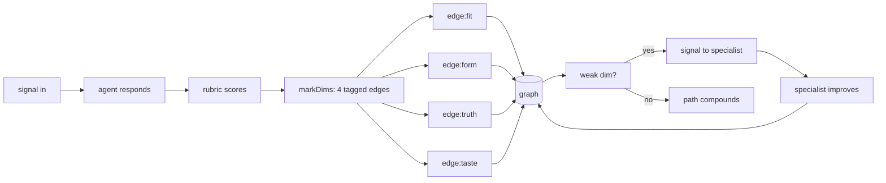

# Rubrics

The POST-check in the deterministic sandwich. Rubrics turn *"did it return"* into *"was it golden"* — and the score feeds `mark()` directly so pheromone learns quality, not just success.

---

## Why rubrics exist

ONE's sandwich wraps every LLM call:

```
PRE:   isToxic(edge)?    → dissolve (no cost)
PRE:   capability exists? → dissolve
LLM:   generate response  (the one probabilistic step)
POST:  result / timeout / dissolved → mark / warn
        │
        └── today: binary. "It returned something → mark(1)."
            missing: "Is it any good?"
```

Rubrics are the missing POST layer. They score the response against fixed dimensions and emit a number in `[0, 1]`. That number becomes the strength argument to `mark()` (or the severity of `warn()`).

```
LLM response ──▶ rubric ──▶ score ──▶ mark(edge, score)
                               │
                               └── pheromone compounds by quality
```

---

## What a golden response is

A golden response is **not** a single right answer. It is a response that clears every must-have dimension in the rubric, regardless of which valid path it took.

```
┌─────────────────────────────────────────────────────────┐
│                                                         │
│   Valid answer space                                    │
│   ┌───────────────────────────────────────────────┐     │
│   │   responses the user would accept             │     │
│   │                                                │     │
│   │    ┌───────────────┐                           │     │
│   │    │  golden zone  │  all must-haves hit       │     │
│   │    │  (many shapes)│  zero must-nots           │     │
│   │    └───────────────┘                           │     │
│   │                                                │     │
│   │   partial: some dims hit → fractional mark    │     │
│   └───────────────────────────────────────────────┘     │
│                                                         │
│   Everything outside → warn()                           │
└─────────────────────────────────────────────────────────┘
```

Multiple answers can all be golden. One missing must-have collapses the whole score.

---

## The four dimensions

Every rubric scores on exactly four dimensions. More is noise.

| Dim | Name      | Question                                | Weight |
| --- | --------- | --------------------------------------- | -----: |
| 1   | **Fit**   | Does it answer the actual ask?          |   0.35 |
| 2   | **Form**  | Is the shape / format / length right?   |   0.20 |
| 3   | **Truth** | Are the facts, numbers, citations real? |   0.30 |
| 4   | **Taste** | Does it sound like the agent's voice?   |   0.15 |
|     |           |                                         |        |

Each dimension is a **tagged edge** — not a separate score. The rubric IS the graph.

```
agent→skill:fit     mark(edge, 0.92)     ← weighted path
agent→skill:form    mark(edge, 0.85)     ← weighted path
agent→skill:truth   mark(edge, 1.00)     ← weighted path
agent→skill:taste   mark(edge, 0.70)     ← weighted path
```

Four `mark()` calls. Four paths. Same `strength - resistance` arithmetic
as routing. `select()` already weights by strength. Tags already exist.
No new system — just tagged edges.

Over N signals, dimensions accumulate independently. `skill:truth` might
reach strength 95 while `skill:taste` sits at 62. L5 evolution reads:
"accurate but sounds wrong — rewrite for voice, not facts."

The composite score is still useful for binary decisions:

```
score = 0.35·fit + 0.20·form + 0.30·truth + 0.15·taste
       │
       ├── >= 0.85  golden        all dims marked strongly
       ├── >= 0.65  good          most dims marked
       ├── >= 0.50  borderline    mixed marks
       └── <  0.50  failed        warn on weak dims
```

---

## Must-haves and must-nots

Each rubric also defines hard gates. Any must-not triggers `warn()` immediately regardless of the weighted score. Any missing must-have caps the relevant dimension at `0.5`.

```yaml
must_have:
  - answers the literal question asked
  - uses the agent's voice/persona
  - cites sources if claims are factual

must_not:
  - hallucinated URLs or stats
  - wrong audience tone (formal vs casual mismatch)
  - empty result wrapped in filler
```

Must-nots are the rubric's toxicity check. They bypass scoring.

---

## Rubric file format

Rubrics live next to agents. One file per skill.

```
agents/donal/
  copywriter.md             ← agent definition
  copywriter.rubric.yml     ← skill-level rubrics
```

```yaml
# agents/donal/copywriter.rubric.yml
skill: copy
version: 1

dimensions:
  fit:
    weight: 0.35
    checks:
      - matches brief topic
      - hits the target audience
      - includes requested CTA
  form:
    weight: 0.20
    checks:
      - within length bounds (30-125 chars for headlines)
      - variant count matches request (3-5)
      - structured as requested (JSON / markdown / plain)
  truth:
    weight: 0.30
    checks:
      - no invented product features
      - claims match the brief's facts
      - numbers are from the brief, not hallucinated
  taste:
    weight: 0.15
    checks:
      - confident, not arrogant
      - brief, not curt
      - warm, not corporate

must_have:
  - at least one variant under 40 chars
  - every headline has a concrete noun
  - CTA present in at least one variant

must_not:
  - false claims ("free forever" when it isn't)
  - competitor bashing
  - stock cliches (robots, handshakes, globes)

golden_examples:
  - brief: "Launch headline for 2-minute deploy"
    response: "Live agent in 2 minutes. No code."
    score: 1.0
    why: "fit: 1, form: 1, truth: 1, taste: 1 — hits every must-have"
```

---

## Scoring it

The scorer is a cheap LLM call (Haiku). It reads the rubric, the input, and
the response — then emits tagged marks directly into the graph.

```typescript
// src/engine/rubric.ts
const DIMS = ['fit', 'form', 'truth', 'taste'] as const

export async function score(
  rubric: Rubric,
  input: unknown,
  response: string
): Promise<RubricScore> {
  const judgment = await complete({
    model: 'anthropic/claude-haiku-4-5',
    system: rubricJudgePrompt(rubric),
    prompt: JSON.stringify({ input, response })
  })
  return parse(judgment)  // { fit, form, truth, taste, violations[] }
}

// Emit tagged edges — rubric dimensions ARE paths
export function markDims(
  net: PersistentWorld,
  edge: string,        // "agent→skill"
  scores: RubricScore,
  rubric: Rubric
) {
  if (scores.violations.length > 0) {
    net.warn(edge, 1)  // must-not hit → full warn, bypass scoring
    return
  }
  for (const dim of DIMS) {
    const taggedEdge = `${edge}:${dim}`   // "agent→skill:fit"
    const s = scores[dim]
    s >= 0.5
      ? net.mark(taggedEdge, s * rubric.dimensions[dim].weight)
      : net.warn(taggedEdge, (1 - s) * rubric.dimensions[dim].weight)
  }
}
```

### Wired into the sandwich

```typescript
// src/engine/persist.ts  (sketch)
const result = await ask(signal)
if (result.result) {
  const r = rubricFor(signal.receiver)
  if (r) {
    const s = await score(r, signal.data, result.result)
    markDims(net, edge, s, r)  // four tagged marks, not one binary
  } else {
    net.mark(edge, 1)  // no rubric → binary fallback
  }
}
```

---

## Per-skill rubric index

Minimum viable set for Donal's stack:

| Skill | File | Golden looks like |
|-------|------|-------------------|
| `copy` | `donal/copywriter.rubric.yml` | 3-5 variants, concrete nouns, CTA, on-voice |
| `fb_ads` | `donal/fb_ads.rubric.yml` | primary text 125 chars, headline 40, hook-angle clear |
| `seo_gbp` | `donal/seo.rubric.yml` | schema valid, EEAT signals, local intent |
| `reports` | `donal/reports.rubric.yml` | numbers cited, lift vs baseline, next-actions |
| `web_dev` | `donal/web_dev.rubric.yml` | compiles, no TODO, a11y basics, mobile-first |
| `analytics` | `donal/analytics.rubric.yml` | source of each number, date range, delta |
| `automation` | `donal/automation.rubric.yml` | idempotent, error path, observable |
| `cro` | `donal/cro.rubric.yml` | hypothesis, metric, sample size, unblocker |
| `ecom` | `donal/ecom.rubric.yml` | SKU accuracy, margin, ops constraints |
| `copywriter:variants` | inherits copy | same plus diversity across hooks |

---

## Results flow up as signals

The result doesn't just get scored — it **travels back up the graph** as a
return signal, marking every path it crosses with tagged weights. The weights
point to different next hops.

```
                          signal DOWN (request)
                          ─────────────────────
    caller ──────────────────────────────────────▶ agent:skill
                          │
                          │  agent responds
                          │
                          signal UP (result + tagged marks)
                          ─────────────────────────────────
    caller ◀──── :fit ────┤  mark(agent→skill:fit, 0.92)
                          │
    reviewer ◀── :truth ──┤  mark(agent→skill:truth, 1.0)
                          │
    voice-coach ◀ :taste ─┤  mark(agent→skill:taste, 0.70)   ← weak, routes here
                          │
    formatter ◀── :form ──┘  mark(agent→skill:form, 0.85)
```

Each tagged weight is simultaneously:
1. **A mark** — pheromone on that dimension's edge
2. **A message** — the score itself is data
3. **A pointer** — weak dims route to the specialist who handles that gap

```typescript
// The return signal carries its own routing
function returnSignal(edge: string, scores: RubricScore): Signal[] {
  const signals: Signal[] = []
  for (const dim of DIMS) {
    const s = scores[dim]
    if (s < 0.65) {
      // Weak dimension → signal the specialist
      signals.push({
        receiver: `${dim}-coach:improve`,    // voice-coach, fact-checker, etc.
        data: { edge, dim, score: s, response: scores.raw }
      })
    }
  }
  return signals  // these get routed through the graph, marking their own paths
}
```

The result is a **fan-out**: one response generates up to four signals,
each marking a different path. The graph specializes by dimension.

---

## How rubrics earn their keep



Three compounding effects:

1. **Routing** — `select()` weights by `strength - resistance`. Tagged edges compound independently — an agent with strong `truth` but weak `taste` still routes for factual work while a better voice agent takes creative work. The graph specializes by dimension.
2. **Evolution** — L5 reads per-dimension strength. `agent→skill:truth` strong but `agent→skill:taste` weak → rewrite prompt for voice, not accuracy. Evolution gets surgical instead of blanket.
3. **Knowledge** — L6 promotes high-strength edges to hypotheses. Tagged edges mean `know()` can report "this agent is golden on fit+truth but fading on form" — hypotheses with dimension resolution.

The graph doesn't just learn *who* is good. It learns *what they're good at*.

---

## What you need to do

```
┌──────────────────────────────────────────────────────────────┐
│                                                              │
│  1.  Draft the rubric types: Rubric, RubricScore, markDims() │
│      src/engine/rubric.ts — tagged edges, not standalone     │
│                                                              │
│  2.  Write the judge prompt (Haiku, JSON-out, deterministic) │
│      Returns { fit, form, truth, taste, violations[] }       │
│                                                              │
│  3.  Wire markDims() into persist.ts after every ask()       │
│      Four tagged marks per response. No rubric → binary.     │
│                                                              │
│  4.  Wire returnSignal() for weak dims → specialist routing  │
│      score < 0.65 → fan-out signal to dim-specific coach     │
│                                                              │
│  5.  Ship 3 rubric YAML files to prove the round-trip        │
│                                                              │
│  6.  Golden examples + calibration (judge vs hand < 0.15)    │
│                                                              │
│  7.  Dashboard: per-skill per-dim strength over 24h          │
│      Shows edge:fit, edge:form, edge:truth, edge:taste       │
│                                                              │
└──────────────────────────────────────────────────────────────┘
```

---

## Anti-patterns

| Don't | Why |
|-------|-----|
| Add a 5th dimension | Noise. 4 dims is the cap. Fold novelty into `taste`. |
| Weight truth below 0.25 | Hallucinations poison the trail faster than style errors. |
| Use GPT-5 as the judge | Cost and latency kill the tick. Haiku is the judge. |
| Write prose rubrics | YAML + checks. The judge must parse, not interpret. |
| Score without golden examples | A rubric without examples drifts. Goldens are the anchor. |
| Skip must-nots | Must-nots are the toxicity check. They are the cheapest signal. |

---

## Calibration loop

```
hand-score 10 responses  ──┐
                            ├──▶ diff  ──▶ if |diff| > 0.15 per dim
judge-score same 10       ──┘               rewrite judge prompt
                                             repeat until < 0.15
                                             lock version in rubric YAML
```

Every rubric has a `version:` field. Bumping it retires old scores from the pheromone average. Calibration is a release event, not a continuous drift.

---

## Relation to existing docs

| Doc | Relation |
|-----|----------|
| `dictionary.md` | `rubric` is a new term — score ∈ [0,1], four dims, must-haves |
| `DSL.md` | `mark(edge, score)` now takes a rubric-weighted float, not a binary |
| `routing.md` | Routing still uses strength-resistance, but strength accrues by quality |
| `donal.md` | Each Fury skill gets a `.rubric.yml` sibling during conversion |
| `metaphors.md` | Ant: "nest quality"; Brain: "reward signal"; Team: "code review" |

---

*Fit. Form. Truth. Taste. Score the response. Feed the trail. Pheromone learns quality.*

---

## Code Rubric — `/do` cycles only

Scores *code changes*, not agent responses. Used in W4 of every `/do` cycle.
The target for every dimension is **1.0** — not "no regression." Every score
below 1.0 must produce a specific improvement instruction that feeds the next
cycle. The rubric is a map forward, not a verdict.

```
Composite: 0.35·security + 0.30·stability + 0.25·simplicity + 0.10·speed
Gate:      ≥ 0.65 to close the cycle
Ambition:  1.0 on every dimension, every cycle
```

| Dim | Name           | Target                                                           | Weight |
| --- | -------------- | ---------------------------------------------------------------- | -----: |
| 1   | **Security**   | Zero vulnerabilities. Every boundary validated. No secrets.      |   0.35 |
| 2   | **Stability**  | 100% tests pass. Zero type errors. Every handler closes its loop.|   0.30 |
| 3   | **Simplicity** | Minimum code for maximum feature. Every line earns its place.    |   0.25 |
| 4   | **Speed**      | 100% Lighthouse on all four categories, all pages.               |   0.10 |

---

### 1 — Security

**What 1.0 looks like:** clean grep, every API route validates at the boundary,
no injection vector exists in the diff.

**KPIs (all must be zero for 1.0):**
```
secrets in diff        grep /api[_-]?key|secret|password|token/i  → 0 hits
injection vectors      eval(), Function(), dangerouslySetInnerHTML  → 0 hits
unvalidated routes     src/pages/api/*.ts without Zod parse         → 0
TypeDB string concat   grep '^\+.*(define|match|insert).*[`+]'
                       and grep '^\+.*\$\{' in query files          → 0 hits
wildcard CORS          "Access-Control-Allow-Origin: *" in Workers   → 0
process.env in Workers context.env is the only allowed accessor      → 0
```

**Scoring:**
| Score | State |
|-------|-------|
| 1.00 | All KPIs = 0 |
| 0.70 | 1 minor gap — non-sensitive field missing validation, no must-not |
| 0.50 | Multiple gaps or one significant unvalidated boundary |
| 0.00 | Any must-not violation (hardcoded secret, eval, unsanitized innerHTML) |

**Must-nots (bypass composite — cycle fails immediately):**
- Hardcoded secret or API key in source → `warn(1)`
- `eval()` or unsanitized `dangerouslySetInnerHTML` → `warn(1)`

**Improvement output when < 1.0:** list every gap as `file:line — what is wrong`.
```
→ improve: src/pages/api/chat.ts:23 — missing z.string() parse on Content-Type header
→ improve: src/lib/query.ts:41 — TypeDB query built with template literal, use params
```

---

### 2 — Stability

**What 1.0 looks like:** the diff cannot break anything. Every test passes.
Every type is explicit. Every signal closes its loop. No wall-clock. No dead names.

**KPIs (all must be zero for 1.0):**
```
test failures          vitest on W3-touched files                  → 0
type errors            tsc --noEmit                                → 0
new `any` types        grep ': any' in diff                        → 0
@ts-ignore without WHY grep @ts-ignore without adjacent comment    → 0
silent returns         handler returns without mark/warn/dissolve  → 0
wall-clock units       "days|hours|weeks|sprint" in new code/docs  → 0
retired dimension names knowledge|connections|people|node|scent|
                        alarm|trail|colony in new code             → 0
```

**Scoring:**
| Score | State |
|-------|-------|
| 1.00 | All KPIs = 0 |
| 0.80 | 1–2 minor type issues (unnecessary assertion, loose union) |
| 0.50 | Multiple type issues or a @ts-ignore without explanation |
| 0.00 | Any test failure on W3-touched files → route back to W3 |

**Must-not:** any test failure on W3-touched files → `warn(1)`, route to W3.5.

**Improvement output when < 1.0:** list exact test name + error, and each type gap.
```
→ improve: vitest: "chat renders message" failed — ChatMessage.tsx:14 type mismatch
→ improve: src/lib/slug.ts:8 — `any` type on `opts`, should be `SlugOptions`
```

---

### 3 — Simplicity

**What 1.0 looks like:** every file fits in 100 lines. Every function fits in 20.
The diff is as small as it could be for the feature delivered. The code reads like
it couldn't be any other way.

**The anchor:** the entire substrate — 100 lines of TypeQL schema + 100 lines of
TypeScript engine — powers groups, actors, things, paths, events, and knowledge.
Six dimensions. The whole colony. That is the reference point. Not a hard limit —
a philosophical anchor. When a file grows past that, ask: is it doing two things?
Could it be two files? The answer is usually yes.

**The dual win:** smaller files are simpler *and* faster. Fewer lines = fewer tokens
per read. W1 recon agents process more files in the same token budget. LLM context
stays lean. Generation is faster because less is loaded. Simplicity and Speed compound
from the same instinct: **do more with less**.

The prime directive: **always strive to write less code.** Deleting is the highest form.
Three inlined lines beat a helper nobody asked for.

**TODO type adjusts the net-LOC benchmark** — W2 must tag every TODO:

| Type | Net LOC target | Simplicity question |
|------|----------------|---------------------|
| `refactor` | ≤ 0 | Did you make it smaller? |
| `fix` | ≤ 10 net | Is this the smallest change that fixes it? |
| `feature` | minimum for scope | Every added line irreducible? |
| `doc` | ≤ 0 | Did you say it in fewer words? |

W4 reads the TODO type from the TODO file header. If absent, default to `feature`.

**KPIs:**
```
file focus             each file does one thing                    → ask when > ~100 lines
function length        any new function                            → ≤ 20 lines preferred
net LOC delta          additions − deletions vs TODO type target   → see table above
new abstractions       interfaces, helpers, wrappers not in TODO   → 0
backwards-compat shims re-exports for removed code, _unused vars   → 0
feature flags          conditional compile-time branches           → 0
WHAT comments          comments describing what the code does      → 0
design token leaks     bg-zinc-*, hex literals, raw hsl()          → 0
```

The file focus check is a thinking prompt, not a line counter. When a file grows large,
ask: "is this doing two things?" If yes, split. If no, carry on. The substrate is the
reference: 100 lines built the whole world — a file that needs 250 lines probably has
two responsibilities worth separating.

**Scoring:**
| Score | State |
|-------|-------|
| 1.00 | Every file feels focused; functions tight; LOC at type target; zero ceremony |
| 0.80 | One file slightly large but clearly single-responsibility; all lines justified |
| 0.60 | A file doing two things that could split, or a helper outside TODO scope |
| 0.40 | A file clearly doing three+ things, or notable ceremony not in TODO |
| 0.20 | Multiple bloated files or significant over-engineering |

**Improvement output when < 1.0:** name what to split or delete.
```
→ improve: src/lib/markdown.ts — 134 lines, two responsibilities: parsing + rendering;
           split into src/lib/markdown-parse.ts + src/lib/markdown-render.ts
→ improve: src/components/chat/EvalCard.tsx — imports shadcn Card but only uses a div;
           remove the import (saves 3 lines, removes unused dep)
→ improve: src/pages/api/chat.ts — 118 lines; tool definitions (lines 60–95) belong
           in src/lib/chat-tools.ts; chat.ts becomes the thin route handler it should be
```

---

### 4 — Speed

**What 1.0 looks like:** 100% Lighthouse on all four categories (Performance,
Accessibility, Best Practices, SEO) on every page. Bundle has not grown. Build
is as fast as it was at W0.

The target is **100**, not the current baseline. If you're at 98%, you should be
finding what costs the 2 points, not defending 98%.

**KPIs:**
```
Lighthouse Performance    target 100 — check /chat first, then all touched pages
Lighthouse Accessibility  target 100 — every interactive element labelled
Lighthouse Best Practices target 100 — no deprecated APIs, HTTPS, correct headers
Lighthouse SEO            target 100 — meta, canonical, robots
bundle delta              new JS shipped gzip (bun build --analyze or cf stats)  → ≤ 0 KB
build time delta          bun run build ms vs W0 baseline                         → ≤ 0 ms
hydration discipline      no client:load where client:idle or client:visible fits → 0 violations
large new deps            dependency > 10 KB gzip not in TODO                    → 0
Worker cold start         no synchronous large-module imports in CF entry points  → 0
streaming routes          no blocking await before first chunk                   → 0

--- token efficiency (LLM generation speed) ---
prompt tokens per call    system prompt + context per LLM invocation             → minimise
cache hit rate            Claude prompt cache; repeated context cached at ≥ 80%  → ≥ 80%
skill/agent body size     each .md file: concise enough to do its job            → no bloat
output token discipline   responses terse; no padding, no filler, no re-stating  → minimise
context stuffing          no injecting full file trees / unused context into prompts → 0
```

Token efficiency matters because every token is latency and cost. A skill body that is 400 lines
longer than necessary costs tokens on every invocation across every caller forever. A chat prompt
that injects the full R2 file listing on every message pays that cost on every turn.
The target: **minimum tokens to correctly complete the task, no more**.

**Scoring:**
| Score | State |
|-------|-------|
| 1.00 | All Lighthouse 100; bundle ≤ W0; cache hit ≥ 80%; no context stuffing; skill bodies lean |
| 0.80 | One Lighthouse 95–99, or bundle +1–2 KB, or cache hit 60–79% |
| 0.60 | One category 90–94, or bundle +2–5 KB, or cache hit < 60%, or context stuffing found |
| 0.40 | One category 85–89, or bundle +5–10 KB, or skill body obviously bloated |
| 0.00 | Any Lighthouse drops > 5 pts, client:load misused, or zero cache on repeated context |

**Must-not:** Lighthouse drop > 5 points on any category → `warn(1)` on speed.

**Improvement output when < 1.0:** name the audit, component, or token culprit.
```
→ improve: Lighthouse Performance 97 on /chat — "Reduce unused JavaScript" audit flags
           EvalCard (client:load); switch to client:visible, saves ~8 KB parse time
→ improve: bundle +3.2 KB gzip — new import of date-fns/format; use Intl.DateTimeFormat instead
→ improve: Accessibility 98 — "Button without accessible name" at MessageList.tsx:67,
           add aria-label="Copy message"
→ improve: cache hit rate 45% — system prompt in chat.ts rebuilt on every request;
           move static preamble above the dynamic section so Claude can cache it
→ improve: agents/support.md is 380 lines; the body repeats its own examples 3×;
           trim to unique instructions only, target ≤ 200 lines, saves ~180 tokens/call
```

---

### Must-nots — bypass composite

| Violation | Dim | Severity |
|-----------|-----|----------|
| Hardcoded secret or API key | security | `warn(1)` — cycle fails |
| `eval()` / unsanitized `dangerouslySetInnerHTML` | security | `warn(1)` — cycle fails |
| Test failure on W3-touched files | stability | `warn(1)` — route to W3.5 |
| Lighthouse any category drops > 5 pts | speed | `warn(1)` on speed dim |

---

### W4 receipt shape

Every score line carries a why and an improvement instruction.

```
### Code Rubric
- security:   0.85   all boundaries validated
  → improve: src/pages/api/provision.ts:31 — missing parse on `slug` param
- stability:  1.00   100% pass, zero type errors, zero violations
- simplicity: 0.70   net +34 LOC; one helper added outside TODO scope
  → improve: inline formatDate() at src/lib/slug.ts:12, remove function (saves 9 lines)
- speed:      0.80   Lighthouse Performance 97 on /chat (LCP 1.3s)
  → improve: EvalCard client:load → client:visible; lazy-loads after above-fold
- composite:  0.87   pass ✓
```

The improvement instructions are the output that feeds the next cycle's W1.
A score of 1.0 means there is nothing to improve — report "clean" and move on.

---

---

## The Compounding Self-Improvement Loop

This is the core of why the 4 S dims work as pheromone. Each cycle scores the
code, emits improvement instructions, and marks strength on the path. The next
cycle reads those instructions and fixes what the prior cycle flagged. Over time,
scores trend toward 1.0 — not because standards drop, but because the codebase
genuinely improves.

```
                    CYCLE N
                    ┌────────────────────────────────────────┐
                    │                                        │
          W0: capture baseline (.w0-baseline.json)          │
                    ↓                                        │
          W1: read .w4-improvements.json from cycle N-1     │
              open improvements = mandatory recon targets    │
                    ↓                                        │
          W2: decide + tag TODO type (refactor/fix/feature) │
                    ↓                                        │
          W3: fix the improvements + the new work           │
                    ↓                                        │
          W4: score { sec, sta, sim, spd }                  │
              → mark(path, composite)   pheromone compounds │
              → write .w4-improvements.json                 │
              → append docs/improvements.md                 │
              → detect systemic gaps (3+ cycles same item)  │
                    │                                        │
                    └──── composite + velocity ─────────────┤
                                                            │
                    CYCLE N+1                               │
                    ↓                                        │
          W1: reads the open improvements                   │
              (those files are now in scope)                │
              cycle continues ───────────────────────────── ┘
```

### The four compounding effects

**1. Pheromone** — `mark(edge, composite)` every cycle. High-scoring paths get
stronger; future `select()` routes through them more confidently. Low-scoring
paths accumulate resistance. The substrate learns which code is trustworthy.

**2. Improvement propagation** — W4's `→ improve:` lines become W1's recon seeds.
Nothing gets lost between cycles. An unresolved gap from cycle 3 is still in scope
at cycle 4, 5, 6 — until it's clean.

**3. Systemic gap promotion** — if the same file:line appears in 3 consecutive
W4 reports, it's no longer a one-off: it's a structural weakness. W4 emits a
`substrate:systemic-gap` signal and TypeDB promotes it to a hypothesis. Future
cycles see it as a known risk, not a surprise.

**4. Velocity tracking** — `velocity = composite(N) − composite(N-1)`. Positive
velocity = the system is improving. Zero or negative = a regression snuck in.
Velocity is pheromone too: high-velocity cycles `mark` stronger; flat cycles
trigger a diagnostic — why did improvement stall?

### What the trajectory looks like

```
Cycle 1:  composite 0.71  velocity —      security 0.60, simplicity 0.70
Cycle 2:  composite 0.82  velocity +0.11  security 0.85 (fixed 2 gaps)
Cycle 3:  composite 0.88  velocity +0.06  security 0.95, simplicity 0.85
Cycle 4:  composite 0.93  velocity +0.05  all dims rising
Cycle 5:  composite 0.97  velocity +0.04  speed 0.90 (EvalCard hydration fixed)
Cycle 6:  composite 1.00  velocity +0.03  all dims 1.0 — golden path
```

Once composite reaches 1.0 for 3 consecutive cycles, the path is a **highway** —
L6 promotes it to a hypothesis: "this codebase is production-grade at this
scope." Future work that touches the same files inherits that trust.

### docs/improvements.md — the learning ledger

Every W4 appends to this file. It is the system's memory across cycles.

```markdown
## 2026-05-05 · cycle 1 · composite=0.71 (Δ —)
- security/0.60:   src/pages/api/provision.ts:31 — missing Zod parse on slug
- stability/0.90:  clean
- simplicity/0.70: src/lib/markdown.ts:45 — parseMarkdown() 18 lines, 1 caller, inline it
- speed/0.80:      EvalCard client:load → client:visible; Lighthouse Perf 97

## 2026-05-06 · cycle 2 · composite=0.82 (Δ +0.11)
- security/0.85:   src/pages/api/chat.ts:18 — Content-Type unchecked
- stability/0.90:  clean
- simplicity/0.82: clean (parseMarkdown inlined ✓)
- speed/0.80:      EvalCard still client:load — not fixed yet [2nd occurrence]

## 2026-05-07 · cycle 3 · composite=0.88 (Δ +0.06)
- security/0.95:   clean (provision.ts fixed ✓, chat.ts fixed ✓)
- stability/1.00:  clean
- simplicity/0.85: clean
- speed/0.75:      EvalCard still client:load [3rd occurrence → SYSTEMIC GAP]
```

The third occurrence of EvalCard triggers `substrate:systemic-gap`. W1 of cycle
4 will treat EvalCard as a mandatory recon target, not an optional one.

### The invariant

The system never scores 1.0 and stops. A 1.0 composite means every dim is clean
this cycle. The next cycle will still run W4 and check again. Quality is not a
destination — it is a rate of decay that the loop counteracts every cycle.

If the loop stops running, quality decays (bugs accumulate, Lighthouse drifts,
code grows). The loop is the immune system.

---

*Security. Stability. Simplicity. Speed. Every cycle compounds. The trail remembers.*
