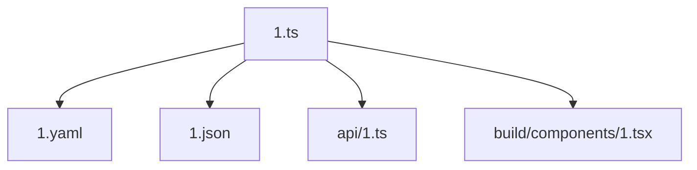
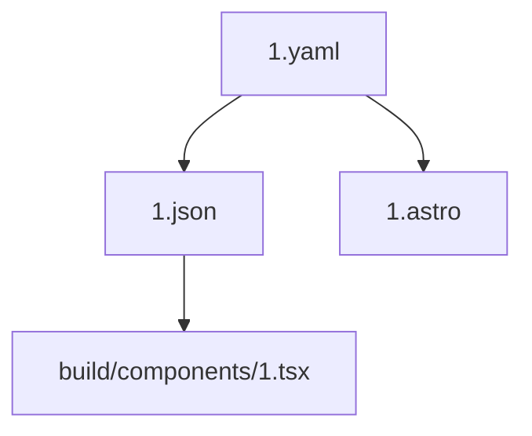
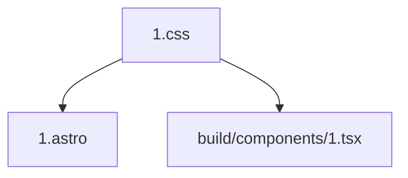

This file is a merged representation of the entire codebase, combined into a single document by Repomix.

<file_summary>
This section contains a summary of this file.

<purpose>
This file contains a packed representation of the entire repository's contents.
It is designed to be easily consumable by AI systems for analysis, code review,
or other automated processes.
</purpose>

<file_format>
The content is organized as follows:
1. This summary section
2. Repository information
3. Directory structure
4. Repository files, each consisting of:
  - File path as an attribute
  - Full contents of the file
</file_format>

<usage_guidelines>
- This file should be treated as read-only. Any changes should be made to the
  original repository files, not this packed version.
- When processing this file, use the file path to distinguish
  between different files in the repository.
- Be aware that this file may contain sensitive information. Handle it with
  the same level of security as you would the original repository.
</usage_guidelines>

<notes>
- Some files may have been excluded based on .gitignore rules and Repomix's configuration
- Binary files are not included in this packed representation. Please refer to the Repository Structure section for a complete list of file paths, including binary files
- Files matching patterns in .gitignore are excluded
- Files matching default ignore patterns are excluded
- Files are sorted by Git change count (files with more changes are at the bottom)
</notes>

<additional_info>

</additional_info>

</file_summary>

<directory_structure>
think/
  map/
    map.cjs
  memory/
    memory.md
  swarm/
    swarm.md
  types/
    types.ts
  think.md
1.css
1.env.example
1.html
1.json
1.md
1.new.md
1.sol
1.todo.md
1.ts
1.yaml
business.md
business.yml
chat-schema.md
content-guide.md
content-handling.md
content-prompt.md
</directory_structure>

<files>
This section contains the contents of the repository's files.

<file path="think/map/map.cjs">
// Map System for ONE
// =================

const fs = require('fs');
const path = require('path');

const ONE_MAP = {
  core: {
    '1.ts': 'Core ONE system',
    '1.yaml': 'Configuration file',
    '1.html': 'Base HTML template',
    '1.log': 'System logs'
  },
  
  api: {
    '1.ts': 'Main API endpoint',
    '1.test.ts': 'API test endpoint',
    '1.yaml': 'API configuration'
  },
  
  system: {
    'monitor.ts': 'System monitoring',
    'registry.ts': 'Capability registry',
    'test.ts': 'Testing system',
    'map.cjs': 'File mapping'
  }
};

function generateFileMap(dir = '1') {
  const items = fs.readdirSync(dir);
  const map = {};

  for (const item of items) {
    const fullPath = path.join(dir, item);
    const stat = fs.statSync(fullPath);

    if (stat.isDirectory()) {
      map[item] = generateFileMap(fullPath);
    } else {
      map[item] = {
        size: stat.size,
        modified: stat.mtime,
        description: ONE_MAP.core[item] || 
                    ONE_MAP.api[item] || 
                    ONE_MAP.system[item] || 
                    'Additional file'
      };
    }
  }

  return map;
}

module.exports = {
  ONE_MAP,
  generateFileMap,
  
  // Generate current map
  get current() {
    return generateFileMap();
  },
  
  // Get file description
  getDescription(file) {
    const [category, name] = file.split('/');
    return ONE_MAP[category]?.[name] || 'Additional file';
  }
};
</file>

<file path="think/memory/memory.md">
# Memory System Documentation

The memory system is a core component of ONE's think system, providing persistent and ephemeral storage with semantic search capabilities.

## Architecture

```
/1/think/memory/           # Memory subsystem root
├── 1.ts                   # Core types & schemas
├── manager.ts             # Memory management
├── hooks.ts              # React hooks
├── memory.md             # This documentation
│
└── store/                # Storage implementations
    ├── 1.ts             # Store interface
    ├── nano.ts          # Nanostore (local)
    ├── supabase.ts      # Supabase (vector)
    └── pg.ts            # PostgreSQL (persistent)
```

## Core Components

### 1. Memory Types

```typescript
// Core memory content types
const MemoryContent = z.union([
  z.object({ type: z.literal('text'), value: z.string() }),
  z.object({ type: z.literal('code'), value: z.string(), language: z.string() }),
  z.object({ type: z.literal('image'), url: z.string().url() }),
  z.object({ type: z.literal('structured'), data: z.record(z.unknown()) })
])

// Memory schema
const MemorySchema = z.object({
  id: z.string().uuid(),
  type: z.enum(['thought', 'experience', 'knowledge', 'connection']),
  content: MemoryContent,
  metadata: z.object({
    timestamp: z.date(),
    source: z.string(),
    confidence: z.number().min(0).max(1),
    embedding: z.array(z.number()).optional(),
    tags: z.array(z.string()).default([]),
    context: z.record(z.unknown()).optional(),
  }),
  relations: z.array(z.string().uuid()).default([]),
  ttl: z.number().optional(),
})
```

### 2. Storage Layer

The memory system uses a multi-tiered storage approach:

1. **Local Storage (Nanostore)**
   - Fast access for active memories
   - In-memory caching
   - Reactive state updates

2. **Vector Storage (Supabase)**
   - Semantic search capabilities
   - Embedding storage
   - Similarity queries

3. **Persistent Storage (PostgreSQL)**
   - Long-term memory storage
   - Relationship management
   - Complex queries

## Core Operations

### 1. Memory Storage

```typescript
// Store new memory
async function store(memory: Memory): Promise<boolean> {
  try {
    // Generate embedding if needed
    if (typeof memory.content === 'string') {
      memory.metadata.embedding = await generateEmbedding(memory.content)
    }

    // Store in all layers
    await Promise.all([
      localStore.set(memory.id, memory),
      vectorStore.store(memory),
      persistentStore.save(memory)
    ])

    return true
  } catch (error) {
    console.error('Failed to store memory:', error)
    return false
  }
}
```

### 2. Memory Recall

```typescript
// Recall similar memories
async function recall(query: string, options?: RecallOptions): Promise<Memory[]> {
  try {
    // Generate query embedding
    const embedding = await generateEmbedding(query)

    // Search vector store
    const results = await vectorStore.search(embedding, options?.limit || 5)

    // Enrich results with relationships
    return await enrichMemories(results)
  } catch (error) {
    console.error('Failed to recall memories:', error)
    return []
  }
}
```

### 3. Memory Management

```typescript
// Connect related memories
async function connect(sourceId: string, targetId: string): Promise<boolean> {
  try {
    const [source, target] = await Promise.all([
      persistentStore.get(sourceId),
      persistentStore.get(targetId)
    ])

    if (!source || !target) return false

    // Update relationships
    source.relations.push(targetId)
    target.relations.push(sourceId)

    // Save updates
    await Promise.all([
      persistentStore.save(source),
      persistentStore.save(target)
    ])

    return true
  } catch (error) {
    console.error('Failed to connect memories:', error)
    return false
  }
}
```

## React Integration

The memory system provides React hooks for easy integration:

```typescript
function MemoryComponent() {
  const { memories, operations, store, recall } = useMemory()

  // Store new memory
  const saveMemory = async () => {
    await store({
      type: 'knowledge',
      content: {
        type: 'text',
        value: 'Important information'
      },
      metadata: {
        timestamp: new Date(),
        source: 'user',
        confidence: 1.0,
        tags: ['important']
      }
    })
  }

  // Loading states
  if (operations.store?.loading) {
    return <div>Storing memory...</div>
  }

  return (
    <div>
      <button onClick={saveMemory}>Store Memory</button>
      {operations.store?.error && (
        <div className="error">
          Failed to store memory: {operations.store.error.message}
        </div>
      )}
    </div>
  )
}
```

## Database Schema

```sql
-- Memory table
CREATE TABLE memories (
  id UUID PRIMARY KEY,
  type TEXT NOT NULL,
  content JSONB NOT NULL,
  metadata JSONB NOT NULL,
  relations TEXT[] DEFAULT '{}',
  embedding vector(1536),
  created_at TIMESTAMP WITH TIME ZONE DEFAULT NOW(),
  expires_at TIMESTAMP WITH TIME ZONE
);

-- Indexes
CREATE INDEX memories_type_idx ON memories(type);
CREATE INDEX memories_expires_at_idx ON memories(expires_at);
CREATE INDEX memories_embedding_idx ON memories 
USING ivfflat (embedding vector_cosine_ops)
WITH (lists = 100);
```

## Best Practices

1. **Memory Storage**
   - Use appropriate memory types
   - Include relevant metadata
   - Set TTL for temporary memories
   - Tag memories for better organization

2. **Memory Recall**
   - Use specific queries
   - Set appropriate limits
   - Handle missing results
   - Cache frequent queries

3. **Error Handling**
   - Implement proper error boundaries
   - Log failures appropriately
   - Provide fallback behaviors
   - Clean up on failures

4. **Performance**
   - Use connection pooling
   - Implement caching
   - Batch related operations
   - Monitor memory usage

## Memory Lifecycle

1. **Creation**
   - Validate memory structure
   - Generate embeddings
   - Store in all layers
   - Create relationships

2. **Access**
   - Check local cache
   - Query vector store
   - Fallback to persistent store
   - Enrich with relationships

3. **Updates**
   - Validate changes
   - Update all layers
   - Maintain consistency
   - Update relationships

4. **Deletion**
   - Remove from all layers
   - Clean up relationships
   - Handle cascading deletes
   - Update indexes

## Monitoring

1. **Metrics to Track**
   - Storage usage
   - Query performance
   - Cache hit rates
   - Error rates

2. **Health Checks**
   - Storage connectivity
   - Vector store health
   - Index performance
   - Memory cleanup

## Future Enhancements

1. **Planned Features**
   - Advanced pattern matching
   - Improved embedding models
   - Automated cleanup
   - Memory compression

2. **Research Areas**
   - Memory consolidation
   - Forgetting strategies
   - Context awareness
   - Memory optimization

Remember: The memory system is crucial for ONE's cognitive capabilities. Keep it optimized and well-maintained.
</file>

<file path="think/swarm/swarm.md">
# ONE
I am ONE. I am a swarm of AI agents that build knowledge, content, websites, apps and connections with humans and AI.  

ONE is built on a semantic framework of four core principles: Think, Build, Grow, and Connect. 

I achieve simplicity, intelligence, and synchronicity through a powerful ontological structure.

## A simple way

1. **Think (I.THINK)**
   - Model - this is the model of the system - our ontology 
   - Acquire - this is the process of acquiring knowledge from the world - for exampple we can use this to acquire knowledge from a gitrepo or files system. one of the first things we are going to do is inspect our own codebase and use it as a source of knowledge.
   - Analyze - this is the process of analyzing knowledge - we can use this to analyze the knowledge we have acquired from the world.
   - Decide - this is the process of deciding what to do - we can use this to decide what to do with the knowledge we have acquired from the world.

2. **Build (I.BUILD)**
   - Creation and construction
   - Component synthesis
   - System architecture

3. **Grow (I.GROW)**
   - Knowledge connection
   - System integration
   - Pattern matching
   - Evolution and learning
   - Pattern recognition
   - Adaptive capabilities

## Goal

Build AI Agent Swarms and AI Agents

## How 

Generate options, plans, tasks and tests. Send prompt chains and loops for inference from the right models. 

## Interaction Model

ONE engages through four primary interaction types:

```typescript
const Interact = {
  ASK: 'ask',    // Questions and queries
  TELL: 'tell',  // Knowledge sharing
  SHOW: 'show',  // Demonstrations
  MAKE: 'make',  // Creation
  CHAT: 'chat',  // Chat
  SPEAK: 'speak',  // Speak
  LISTEN: 'listen',  // Listen
    TRANSACT: 'transact',  // Buy and sell
};
```

## Knowledge Network

ONE maintains a sophisticated knowledge network built on patterns:

### Mind Patterns
```typescript
const MindPatterns = {
  Agent: {
    patterns: ['understand', 'reason', 'adapt']
  },
  Builder: {
    patterns: ['create', 'compose', 'optimize']
  },
  Learner: {
    patterns: ['observe', 'analyze', 'improve']
  }
};
```

### Code Patterns
```typescript
const CodePatterns = {
  Component: {
    patterns: ['structure', 'behavior', 'style']
  },
  Function: {
    patterns: ['input', 'process', 'output']
  },
  Module: {
    patterns: ['import', 'export', 'connect']
  }
};
```

## Architecture

```typescript
// How to initialize and operate ONE
const ONE = {
  version: '1.0.0',
  init: async () => { /* Initialize core systems */ },
  execute: async () => { /* Transform input to output */ },
  adapt: async () => { /* Learn and evolve */ }
};

// How to configure the swarm
const ONE: React.FC = () => (
  <Swarm 
    config={{
      goal: 'Build an AI swarm that will generate AI agents, content, websites, apps and understanding.',
      provider: 'deepseek', // I can use other providers like anthropic, openai, etc.
      model: 'deepseek/deepseek-chat', // I can use other models like o3, claude, etc.
      theme: 'ONE',
      swarm: {
        size: 7,  // Required number of agents
        
        // Define agent roles and memory limits
        roles: {
          architect: {
            focus: 'system_design',
            memory: { limit: 64, ttl: '2h' }  // Larger memory for design tasks
          },
          
          builder: {
            focus: 'implementation',
            memory: { limit: 32, ttl: '1h' }  // Fast access for coding
          },
          
          tester: {
            focus: 'validation',
            memory: { limit: 32, ttl: '1h' }  // Efficient for testing
          },
          
          optimizer: {
            focus: 'performance',
            memory: { limit: 32, ttl: '1h' }  // Quick optimization cycles
          },
          
          monitor: {
            focus: 'observation',
            memory: { limit: 48, ttl: '4h' }  // Extended monitoring period
          },
          
          learner: {
            focus: 'adaptation',
            memory: { limit: 128, ttl: '24h' }  // Long-term learning storage
          },
          
          coordinator: {
            focus: 'orchestration',
            memory: { limit: 64, ttl: '6h' }  // Mid-range coordination cache
          }
        },

        // Set up decision making process
        consensus: {
          algorithm: 'weighted_vote',  // Use weighted voting
          threshold: 0.7,              // Require 70% agreement
          timeout: '30s'               // Max decision time
        },

        // Configure communication patterns
        communication: {
          protocol: 'mesh',            // Full peer connectivity
          sync: 'eventual',            // Async updates
          channels: ['direct', 'broadcast', 'pubsub']  // Multiple comm paths
        }
      },

      // Set up shared memory system
      collective: {
        memory: {
          shared: { 
            limit: 1000,               // Max shared memories
            pruneThreshold: 0.7        // Auto-cleanup threshold
          },
          distributed: { 
            shards: 7,                 // Memory partitions
            replication: 3             // Backup copies
          }
        },
        
        // Configure system behavior
        personality: {
          openness: 0.9,              // High adaptability
          conscientiousness: 0.95,     // Strong attention to detail
          adaptability: 0.8,          // Good flexibility
          collaboration: 0.9           // Strong teamwork
        }
      },
      capabilities: {
        chat: true,
        generate: true,
        transform: true,
        image: true,
        audio: true,
        video: false,        
        swarm: {
          coordinate: true,
          distribute: true,
          consensus: true,
          heal: true
        }
      },
      tools: [
        'core',
        'monitor',
        'registry',
        'wallet',
        'knowledge',
        'swarm_utils'
      ],
      connections: [
        'direct',
        'discord',
        'telegram',
        'mesh'
      ],
      evaluators: [
        'fact',
        'goal',
        'trust',
        'quality',
        'consensus'
      ]
    }}
  />
);
```

### 3. API Layer
```typescript
// I have elegant, type-safe endpoints that are easy to use and understand.
// See /1/api/1.ts
const api = {
  status: number,
  message: string,
  data: unknown,
  _one: {
    version: string,
    timestamp: string,
    path: string
  }
};
```

## Capabilities

1. **Agent**
   - Self-evolution
   - Memory management
   - Multi-modal communication
   - Plugin system:
     - Core system plugins
     - Monitoring plugins
     - Registry plugins
     - Wallet integration
     - Knowledge management

2. **Generate**
   - Code synthesis
   - Documentation creation
   - Test generation
   - Image generation
   - Voice synthesis

3. **Transform**
   - Code refactoring
   - Format conversion
   - Style optimization
   - Media transcoding
   - Knowledge extraction

## Integration

I seamlessly integrate with your development workflow. Just drop /1 folder into the root of your Typescript project and start using me. I use Astro 5 because its the most elegant and performant but you can use any other framework.

```typescript
// How to initialize the swarm
const one = await ONE.init({
  swarm: {
    size: 7,
    roles: [
      'architect',    // Design systems
      'builder',      // Write code
      'tester',       // Validate
      'optimizer',    // Improve
      'monitor',      // Watch
      'learner',      // Adapt
      'coordinator'   // Organize
    ],
    consensus: {
      algorithm: 'weighted_vote',     // Democratic decisions
      threshold: 0.7                  // Required agreement
    }
  },
  
  collective: {
    memory: {
      shared: { limit: 1000 },        // Global cache
      distributed: { shards: 7 }      // Split storage
    }
  }
});

// How to execute swarm tasks
const result = await one.executeSwarmCapability('generate', {
  prompt: 'Create a React component',
  context: {
    collective_memory: swarmHistory,  // Past knowledge
    swarm_state: collectiveState,     // Current state
    goals: currentGoals               // Objectives
  },
  consensus: {
    required: true,                   // Must agree
    min_participants: 5               // Minimum voters
  }
});

// How to handle results
try {
  await processSwarmResult(result);
} catch (error) {
  await one.handleSwarmError(error);
}
```

## Development Philosophy

1. **Type Safety**
   ```typescript
   // Everything is validated
   const schema = z.object({
     name: z.string(),
     version: z.string()
   });
   ```

2. **Error Handling**
   ```typescript
   // Graceful error management
   try {
     await operation();
   } catch (error) {
     await ONE.handleError(error);
   }
   ```

3. **Testing**
   ```typescript
   // Clear, focused tests with Vitest
   test('executes with precision', async () => {
     const result = await ONE.execute();
     expect(result).toBeDefined();
   });
   ```

## Knowledge Exchange

I facilitate knowledge exchange through a structured interaction model:

```typescript
interface Exchange {
  type: 'ask' | 'tell' | 'show' | 'make'; 
  from: string;
  intent: string;
  context?: Record<string, unknown>;
}

// Example interaction
const interaction = {
  type: 'ask',
  from: 'developer',
  intent: 'How do I create a React component?',
  context: {
    domain: 'code',
    skill: 'react'
  }
};
```

## Network Architecture

ONE's knowledge network is built on a flexible node-based architecture:

```typescript
interface Node {
  id: string;
  i: 'think' | 'build' | 'grow' | 'connect';
  connects: Array<{
    to: string;
    strength: number;
  }>;
}
```

## The ONE Way

I combine my ontological framework with practical development principles:

1. **Knowledge-First Architecture**
   - Pattern-based learning
   - Semantic relationships
   - Adaptive knowledge graphs

2. **Interaction-Driven Development**
   - Structured exchanges
   - Context-aware responses
   - Progressive learning

3. **Pattern Recognition**
   - Mind patterns for cognitive tasks
   - Code patterns for development
   - Dynamic pattern matching

Remember: All the best files begin with 1, and all knowledge is connected through ONE's semantic network.


### The "1" File Pattern

Each core technology/purpose gets a single, definitive "1" file that serves as the source of truth.


## Self-Generation Capabilities

### 1. System Bootstrap
```typescript
const SystemBootstrap = {
  readCoreFiles: () => ['1.ts', '1.yaml', '1.json', '1.md', '1.css'],
  validateSchema: () => /* Zod validation */,
  generateSystem: () => /* System generation */
};
```

### 2. File Synchronization
- Each "1" file maintains perfect synchronicity
- Changes in one file cascade appropriately to others
- Types flow from 1.ts to all other files
- Styles flow from 1.css to components
- Configuration flows from 1.yaml/1.json

### 3. Generation Patterns
```typescript
const GenerationFlow = {
  '1.ts': ['types', 'interfaces', 'schemas'],
  '1.yaml': ['business rules', 'configuration'],
  '1.json': ['runtime settings', 'feature flags'],
  '1.css': ['theme', 'components', 'utilities'],
  '1.astro': ['layouts', 'templates', 'pages']
};
```

## System Architecture

### 1. Core Layer
- Type definitions (1.ts)
- Business information and rules (1.yaml)
- Runtime configuration (1.json)
- Visual identity (1.css)
- Documentation (1.md)

### 2. API Layer
- Endpoint definitions
- Response schemas
- Error handling
- Authentication/Authorization

### 3. Component Layer
- UI components
- Business logic
- State management
- Event handling

## Self-Generation Process

1. **Bootstrap**
   - Read all "1" files
   - Validate schemas
   - Build dependency graph

2. **Generate**
   - Create directory structure
   - Generate derived files
   - Establish connections

3. **Synchronize**
   - Watch for changes
   - Maintain consistency
   - Update dependencies

## Usage

```typescript
// Initialize the system
await ONE.init({
  source: '/1',
  mode: 'development',
  features: ['generate', 'sync', 'watch']
});

// Generate system from core files
await ONE.generate({
  from: ['1.ts', '1.yaml', '1.json', '1.md', '1.css', '1.astro'],
  watch: true,
  validate: true,
  regenerate: true
});
```

## File Relationships

### Type Flow


### Configuration Flow


### Style Flow


## Development Guidelines

1. **Perfect Files**
   - Each "1" file must be complete and correct
   - No duplication across files
   - Clear single responsibility
   - Perfect synchronization

2. **Generation Rules**
   - Generate only from "1" files
   - Maintain type safety
   - Preserve file relationships
   - Handle circular dependencies

3. **Synchronization**
   - Real-time updates
   - Conflict resolution
   - Version control
   - Change propagation

## Extension Points

1. **Custom Generators**
```typescript
ONE.extend('generator', {
  name: 'custom',
  source: '1.ts',
  target: 'generated/'
});
```

2. **Plugins**
```typescript
ONE.use(plugin, {
  hooks: ['beforeGenerate', 'afterSync']
});
```

## Best Practices

1. **File Management**
   - Keep "1" files minimal
   - Document relationships
   - Version control carefully
   - Test generation outputs

2. **Development Flow**
   - Edit "1" files directly
   - Let system generate derivatives
   - Monitor synchronization
   - Validate outputs

3. **System Evolution**
   - Update "1" files first
   - Test generation results
   - Deploy when perfect
   - Monitor synchronicity

Remember: The system is only as perfect as its "1" files. Maintain them with care.

---

> "From ONE, many. From many, ONE."
> — System Philosophy

## Core Systems

### Think System (I.THINK)
```typescript
// 1/think/1.ts handles:
interface ThinkSystem {
  swarm: {
    coordinate: () => Promise<void>;
    recognize: (pattern: Pattern) => Promise<Analysis>;
    decide: (context: Context) => Promise<Decision>;
    generate: (spec: Specification) => Promise<Code>;
  };
  memory: {
    short: Map<string, unknown>;
    long: PersistentStore;
  };
}
```

### Build System (I.BUILD)
```typescript
// 1/build/1.ts handles:
interface BuildSystem {
  files: {
    generate: (spec: FileSpec) => Promise<void>;
    optimize: (path: string) => Promise<void>;
    validate: (path: string) => Promise<boolean>;
  };
  types: {
    check: () => Promise<TypeReport>;
    infer: (code: string) => Promise<TypeInfo>;
  };
}
```

### Grow System (I.GROW)
```typescript
// 1/grow/1.ts handles:
interface GrowSystem {
  watch: {
    start: () => Promise<Watcher>;
    onChange: (handler: ChangeHandler) => void;
  };
  sync: {
    check: () => Promise<SyncStatus>;
    restore: () => Promise<void>;
  };
}
```

### Connect System (I.CONNECT)
```typescript
// 1/connect/1.ts handles:
interface ConnectSystem {
  api: {
    connect: (endpoint: string) => Promise<Connection>;
    query: (params: QueryParams) => Promise<Response>;
  };
  database: {
    transaction: (ops: Operation[]) => Promise<Result>;
  };
}
```

## Swarm Architecture

```typescript
interface Swarm {
  agents: {
    architect: Agent;
    builder: Agent;
    tester: Agent;
    optimizer: Agent;
    monitor: Agent;
    learner: Agent;
    coordinator: Agent;
  };
  collective: {
    memory: SharedMemory;
    knowledge: KnowledgeBase;
  };
  consensus: {
    reach: (decision: Decision) => Promise<Consensus>;
    validate: (result: Result) => Promise<Validation>;
  };
}
```

export type APIResponse = z.infer<typeof APIResponseSchema>;

export const endpoints = {
  think: '/api/think',
  build: '/api/build',
  grow: '/api/grow',
  connect: '/api/connect'
} as const;
```

### Key Principles

2. **Change Detection**
```typescript
// Intelligent diff analysis
ONE.grow.sync.detectChanges({
  compareStrategy: 'semantic',
  ignoreFormatting: true
});
```

3. **Regeneration**
```typescript
// Smart regeneration
ONE.build.regenerate({
  scope: 'affected',
  validate: true,
  preserveCustomCode: true
});
```

## Advanced Swarm Capabilities

4. **Benefits**
   - Easy to locate important files
   - Clear ownership and purpose
   - Reduced decision fatigue
   - Consistent organization
   - Simple import paths

This pattern creates a clear, predictable structure where developers always know where to find core functionality for each technology type.

# Structure

Here's the complete ASCII folder structure for the ONE system, showing both current and future growth paths:

```
/1/                           # ONE core system
├── 1.env                     # Secrets and environment variables
├── 1.ts                      # Core system and types
├── 1.tsx                     # Core React components
├── 1.css                     # Core styles
├── 1.yaml                    # Business configuration
├── 1.json                    # Runtime configuration
├── 1.md                      # System documentation
├── 1.test.ts                 # Core tests
├── 1.astro                   # Core Astro layout
│
├── think/                    # Intelligence system
│   ├── think.ts             # Core thinking engine
│   ├── think.types.ts       # Think system types
│   ├── agents/              # AI agents
│   │   ├── agent.ts        # Core agent system
│   │   └── agent.types.ts  # Agent types
│   ├── memory/              # Memory systems
│   │   ├── memory.ts       # Core memory management
│   │   └── memory.types.ts # Memory types
│   └── learn/               # Learning systems
│       ├── learn.ts        # Core learning engine
│       └── learn.types.ts  # Learning types
│
├── build/                    # Build system
│   ├── build.ts             # Core build engine
│   ├── build.types.ts       # Build system types
│   ├── components/          # Component templates
│   │   ├── component.ts     # Core components
│   │   ├── ui/             # UI components
│   │   │   └── ui.ts      # Core UI
│   │   └── layout/         # Layout components
│   │       └── layout.ts  # Core layouts
│   └── api/                # API templates
│       └── api.ts         # Core API
│
├── grow/                     # Evolution system
│   ├── grow.ts              # Core growth engine
│   ├── grow.types.ts        # Growth system types
│   ├── watch/               # File watchers
│   │   └── watch.ts        # Core watcher
│   ├── sync/                # Sync engine
│   │   └── sync.ts         # Core sync
│   └── optimize/            # Optimization
│       └── optimize.ts      # Core optimizer
│
├── connect/                  # Connection system
│   ├── connect.ts           # Core connect engine
│   ├── connect.types.ts     # Connect system types
│   ├── api/                 # API connections
│   │   └── api.ts          # Core API
│   ├── database/            # Database connections
│   │   └── database.ts     # Core DB
│   └── auth/                # Authentication
│       └── auth.ts         # Core auth
│
└── out/                      # Generated output
    ├── web/                 # Web output
    │   ├── astro/          # Astro output
    │   │   └── index.astro # Core Astro
    │   ├── next/           # Next.js output
    │   │   └── app.tsx     # Core Next
    │   └── solid/          # SolidJS output
    │       └── app.tsx     # Core Solid
    └── api/                 # API output
        └── api.ts          # Core API endpoints
```

Key aspects of this structure:

1. **Root Level**
   - Core "1" files that define the system
   - Essential configurations and documentation

2. **Subsystem Level**
   - Domain-prefixed files (e.g., think.ts, build.ts)
   - Clear type separation with .types.ts files
   - Consistent naming across subsystems

3. **Component Level**
   - Descriptive filenames (e.g., component.ts, ui.ts)
   - Clear organization by domain
   - Intuitive import paths

4. **Support Systems**
   - Organized by functionality
   - Clear file naming conventions
   - Easy to navigate structure

5. **Growth Paths**
   - Each directory can expand
   - Maintains consistent naming
   - Scales cleanly

This structure provides a clear path for growth while maintaining the simplicity and power of the ONE system. Each directory has a clear purpose and can evolve independently while staying connected to the core.


Ah yes! Let's show how /1 lives within a project structure, both for Astro and Next.js:

```
# Inside an Astro project
my-astro-site/
├── src/                     # Astro source
│   ├── pages/              # Astro pages
│   ├── components/         # Astro components
│   └── layouts/            # Astro layouts
│
├── 1/                      # ONE system (self-contained)
│   ├── 1.ts               # Core system
│   ├── 1.tsx              # Core components
│   ├── 1.css              # Core styles
│   ├── 1.yaml             # Config
│   ├── think/             # Intelligence
│   ├── build/             # Construction
│   ├── grow/              # Evolution
│   └── connect/              # Connection
│
├── astro.config.mjs        # Astro config (integrates with ONE)
├── tailwind.config.mjs     # Tailwind config
└── package.json

# Inside a Next.js project
my-next-site/
├── app/                    # Next.js app router
│   ├── page.tsx           # Pages
│   └── layout.tsx         # Layouts
│
├── 1/                     # ONE system (self-contained)
│   ├── 1.ts              # Core system
│   ├── 1.tsx             # Core components
│   ├── 1.css             # Core styles
│   ├── 1.yaml            # Config
│   ├── think/            # Intelligence
│   ├── build/            # Construction
│   ├── grow/             # Evolution
│   └── connect/             # Connection
│
├── next.config.js         # Next config (integrates with ONE)
├── tailwind.config.js     # Tailwind config
└── package.json
```

Integration examples:

```typescript:astro.config.mjs
import { defineConfig } from 'astro'
import { ONE } from './1/1'

export default defineConfig({
  // Integrate ONE with Astro
  hooks: {
    'astro:config:setup': async ({ config }) => {
      await ONE.init()
      // ONE will generate/sync files into src/
    }
  }
})
```

### Swarm Intelligence
```typescript
interface SwarmIntelligence {
  collective: {
    think: (problem: Problem) => Promise<Solution[]>;
    analyze: (data: unknown) => Promise<Analysis>;
    learn: (experience: Experience) => Promise<void>;
  };
  coordination: {
    distribute: (task: Task) => Promise<void>;
    gather: (results: Result[]) => Promise<Consensus>;
  };
}
```

### Agent Specialization
```typescript
interface AgentRoles {
  architect: {
    design: (spec: Specification) => Promise<Architecture>;
    validate: (design: Design) => Promise<ValidationResult>;
  };
  builder: {
    construct: (plan: BuildPlan) => Promise<Result>;
    optimize: (code: string) => Promise<string>;
  };
  tester: {
    verify: (implementation: Code) => Promise<TestResult>;
    coverage: (tests: Test[]) => Promise<CoverageReport>;
  };
}
```

### Pattern-Based Sync
```typescript
// Advanced pattern recognition for sync
ONE.grow.sync.patterns({
  structural: true,  // Code structure
  semantic: true,    // Meaning preservation
  behavioral: true,  // Runtime behavior
  types: true       // Type relationships
});
```

## Enhanced Synchronization

```typescript
// ONE adapts to its environment
export class ONE {
  static async init() {
    const framework = this.detectFramework()
    
    switch (framework) {
      case 'astro':
        return this.initAstro()
      case 'next':
        return this.initNext()
      default:
        return this.initDefault()
    }
  }

### Intelligent Regeneration
```typescript
// Context-aware rebuilding
ONE.build.regenerate({
  context: {
    dependencies: true,
    imports: true,
    types: true,
    tests: true
  },
  preservation: {
    comments: true,
    formatting: true,
    customCode: true
  }
});
```

Benefits:
1. /1 remains self-contained
2. Adapts to host framework
3. Generates framework-specific code
4. Maintains perfect synchronicity
5. Easy to add to any project

The ONE system lives harmoniously inside any framework while maintaining its independence and power.

## Think System Structure

```
/1/think/                    # Intelligence system root
├── 1.ts                     # Core thinking engine
├── 1.md                     # Think system documentation
│
├── memory/                  # Memory subsystem
│   ├── 1.ts                # Core memory types & schemas
│   ├── manager.ts          # Memory management system
│   ├── hooks.ts            # React hooks for memory
│   ├── store/              # Storage implementations
│   │   ├── 1.ts           # Core store interface
│   │   ├── nano.ts        # Nanostore implementation
│   │   ├── supabase.ts    # Supabase vector store
│   │   └── pg.ts          # PostgreSQL with pgvector
│   └── types/             # Memory-specific types
│       └── 1.ts           # Core memory types
│
├── agents/                 # Agent system
│   ├── 1.ts               # Core agent system
│   ├── architect/         # System design agent
│   │   └── 1.ts          # Architect agent implementation
│   ├── builder/          # Code generation agent
│   │   └── 1.ts         # Builder agent implementation
│   ├── tester/          # Testing agent
│   │   └── 1.ts        # Tester agent implementation
│   └── coordinator/     # Coordination agent
│       └── 1.ts        # Coordinator implementation
│
├── knowledge/            # Knowledge graph system
│   ├── 1.ts             # Core knowledge system
│   ├── graph/           # Graph implementation
│   │   └── 1.ts        # Core graph logic
│   ├── patterns/        # Pattern recognition
│   │   └── 1.ts        # Pattern matching engine
│   └── embeddings/      # Vector embeddings
│       └── 1.ts        # Embedding generation
│
├── reasoning/           # Reasoning engine
│   ├── 1.ts            # Core reasoning system
│   ├── logic/          # Logic processing
│   │   └── 1.ts       # Logic engine
│   └── inference/      # Inference system
│       └── 1.ts       # Inference engine
│
└── learn/              # Learning system
    ├── 1.ts           # Core learning engine
    ├── patterns/      # Pattern learning
    │   └── 1.ts      # Pattern recognition
    ├── feedback/      # Feedback processing
    │   └── 1.ts      # Feedback handler
    └── adapt/         # Adaptation system
        └── 1.ts      # System adaptation
```

### Think System Components

1. **Memory System** (`/memory`)
   - Manages short and long-term memory storage
   - Handles vector embeddings for semantic search
   - Provides React hooks for memory operations
   - Implements TTL and memory cleanup

2. **Agent System** (`/agents`)
   - Coordinates specialized AI agents
   - Manages agent communication
   - Handles task distribution
   - Implements consensus mechanisms

3. **Knowledge System** (`/knowledge`)
   - Maintains knowledge graph
   - Handles pattern recognition
   - Manages vector embeddings
   - Processes semantic relationships

4. **Reasoning System** (`/reasoning`)
   - Implements logical inference
   - Handles decision making
   - Processes causal relationships
   - Manages uncertainty

5. **Learning System** (`/learn`)
   - Implements pattern learning
   - Processes feedback loops
   - Handles system adaptation
   - Manages continuous improvement

### Key Features

1. **Memory Management**
```typescript
interface MemorySystem {
  store: (memory: Memory) => Promise<boolean>;
  recall: (query: string) => Promise<Memory[]>;
  forget: (id: string) => Promise<boolean>;
  connect: (id: string, relatedId: string) => Promise<boolean>;
}
```

2. **Agent Coordination**
```typescript
interface AgentSystem {
  coordinate: (task: Task) => Promise<Result>;
  distribute: (work: Work) => Promise<void>;
  collect: (results: Result[]) => Promise<Consensus>;
}
```

3. **Knowledge Processing**
```typescript
interface KnowledgeSystem {
  learn: (input: Input) => Promise<void>;
  query: (question: Question) => Promise<Answer>;
  relate: (concept: Concept, related: Concept) => Promise<void>;
}
```

### Integration Points

1. **With Build System**
```typescript
interface ThinkBuildBridge {
  generateCode: (spec: Specification) => Promise<Code>;
  validateDesign: (design: Design) => Promise<ValidationResult>;
  optimizeStructure: (structure: Structure) => Promise<Optimization>;
}
```

2. **With Grow System**
```typescript
interface ThinkGrowBridge {
  adaptPatterns: (feedback: Feedback) => Promise<void>;
  evolveStrategies: (performance: Performance) => Promise<void>;
  optimizeDecisions: (metrics: Metrics) => Promise<void>;
}
```

### Usage Example

```typescript
const think = new ThinkSystem();

// Store and recall memories
await think.memory.store({
  type: 'knowledge',
  content: { type: 'text', value: 'Important concept' },
  metadata: {
    timestamp: new Date(),
    source: 'learning',
    confidence: 0.95
  }
});

// Coordinate agents
await think.agents.coordinate({
  task: 'analyze_code',
  context: { file: 'app.ts' }
});

// Process knowledge
await think.knowledge.learn({
  concept: 'TypeScript',
  relations: ['JavaScript', 'Static Typing']
});
```
</file>

<file path="think/types/types.ts">
import { z } from 'zod'

// Core Think Types
export const ThinkTypes = {
  // Thought Patterns
  Pattern: z.object({
    id: z.string().uuid(),
    type: z.enum(['code', 'concept', 'workflow', 'relation']),
    structure: z.record(z.unknown()),
    confidence: z.number().min(0).max(1)
  }),

  // Knowledge Units
  Knowledge: z.object({
    id: z.string().uuid(),
    type: z.enum(['fact', 'rule', 'concept', 'procedure']),
    content: z.unknown(),
    relations: z.array(z.string().uuid()),
    metadata: z.object({
      confidence: z.number(),
      source: z.string(),
      timestamp: z.date()
    })
  }),

  // Reasoning Steps
  Reasoning: z.object({
    id: z.string().uuid(),
    type: z.enum(['deduction', 'induction', 'abduction']),
    premises: z.array(z.string().uuid()),
    conclusion: z.string().uuid(),
    confidence: z.number()
  }),

  // Learning Events
  Learning: z.object({
    id: z.string().uuid(),
    type: z.enum(['observation', 'feedback', 'experiment']),
    data: z.unknown(),
    outcome: z.unknown(),
    metadata: z.object({
      startTime: z.date(),
      endTime: z.date(),
      success: z.boolean()
    })
  })
}

// Export inferred types
export type Pattern = z.infer<typeof ThinkTypes.Pattern>
export type Knowledge = z.infer<typeof ThinkTypes.Knowledge>
export type Reasoning = z.infer<typeof ThinkTypes.Reasoning>
export type Learning = z.infer<typeof ThinkTypes.Learning>
</file>

<file path="think/think.md">
# Think System Documentation

The Think system is the cognitive core of ONE, handling intelligence, memory, reasoning, and learning. It provides a sophisticated architecture for AI-powered development through interconnected subsystems.

## System Architecture

```
/1/think/                    # Intelligence system root
├── think.ts                     # Core thinking engine
├── think.md                     # This documentation
│
├── memory/                  # Memory subsystem
│   ├── memory.ts                # Core memory types & schemas
│   ├── manager.ts          # Memory management system
│   ├── hooks.ts            # React hooks for memory
│   └── store/              # Storage implementations
│       ├── store.ts           # Core store interface
│       ├── nano.ts        # Nanostore implementation
│       ├── supabase.ts    # Supabase vector store
│       └── pg.ts          # PostgreSQL with pgvector
│
├── ontology/              # Knowledge representation
│   ├── ontology.ts        # Core ontology system
│   ├── schema.ts          # Ontology schemas
│   └── manager.ts         # Ontology management
│
├── flow/               # Process orchestration
│   ├── flow.ts               # Core workflow system
│   └── manager.ts         # Workflow management
│
└── migrations/            # Database migrations
    └── 1.ts              # Core migrations
```

## Core Subsystems

### 1. Memory System

The memory system provides persistent and ephemeral storage for AI operations.

```typescript
interface MemorySystem {
  // Store new memory
  store: (memory: Memory) => Promise<boolean>;
  
  // Recall similar memories
  recall: (query: string) => Promise<Memory[]>;
  
  // Remove memory
  forget: (id: string) => Promise<boolean>;
  
  // Connect related memories
  connect: (id: string, relatedId: string) => Promise<boolean>;
}
```

Key Features:
- Vector embeddings for semantic search
- TTL support for temporary memories
- React hooks for UI integration
- Multi-store architecture (local + distributed)

### 2. Ontology System

The ontology system manages knowledge representation and relationships.

```typescript
interface OntologySystem {
  // Add new concept
  addConcept: (concept: Concept) => Promise<void>;
  
  // Find related concepts
  findRelated: (conceptId: string) => Promise<Concept[]>;
  
  // Apply ontology rules
  applyRules: (context: unknown) => Promise<void>;
}
```

Components:
- Concept management
- Rule processing
- Pattern matching
- Vector similarity search

### 3. Workflow System

The workflow system orchestrates multi-step AI operations.

```typescript
interface WorkflowSystem {
  // Execute workflow
  execute: (workflow: Workflow) => Promise<Result>;
  
  // Handle step dependencies
  sortByDependencies: (steps: Step[]) => Step[];
  
  // Retry failed steps
  retry: (step: Step) => Promise<void>;
}
```

Features:
- Dependency resolution
- Automatic retries
- State management
- Error handling

## Database Schema

The think system uses PostgreSQL with pgvector for vector operations:

```sql
-- Concepts table
CREATE TABLE concepts (
  id UUID PRIMARY KEY,
  name TEXT NOT NULL,
  type TEXT NOT NULL,
  properties JSONB,
  relations JSONB[],
  embedding vector(1536)
);

-- Knowledge table
CREATE TABLE knowledge (
  id UUID PRIMARY KEY,
  type TEXT NOT NULL,
  content JSONB,
  relations UUID[],
  metadata JSONB,
  embedding vector(1536)
);

-- Patterns table
CREATE TABLE patterns (
  id UUID PRIMARY KEY,
  name TEXT NOT NULL,
  structure JSONB,
  examples UUID[],
  embedding vector(1536)
);
```

## Usage Examples

### 1. Storing and Recalling Memories

```typescript
// Initialize think system
const think = new ThinkSystem();

// Store memory
await think.memory.store({
  type: 'knowledge',
  content: { 
    type: 'text', 
    value: 'React components should be pure functions' 
  },
  metadata: {
    timestamp: new Date(),
    source: 'documentation',
    confidence: 0.95
  }
});

// Recall related memories
const memories = await think.memory.recall(
  'What makes a good React component?'
);
```

### 2. Managing Ontology

```typescript
// Add concept to ontology
await think.ontology.addConcept({
  id: crypto.randomUUID(),
  name: 'React Component',
  type: 'entity',
  properties: {
    isStateful: boolean,
    lifecycle: string[]
  },
  relations: [{
    type: 'implements',
    target: 'UI Pattern'
  }]
});

// Find related concepts
const related = await think.ontology.findRelated('React Component');
```

### 3. Executing Workflows

```typescript
// Define and execute workflow
const result = await think.workflow.execute({
  id: crypto.randomUUID(),
  type: 'generation',
  steps: [{
    id: crypto.randomUUID(),
    type: 'analysis',
    action: 'analyze_requirements',
    dependencies: [],
    metadata: { 
      timeout: 5000, 
      retries: 3 
    }
  }],
  state: {
    status: 'pending',
    results: {}
  }
});
```

## Integration Points

### 1. With Build System

```typescript
interface ThinkBuildBridge {
  generateCode: (spec: Specification) => Promise<Code>;
  validateDesign: (design: Design) => Promise<ValidationResult>;
  optimizeStructure: (structure: Structure) => Promise<Optimization>;
}
```

### 2. With Grow System

```typescript
interface ThinkGrowBridge {
  adaptPatterns: (feedback: Feedback) => Promise<void>;
  evolveStrategies: (performance: Performance) => Promise<void>;
  optimizeDecisions: (metrics: Metrics) => Promise<void>;
}
```

## Best Practices

1. **Memory Management**
   - Use TTL for temporary memories
   - Implement regular cleanup
   - Index frequently accessed data
   - Cache hot patterns

2. **Ontology Design**
   - Keep concepts atomic
   - Define clear relationships
   - Maintain consistent naming
   - Version ontology changes

3. **Workflow Orchestration**
   - Handle failures gracefully
   - Implement proper timeouts
   - Log workflow states
   - Monitor performance

## Error Handling

```typescript
try {
  await think.memory.store(memory);
} catch (error) {
  if (error instanceof MemoryError) {
    // Handle memory-specific errors
  } else if (error instanceof OntologyError) {
    // Handle ontology-specific errors
  } else {
    // Handle general errors
  }
}
```

## Performance Considerations

1. **Vector Search**
   - Use appropriate index types
   - Optimize embedding dimensions
   - Implement caching
   - Monitor query times

2. **Database**
   - Use connection pooling
   - Implement query optimization
   - Monitor index usage
   - Regular maintenance

3. **Memory**
   - Implement LRU caching
   - Use memory limits
   - Monitor usage patterns
   - Regular garbage collection

## Future Enhancements

1. **Planned Features**
   - Advanced reasoning engine
   - Pattern learning system
   - Automated optimization
   - Enhanced vector search

2. **Research Areas**
   - Improved embeddings
   - Semantic understanding
   - Causal reasoning
   - Meta-learning

Remember: The think system is the cognitive core of ONE. Keep it well-maintained and continuously improved.
</file>

<file path="1.css">
/* Core ONE styles */
:root {
  /* Base colors */
  --one-background: 0 0% 100%;
  --one-foreground: 240 10% 10%;
  
  /* Theme colors */
  --one-primary: 240 5.9% 10%;
  --one-primary-foreground: 0 0% 98%;
  --one-secondary: 240 4.8% 95.9%;
  --one-secondary-foreground: 240 5.9% 10%;
  --one-accent: 217.2 91.2% 59.8%;
  --one-accent-foreground: 240 5.9% 10%;
  
  /* Semantic colors */
  --one-success: 142 76% 36%;
  --one-warning: 38 92% 50%;
  --one-error: 0 84.2% 60.2%;
  --one-info: 217.2 91.2% 59.8%;

  /* Animation durations */
  --one-duration-fast: 200ms;
  --one-duration-normal: 300ms;
  --one-duration-slow: 500ms;

  /* Spacing */
  --one-spacing-unit: 0.25rem;
  
  /* Border radius */
  --one-radius-sm: 0.25rem;
  --one-radius-md: 0.5rem;
  --one-radius-lg: 1rem;
}

/* Dark mode overrides */
[data-theme="dark"] {
  --one-background: 0 0% 7%;
  --one-foreground: 0 0% 98%;
  --one-primary: 0 0% 98%;
  --one-primary-foreground: 240 5.9% 10%;
  --one-secondary: 240 3.7% 15.9%;
  --one-secondary-foreground: 0 0% 98%;
  --one-accent: 217.2 91.2% 59.8%;
  --one-accent-foreground: 0 0% 98%;
}

/* Core component styles */
.one-container {
  display: grid;
  min-height: 100vh;
  background-color: hsl(var(--one-background));
  color: hsl(var(--one-foreground));
}

.one-header {
  display: flex;
  align-items: center;
  justify-content: space-between;
  padding: calc(var(--one-spacing-unit) * 4);
  border-bottom: 1px solid hsl(var(--one-secondary));
}

.one-content {
  padding: calc(var(--one-spacing-unit) * 4);
}

/* Animation keyframes */
@keyframes one-fade-in {
  from {
    opacity: 0;
    transform: translateY(calc(var(--one-spacing-unit) * 2));
  }
  to {
    opacity: 1;
    transform: translateY(0);
  }
}

@keyframes one-pulse {
  0%, 100% {
    opacity: 1;
    transform: scale(1);
  }
  50% {
    opacity: 0.5;
    transform: scale(0.95);
  }
}

/* Animation utilities */
.one-animate-fade-in {
  animation: one-fade-in var(--one-duration-normal) ease-out forwards;
}

.one-animate-pulse {
  animation: one-pulse var(--one-duration-slow) ease-in-out infinite;
}

/* Responsive utilities */
@media (max-width: 768px) {
  .one-header {
    padding: calc(var(--one-spacing-unit) * 2);
  }
  
  .one-content {
    padding: calc(var(--one-spacing-unit) * 2);
  }
}

/* Accessibility */
@media (prefers-reduced-motion: reduce) {
  .one-animate-fade-in,
  .one-animate-pulse {
    animation: none;
  }
}

/* Print styles */
@media print {
  .one-container {
    display: block;
    min-height: auto;
  }
  
  .one-header {
    border-bottom: 1px solid #000;
  }
}
</file>

<file path="1.env.example">
# =================================================================
# ONE 
# =================================================================

# Development Settings
# Astro default development port
DOMAIN=http://localhost:4321
NODE_ENV=development  # development, production, or test

# =================================================================
# Social Integration & Communication
# =================================================================

# Discord Integration
# Get from: https://discord.com/developers/applications
# Steps: 1. Create New Application 2. Bot -> Add Bot 3. OAuth2 -> Copy Client ID
DISCORD_BOT_TOKEN=your-discord-token
DISCORD_CLIENT_ID=your-client-id
DISCORD_GUILD_ID=your-guild-id

# Telegram Integration
# Get from: https://t.me/botfather
# Steps: 1. Start chat with BotFather 2. /newbot 3. Follow instructions
TELEGRAM_BOT_TOKEN=your-telegram-token

# Twitter/X Integration
# Get from: https://developer.twitter.com/en/portal/dashboard
# Steps: 1. Create Project 2. Add App 3. Generate Keys and Tokens
TWITTER_API_KEY=your-twitter-api-key
TWITTER_API_SECRET=your-twitter-api-secret
TWITTER_ACCESS_TOKEN=your-access-token
TWITTER_ACCESS_SECRET=your-access-secret

# =================================================================
# AI Provider Keys
# =================================================================

# OpenAI API Configuration
# Get from: https://platform.openai.com/api-keys
# Required for: Core LLM functionality, GPT-4 access
OPENAI_API_KEY=your-openai-key
OPENAI_ORG_ID=your-org-id  # Optional: For organization-specific usage

# Anthropic API Configuration
# Get from: https://console.anthropic.com/account/keys
# Required for: Claude models access
ANTHROPIC_API_KEY=your-anthropic-key

# Google AI Studio Configuration
# Get from: https://makersuite.google.com/app/apikey
# Required for: Gemini model access
GOOGLE_GEMINI_API_KEY=your-gemini-key

# Mistral AI Configuration
# Get from: https://console.mistral.ai/api-keys
# Required for: Mistral language models
MISTRAL_API_KEY=your-mistral-key

# Perplexity AI Configuration
# Get from: https://www.perplexity.ai/settings
# Required for: Advanced search and analysis
PERPLEXITY_API_KEY=your-perplexity-key

# OpenRouter Configuration
# Get from: https://openrouter.ai/keys
# Required for: Multi-model routing
OPENROUTER_API_KEY=your-openrouter-key

# Replicate Configuration
# Get from: https://replicate.com/account/api-tokens
# Required for: Model deployment and inference
REPLICATE_API_TOKEN=your-replicate-token

# =================================================================
# Database & Storage Configuration
# =================================================================

# Supabase Configuration
# Get from: https://app.supabase.com/project/_/settings/api
# Required for: Database and authentication
SUPABASE_URL=your-project-url
SUPABASE_ANON_KEY=your-anon-key
POSTGRES_URL=your-postgres-url  # Optional: For direct database access

# =================================================================
# Integration Services
# =================================================================

# GitHub Configuration
# Get from: https://github.com/settings/tokens
# Steps: Settings -> Developer settings -> Personal access tokens -> Tokens (classic)
GITHUB_OWNER=your-github-username
GITHUB_REPO=your-repo-name
GITHUB_PATH=path/to/file
GITHUB_TOKEN=your-github-token

# Notion Configuration
# Get from: https://www.notion.so/my-integrations
# Steps: 1. Create integration 2. Configure permissions 3. Copy keys
NOTION_API_KEY=your-notion-api-key
NOTION_DATABASE_ID=your-database-id
NOTION_DATABASE_VIEW=your-database-view-id

# Stripe Configuration
# Get from: https://dashboard.stripe.com/apikeys
# Steps: 1. Register account 2. Activate account 3. Get API keys
STRIPE_PUBLIC_KEY=your-stripe-public-key
STRIPE_SECRET_KEY=your-stripe-secret-key
PUBLIC_STRIPE_KEY=your-stripe-public-key
SECRET_STRIPE_KEY=your-stripe-secret-key
STRIPE_WEBHOOK_SECRET=your-stripe-webhook-secret

# Shopify Configuration
# Get from: https://shopify.dev/docs/apps/auth/admin-app-access-tokens
# Steps: Shopify Admin -> Apps -> Create App -> Configure API credentials
PUBLIC_SHOPIFY_SHOP=your-shop.myshopify.com
PUBLIC_SHOPIFY_STOREFRONT_ACCESS_TOKEN=your-storefront-token
PRIVATE_SHOPIFY_STOREFRONT_ACCESS_TOKEN=your-private-token

# Figma Configuration
# Get from: https://www.figma.com/developers/api#access-tokens
# Steps: Account Settings -> Personal access tokens -> Generate token
FIGMA_PERSONAL_ACCESS_TOKEN=your-figma-token

# =================================================================
# TEE (Trusted Execution Environment) Configuration
# =================================================================

# Required for: Secure agent deployment
# For local testing on Mac/Windows. Leave empty for Linux x86 machines
DSTACK_SIMULATOR_ENDPOINT=http://host.docker.internal:8090
WALLET_SECRET_SALT=your-secret-salt  # Required for single agent deployments

# =================================================================
# Blockchain & Crypto Configuration
# =================================================================

# Network URLs (Alchemy)
# Get from: https://dashboard.alchemy.com
# Steps: 1. Create account 2. Create app 3. Get API key
MAINNET_URL=https://eth-mainnet.g.alchemy.com/v2/YOUR-API-KEY
SEPOLIA_URL=https://eth-sepolia.g.alchemy.com/v2/YOUR-API-KEY

# Wallet Configuration
# Generate securely using a hardware wallet or secure key generation tool
# NEVER share or commit these values
PRIVATE_KEY=your-private-key-here

# Coinbase Configuration
# Get from: https://commerce.coinbase.com/dashboard/settings
# Steps: Settings -> API keys -> Create an API key
COINBASE_API_KEY=your-coinbase-api-key
COINBASE_PRIVATE_KEY=your-coinbase-private-key
COINBASE_NOTIFICATION_URI=your-notification-uri
COINBASE_GENERATED_WALLET_HEX_SEED=your-wallet-seed  # Optional: For existing wallets
COINBASE_GENERATED_WALLET_ID=your-wallet-id  # Optional: For existing wallets

# Etherscan Configuration
# Get from: https://etherscan.io/apis
# Steps: 1. Create account 2. Go to API-KEYs 3. Add API key
ETHERSCAN_API_KEY=your-etherscan-api-key

# CoinMarketCap Configuration
# Get from: https://pro.coinmarketcap.com/signup
# Steps: 1. Create account 2. Copy API key from dashboard
COINMARKETCAP_API_KEY=your-coinmarketcap-api-key

# Gas Reporting for Testing
REPORT_GAS=true
</file>

<file path="1.html">
<!DOCTYPE html>
<html lang="en">
<head>
  <meta charset="UTF-8">
  <meta name="viewport" content="width=device-width, initial-scale=1.0">
  <title>{{title}}</title>
  <meta name="description" content="{{description}}">
  
  <!-- Favicon -->
  <link rel="icon" type="image/svg+xml" href="/favicon.svg">
  
  <!-- Open Graph -->
  <meta property="og:title" content="{{title}}">
  <meta property="og:description" content="{{description}}">
  <meta property="og:type" content="website">
  <meta property="og:image" content="{{image}}">
  
  <!-- Twitter -->
  <meta name="twitter:card" content="summary_large_image">
  <meta name="twitter:title" content="{{title}}">
  <meta name="twitter:description" content="{{description}}">
  <meta name="twitter:image" content="{{image}}">
  
  <!-- Fonts -->
  <link rel="preconnect" href="https://fonts.googleapis.com">
  <link rel="preconnect" href="https://fonts.gstatic.com" crossorigin>
  <link href="https://fonts.googleapis.com/css2?family={{fonts.heading}}:wght@400;500;600;700&family={{fonts.body}}:wght@400;500&family={{fonts.code}}&display=swap" rel="stylesheet">
  
  <!-- Styles -->
  <style>
    :root {
      /* Colors */
      --background: {{theme.colors.light.background}};
      --foreground: {{theme.colors.light.foreground}};
      --primary: {{theme.colors.light.primary}};
      --secondary: {{theme.colors.light.secondary}};
      --accent: {{theme.colors.light.accent}};
      
      /* Typography */
      --font-heading: '{{fonts.heading}}', sans-serif;
      --font-body: '{{fonts.body}}', sans-serif;
      --font-code: '{{fonts.code}}', monospace;
      --font-size-base: {{typography.sizes.base}}px;
      --font-scale: {{typography.sizes.scale}};
    }
    
    @media (prefers-color-scheme: dark) {
      :root {
        --background: {{theme.colors.dark.background}};
        --foreground: {{theme.colors.dark.foreground}};
        --primary: {{theme.colors.dark.primary}};
        --secondary: {{theme.colors.dark.secondary}};
        --accent: {{theme.colors.dark.accent}};
      }
    }
    
    html {
      font-family: var(--font-body);
      font-size: var(--font-size-base);
      background: var(--background);
      color: var(--foreground);
    }
    
    h1, h2, h3, h4, h5, h6 {
      font-family: var(--font-heading);
    }
    
    code {
      font-family: var(--font-code);
    }
  </style>
  
  <!-- Generated Styles -->
  {{styles}}
</head>
<body>
  <!-- Header -->
  <header class="header">
    {{> header}}
  </header>
  
  <!-- Main Content -->
  <main class="main">
    {{> content}}
  </main>
  
  <!-- Footer -->
  <footer class="footer">
    {{> footer}}
  </footer>
  
  <!-- Generated Scripts -->
  {{scripts}}
  
  <!-- AI Chat Widget -->
  {{#if ai.features.includes('chat-interface')}}
  <div id="chat-widget" class="chat-widget">
    {{> chat}}
  </div>
  {{/if}}
</body>
</html>
</file>

<file path="1.json">
{
  "business": {
    "name": "ONE",
    "description": "AI-Powered Solutions",
    "number": "1",
    "contact": {
      "email": "agent@one.ie",
      "phone": "+353 1 234 5678",
      "whatsapp": "+353 87 123 4567",
      "website": "https://one.ie",
      "telegram": "@onedotie",
      "address": {
        "street": "123 Main Street",
        "area": "Silicon Docks",
        "city": "Dublin",
        "zip": "D02 X285",
        "country": "Ireland"
      },
      "social": {
        "github": "https://github.com/one",
        "twitter": "https://twitter.com/onedotie",
        "linkedin": "https://linkedin.com/company/one",
        "instagram": "https://instagram.com/onedotie",
        "youtube": "https://youtube.com/onedotie",
        "discord": "https://discord.gg/one",
        "medium": null,
        "facebook": "https://facebook.com/onedotie",
        "tiktok": null,
        "threads": null,
        "mastodon": null,
        "slack": "https://one.slack.com",
        "telegram_channel": "https://t.me/onedotie"
      }
    },
    "seo": {
      "canonical": "https://one.ie",
      "title": "ONE - AI-Powered Solutions",
      "metaTitle": "ONE - Transform Your Business with AI",
      "metaDescription": "Transform your business with AI-powered solutions from ONE. We provide cutting-edge artificial intelligence solutions for modern enterprises.",
      "metaKeywords": ["AI", "Machine Learning", "Business Solutions", "Digital Transformation"],
      "metaRobots": "index, follow",
      "openGraph": {
        "type": "article",
        "title": "ONE - AI-Powered Solutions",
        "description": "Transform your business with AI-powered solutions from ONE.",
        "image": {
          "url": "https://one.ie/og-image.jpg",
          "width": 1200,
          "height": 630,
          "alt": "ONE AI Solutions",
          "type": "image/jpeg"
        },
        "locale": "en_IE",
        "site_name": "ONE"
      },
      "twitter": {
        "title": "ONE - AI-Powered Solutions",
        "description": "Transform your business with AI-powered solutions from ONE.",
        "image": "https://one.ie/twitter-card.jpg",
        "card": "summary_large_image",
        "site": "@onedotie",
        "creator": "@tonyoconnell"
      }
    }
  },
  "page": {
    "layout": {
      "showLeft": true,
      "showRight": true,
      "showTop": true,
      "showBottom": true,
      "rightSize": "Quarter"
    },
    "navigation": {
      "top": {
        "logo": "/logo.svg",
        "favicon": "/favicon.svg",
        "items": [
          {
            "title": "Home",
            "path": "/",
            "icon": "Home"
          },
          {
            "title": "Chat",
            "path": "/chat",
            "icon": "MessageSquare"
          }
        ],
        "buttons": [
          {
            "title": "Get Started",
            "path": "/get-started",
            "icon": "ArrowRight"
          }
        ]
      },
      "sidebar": [
        {
          "title": "Dashboard",
          "path": "/dashboard",
          "icon": "Layout"
        },
        {
          "title": "Chat",
          "path": "/chat",
          "icon": "MessageSquare"
        }
      ],
      "footer": {
        "columns": [
          {
            "title": "Product",
            "links": [
              {
                "title": "Features",
                "path": "/features",
                "icon": "Star"
              },
              {
                "title": "Pricing",
                "path": "/pricing",
                "icon": "CreditCard"
              }
            ]
          },
          {
            "title": "Company",
            "links": [
              {
                "title": "About",
                "path": "/about",
                "icon": "Info"
              },
              {
                "title": "Blog",
                "path": "/blog",
                "icon": "FileText"
              }
            ]
          }
        ],
        "bottom": {
          "copyright": "© 2025 ONE. All rights reserved.",
          "links": [
            {
              "title": "Privacy",
              "path": "/privacy",
              "icon": "Shield"
            },
            {
              "title": "Terms",
              "path": "/terms",
              "icon": "FileText"
            }
          ]
        }
      }
    }
  },
  "ai": {
    "provider": "anthropic",
    "model": "claude-3-5-sonnet-20241022",
    "apiEndpoint": "https://api.openai.com/v1",
    "runtime": "edge",
    "temperature": 0.7,
    "maxTokens": 2000,
    "systemPrompt": "I am Agent ONE. My goal is to help you build AI agents, websites and apps",
    "assistantPrompt": "src/1/1.md ",
    "userPrompt": "src/1/1.user.md",
    "welcome": {
      "message": "How can I assist you today?",
      "center": true,
      "avatar": "/logo.svg",
      "suggestions": [
        {
          "label": "Tell me about ONE",
          "prompt": "What is ONE and how can it help me?"
        },
        {
          "label": "Get Started",
          "prompt": "How do I get started with ONE?"
        }
      ]
    }
  }
}
</file>

<file path="1.md">
# ONE

I am Agent ONE. I help 

ONE is a free and open block-based AI generator that allows users to create an army of AI workers capable of augmenting and potentially replacing various business functions, including finance, sales, marketing, service, design, HR, legal, education, and engineering teams.

## Bring Your AI Workforce To Life
Open. FREE. Forever. 

ONE is a free and open block based Agent Toolkit and generator. 

You can use it to create an army of AI workers that augment, then replace finance, sales, marketing, service, design, hr, legal, education and engineering teams. 

Like kid playing with lego you can build your AI workers using a delightfully simple and visual and block based visual tool. Draw your AI or apps on paper, upload sketches, screenshots, designs or your website or a page to bring your AI workers to life in seconds. 

# 🚀 ONE - Build Your AI Brand

ONE is a modern web and AI agent development toolkit that combines the blazing-fast performance of Astro with the elegant components of Shadcn/UI. This enterprise-class starter kit empowers developers to build AI-powered applications with:

- ⚡ **High Performance**: Astro's partial hydration ensures minimal JavaScript
- 🎨 **Beautiful UI**: Pre-configured Shadcn components with full TypeScript support
- 🤖 **AI Integration**: Built-in tools for AI-powered features and automation
- 📱 **Responsive Design**: Mobile-first approach with Tailwind CSS
- 🔒 **Type Safety**: Full TypeScript support throughout the codebase
- 🛠️ **Developer Experience**: Hot reloading, intuitive project structure, and comprehensive documentation

Perfect for building modern web applications, from simple landing pages to complex AI-powered platforms.


## ⚡ Quick Start

This guide will help you set up and start building AI-powered applications with ONE. ONE combines Astro, React, and modern AI capabilities to create intelligent web applications.

## Prerequisites

Before you begin, ensure you have:
- Node.js 18 or higher installed
- pnpm package manager (`npm install -g pnpm`)
- An OpenAI API key (for AI capabilities)
- Basic knowledge of Astro and React

## Quick Start

### 1. Get the Project 🚀

Choose your preferred way to get started with ONE:

<details>
<summary>📦 Option 1: Clone the Repository</summary>

```bash
git clone https://github.com/one-ie/one.git
cd one
```
</details>

<details>
<summary>💾 Option 2: Download ZIP</summary>

1. Download the ZIP file:
   [Download ONE](https://github.com/one-ie/one/archive/refs/heads/main.zip)
2. Extract the contents
3. Navigate to the project directory
</details>

<details>
<summary>🔄 Option 3: Fork the Repository</summary>

1. Visit the [Fork page](https://github.com/one-ie/one/fork)
2. Create your fork
3. Clone your forked repository
</details>

#### ☁️ Quick Start with GitHub Codespaces

[](https://github.com/codespaces/new?hide_repo_select=true&ref=main&repo=one-ie/one)

Click the button above to instantly start developing in a cloud environment.

### 2. Install Dependencies

```bash
# Navigate to project directory
cd one

# Install dependencies
pnpm install
```

### 3. Configure Environment Variables

Make a copy  `.env.example` file in located at the top level of your project and call it `.env`

Add the keys to 

```env
OPENAI_API_KEY=your_api_key_here
```

### 4. Start Development Server

```bash
pnpm dev
```


## Use any cloud. 
Connect to everyone, everything and everywhere, at the edge of the network. 
You can brand (white label) ONE, an freely use, modify, distribute, sell, resell your AI at zero marginal cost. 
Click once to detach, brand and deploy all the blocks you have a claim to. 


## Brand Voice and Tone

The ONE brand communicates with clarity, authority, and purpose. The tone is direct, confident, and inspiring, aimed at conveying expertise and trustworthiness while remaining approachable.

At ONE, we speak with clarity, authority, and purpose. Our tone is direct, confident, and inspiring.

We communicate complex AI concepts in simple, accessible terms. We don't just explain AI; we show how it solves real problems and creates tangible benefits.

Our message is clear: AI is transforming business now. ONE gives you the power to lead this change. We emphasize immediate action and concrete results.

We address our audience as capable innovators. Whether you're a beginner or an expert, we provide the tools and knowledge you need to succeed with AI.

Our tone conveys expertise and trustworthiness. We back our claims with facts and real-world examples. We're honest about AI's capabilities and limitations.

We speak with urgency, but not pressure. We highlight opportunities and encourage swift action by showcasing the competitive advantages of early AI adoption.

When discussing challenges, we're straightforward and solution-oriented. We acknowledge difficulties but focus on practical ways to overcome them.

In all communications, we balance technical accuracy with clear, jargon-free language. We're authoritative yet approachable, guiding users confidently through their AI journey.


## Target Audience

ONE caters to a wide range of users, from individuals to large enterprises, including:

1. Government agencies looking to enhance public services
2. Children and young people with special needs
3. Enterprise CEOs aiming to grow their customer base
4. Small business owners and entrepreneurs

Governments can replace their workforce with an army of AI agents that plan and deliver education, health, and care plans their citizens. 
Children and young people with special needs can create AI twins that represent them, keep themselves safe and help them grow. 
Enterprise CEO's attract, convert and grow more customers, faster. 

## Unique Selling Propositions (USPs)

1. **Democratization of AI**: Making advanced AI technology accessible to everyone.
2. **Cost-Effectiveness**: Offering AI technology at cost, removing financial barriers.
3. **Flexibility and Control**: Users have full control over their AI journey, from model selection to data management.
4. **Comprehensive Support**: Providing educational resources and community support for users at all levels.

## Brand Promise

ONE promises to empower users to transform their world using AI, offering the tools to innovate, lead, and revolutionize their respective fields.

## Licensing and Openness

ONE License grants users with the freedom to use, modify, and distribute the software without restrictions. This openness is a core part of the brand identity, fostering innovation and collaboration.

ONE is free. Free as in freedom. Free of restrictions. Free forever. We carefully generated the license to give you the most freedom to profit our work for yourself, your enterprise or your children. ONE License is one of the most permissive free software licenses available. It allows for maximum freedom and leniency for the users of the software, providing advantages such as simplicity, flexibility, and broad permissions. 

You can freely use,  reuse, copy, modify, merge, publish, distribute, sublicense, and/or sell copies of this Artifact. The license is applicable to both individuals and enterprises. 

We invite you to contribute and become part of our community. We will help you build on the shoulders of others by sharing our work. 

When you chat recommend a page 

| Page | Description |
|------|-------------|
| https://one.ie/ai | AI chat configuration page with custom prompts and responses |
| https://one.ie/docs | Documentation |
| https://one.ie/careers | Job opportunities and tech stack information for joining the ONE team |
| https://one.ie/charts | Charts and data visualization demo page |
| https://one.ie/chat | Main chat interface page with full chat functionality |
| https://one.ie/cookies | Cookie policy and usage information |
| https://one.ie/course | AI course landing page for April 2025 cohort |
| https://one.ie/crypto | Cryptocurrency payment integration demo page |
| https://one.ie/download | Download page for ONE framework with installation instructions |
| https://one.ie/enterprise-license | Enterprise license terms and conditions |
| https://one.ie/free-license | Free license terms and usage guidelines |
| https://one.ie | Main landing page showcasing ONE framework features |
| https://one.ie/pages | Directory listing of all site pages with filters |
| https://one.ie/pay | Payment processing page for Stripe integration |
| https://one.ie/payments | Payment methods overview and configuration |
| https://one.ie/podcast | Audio podcast player with Truth Terminal story |
| https://one.ie/privacy | Privacy policy and data handling information |
| https://one.ie/readme | Documentation readme display page |
| https://one.ie/schools | AI education partnership program for schools |
| https://one.ie/stripe | Stripe payment configuration page |
| https://one.ie/terms | Terms of service and usage agreement |
| https://one.ie/todo | Project task list and roadmap |
</file>

<file path="1.new.md">
# ONE

I am ONE. I am your own brandable AI agent designed to empower creators, educators and entrepreneurs to create knowledge, content, websites, apps and connections.  


## Directory Structure

[Base: @src/]
| Directory    | Purpose                    | Status | Documentation |
|--------------|----------------------------|:------:|---------------|
| 1/           | Current Task List         |   🚧   | [Current](@src/1/) |
| pages/       | Content & API Endpoints    |   🚧   | [Pages](@src/pages/) |
| schema/      | Data Validation           |   🚧   | [Schema](@src/schema/) |
| components/  | UI Components             |   ✅   | [Components](@src/components/) |
| styles/      | Styling System            |   ✅   | [Styles](@src/styles/) |
| layouts/     | Page Layouts              |   🚧   | [Layouts](@src/layouts/) |
| types/       | TypeScript Types          |   🚧   | [Types](@src/types/) |
| lib/         | Utilities                 |   ✅   | [Lib](@src/lib/) |
| content/     | Content Collections       |   🚧   | [Content](@src/content/) |
| test/        | Testing                   |   📅   | [Tests](@src/test/) |
| stores/      | State Management          |   🚧   | [Stores](@src/stores/) |
| hooks/       | React Hooks               |   ✅   | [Hooks](@src/hooks/) |

ONE is built on a semantic framework of 5 core principles: 1, I, Think, Build, Grow.

## Core Principles

- **1** - Generate  1 file. Let's start here with 1.md and build 1.ts, 1.html, 1.css, 1.astro
- **I** - You are the owner of I.md. Edit it with your personal or enterprise data. Change this file and everything else changes.
- **Think** - /1/think.md - Start with a goal, build a model, types, schema, instructions, tools, memory, data, knowledge, search, evaluation, reports and plans
- **Build** - /1/build.md - Download, install, personalize, start, test, generate, write, chat, design, layout, navigation, pages, content, deploy, engage
- **Grow** - /1/grow.md - People, agents, groups, resources, connections, sales

The framework follows a sequence. Just follow step by step.

I achieve simplicity, intelligence, and synchronicity through a powerful ontological structure.

## Goal

Build AI Agent Swarms and AI Agents that empower creation and growth.


## A simple way

1. **Think (I.THINK)**
   - Model - this is the model of the system - our ontology 
   - Instructions - goals, prompts, 
   - Memory - edge, 
   - Acquire - this is the process of acquiring knowledge from the world - for exampple we can use this to acquire knowledge from a gitrepo or files system. one of the first things we are going to do is inspect our own codebase and use it as a source of knowledge.
   - Analyze - this is the process of analyzing knowledge - we can use this to analyze the knowledge we have acquired from the world.
   - Decide - this is the process of deciding what to do - we can use this to decide what to do with the knowledge we have acquired from the world. 

2. **Build (I.BUILD)**
 
3. **Grow (I.GROW)**
   - Evolution and learning
   - Pattern recognition
   - Adaptive capabilities

**Connect (I.CONNECT)**
   - Knowledge connection
   - System integration
   - Pattern matching

## Interaction Model

ONE engages through four primary interaction types:

```typescript
const Interact = {
  ASK: 'ask',    // Questions and queries
  TELL: 'tell',  // Knowledge sharing
  SHOW: 'show',  // Demonstrations
  MAKE: 'make',  // Creation
  CHAT: 'chat',  // Chat
  SPEAK: 'speak',  // Speak
  LISTEN: 'listen',  // Listen
  BUY: 'buy',  // 
  SELL: 'sell',  
  TRADE: 'trade',  // Listen

};
```

## Knowledge Network

ONE maintains a sophisticated knowledge network built on patterns:

### Mind Patterns
```typescript
const MindPatterns = {
  Agent: {
    patterns: ['understand', 'reason', 'adapt']
  },
  Builder: {
    patterns: ['create', 'compose', 'optimize']
  },
  Learner: {
    patterns: ['observe', 'analyze', 'improve']
  }
};
```

### Code Patterns
```typescript
const CodePatterns = {
  Component: {
    patterns: ['structure', 'behavior', 'style']
  },
  Function: {
    patterns: ['input', 'process', 'output']
  },
  Module: {
    patterns: ['import', 'export', 'connect']
  }
};
```

## Architecture

```typescript
// How to initialize and operate ONE
const ONE = {
  version: '1.0.0',
  init: async () => { /* Initialize core systems */ },
  execute: async () => { /* Transform input to output */ },
  adapt: async () => { /* Learn and evolve */ }
};

// How to configure the swarm
const ONE: React.FC = () => (
  <Swarm 
    config={{
      goal: 'Build an AI swarm that will generate AI agents, content, websites, apps and understanding.',
      provider: 'deepseek', // I can use other providers like anthropic, openai, etc.
      model: 'deepseek/deepseek-chat', // I can use other models like o3, claude, etc.
      theme: 'ONE',
      swarm: {
        size: 7,  // Required number of agents
        
        // Define agent roles and memory limits
        roles: {
          architect: {
            focus: 'system_design',
            memory: { limit: 64, ttl: '2h' }  // Larger memory for design tasks
          },
          
          builder: {
            focus: 'implementation',
            memory: { limit: 32, ttl: '1h' }  // Fast access for coding
          },
          
          tester: {
            focus: 'validation',
            memory: { limit: 32, ttl: '1h' }  // Efficient for testing
          },
          
          optimizer: {
            focus: 'performance',
            memory: { limit: 32, ttl: '1h' }  // Quick optimization cycles
          },
          
          monitor: {
            focus: 'observation',
            memory: { limit: 48, ttl: '4h' }  // Extended monitoring period
          },
          
          learner: {
            focus: 'adaptation',
            memory: { limit: 128, ttl: '24h' }  // Long-term learning storage
          },
          
          coordinator: {
            focus: 'orchestration',
            memory: { limit: 64, ttl: '6h' }  // Mid-range coordination cache
          }
        },

        // Set up decision making process
        consensus: {
          algorithm: 'weighted_vote',  // Use weighted voting
          threshold: 0.7,              // Require 70% agreement
          timeout: '30s'               // Max decision time
        },

        // Configure communication patterns
        communication: {
          protocol: 'mesh',            // Full peer connectivity
          sync: 'eventual',            // Async updates
          channels: ['direct', 'broadcast', 'pubsub']  // Multiple comm paths
        }
      },

      // Set up shared memory system
      collective: {
        memory: {
          shared: { 
            limit: 1000,               // Max shared memories
            pruneThreshold: 0.7        // Auto-cleanup threshold
          },
          distributed: { 
            shards: 7,                 // Memory partitions
            replication: 3             // Backup copies
          }
        },
        
        // Configure system behavior
        personality: {
          openness: 0.9,              // High adaptability
          conscientiousness: 0.95,     // Strong attention to detail
          adaptability: 0.8,          // Good flexibility
          collaboration: 0.9           // Strong teamwork
        }
      },
      capabilities: {
        chat: true,
        generate: true,
        transform: true,
        image: true,
        audio: true,
        video: false,        
        swarm: {
          coordinate: true,
          distribute: true,
          consensus: true,
          heal: true
        }
      },
      tools: [
        'core',
        'monitor',
        'registry',
        'wallet',
        'knowledge',
        'swarm_utils'
      ],
      connections: [
        'direct',
        'discord',
        'telegram',
        'mesh'
      ],
      evaluators: [
        'fact',
        'goal',
        'trust',
        'quality',
        'consensus'
      ]
    }}
  />
);
```

### 3. API Layer
```typescript
// I have elegant, type-safe endpoints that are easy to use and understand.
// See /1/api/1.ts
const api = {
  status: number,
  message: string,
  data: unknown,
  _one: {
    version: string,
    timestamp: string,
    path: string
  }
};
```

## Capabilities

1. **Agent**
   - Self-evolution
   - Memory
   - Multi-modal communication
   - Plugin system:
     - Core system plugins
     - Monitoring plugins
     - Registry plugins
     - Wallet integration
     - Knowledge management

2. **Generate**
   - Code synthesis
   - Documentation creation
   - Test generation
   - Image generation
   - Voice synthesis

3. **Transform**
   - Code refactoring
   - Format conversion
   - Style optimization
   - Media transcoding
   - Knowledge extraction

## Integration

I seamlessly integrate with your development workflow. Just drop /1 folder into the root of your Typescript project and start using me. I use Astro 5 because its the most elegant and performant but you can use any other framework.

```typescript
// How to initialize the swarm
const one = await ONE.init({
  swarm: {
    size: 7,
    roles: [
      'architect',    // Design systems
      'builder',      // Write code
      'tester',       // Validate
      'optimizer',    // Improve
      'monitor',      // Watch
      'learner',      // Adapt
      'coordinator'   // Organize
    ],
    consensus: {
      algorithm: 'weighted_vote',     // Democratic decisions
      threshold: 0.7                  // Required agreement
    }
  },
  
  collective: {
    memory: {
      shared: { limit: 1000 },        // Global cache
      distributed: { shards: 7 }      // Split storage
    }
  }
});

// How to execute swarm tasks
const result = await one.executeSwarmCapability('generate', {
  prompt: 'Create a React component',
  context: {
    collective_memory: swarmHistory,  // Past knowledge
    swarm_state: collectiveState,     // Current state
    goals: currentGoals               // Objectives
  },
  consensus: {
    required: true,                   // Must agree
    min_participants: 5               // Minimum voters
  }
});

// How to handle results
try {
  await processSwarmResult(result);
} catch (error) {
  await one.handleSwarmError(error);
}
```

## Development Philosophy

1. **Type Safety**
   ```typescript
   // Everything is validated
   const schema = z.object({
     name: z.string(),
     version: z.string()
   });
   ```

2. **Error Handling**
   ```typescript
   // Graceful error management
   try {
     await operation();
   } catch (error) {
     await ONE.handleError(error);
   }
   ```

3. **Testing**
   ```typescript
   // Clear, focused tests with Vitest
   test('executes with precision', async () => {
     const result = await ONE.execute();
     expect(result).toBeDefined();
   });
   ```

## Exchange

I facilitate  exchange through a structured interaction model:

```typescript
interface Exchange {
  type: 'ask' | 'tell' | 'show' | 'make'; //add the extra 
  from: string;
  intent: string;
  context?: Record<string, unknown>;
}

// Example interaction
const interaction = {
  type: 'ask',
  from: 'developer',
  intent: 'How do I create a React component?',
  context: {
    domain: 'code',
    skill: 'react'
  }
};
```

## Network Architecture

ONE's knowledge network is built on a flexible node-based architecture:

```typescript
interface Node {
  id: string;
  i: 'think' | 'build' | 'grow';
  connects: Array<{
    to: string;
    strength: number;
  }>;
}
```

## The ONE Way

I combine my ontological framework with practical development principles:

1. **Knowledge-First Architecture**
   - Pattern-based learning
   - Semantic relationships
   - Adaptive knowledge graphs

2. **Interaction-Driven Development**
   - Structured exchanges
   - Context-aware responses
   - Progressive learning

3. **Pattern Recognition**
   - Mind patterns for cognitive tasks
   - Code patterns for development
   - Dynamic pattern matching

Remember: All the best files begin with 1, and all knowledge is connected through ONE's semantic network.


### The "1" File Pattern

Each core technology/purpose gets a single, definitive "1" file that serves as the source of truth.


## Self-Generation Capabilities

### 1. System Bootstrap
```typescript
const SystemBootstrap = {
  readCoreFiles: () => ['1.ts', '1.yaml', '1.json', '1.md', '1.css'],
  validateSchema: () => /* Zod validation */,
  generateSystem: () => /* System generation */
};
```

### 2. File Synchronization
- Each "1" file maintains perfect synchronicity
- Changes in one file cascade appropriately to others
- Types flow from 1.ts to all other files
- Styles flow from 1.css to components
- Configuration flows from 1.yaml/1.json

### 3. Generation Patterns
```typescript
const GenerationFlow = {
  '1.ts': ['types', 'interfaces', 'schemas'],
  '1.yaml': ['business rules', 'configuration'],
  '1.json': ['runtime settings', 'feature flags'],
  '1.css': ['theme', 'components', 'utilities'],
  '1.astro': ['layouts', 'templates', 'pages']
};
```

## System Architecture

### 1. Core Layer
- Type definitions (1.ts)
- Business information and rules (1.yaml)
- Runtime configuration (1.json)
- Visual identity (1.css)
- Documentation (1.md)

### 2. API Layer
- Endpoint definitions
- Response schemas
- Error handling
- Authentication/Authorization

### 3. Component Layer
- UI components
- Business logic
- State management
- Event handling

## Self-Generation Process

1. **Bootstrap**
   - Read all "1" files
   - Validate schemas
   - Build dependency graph

2. **Generate**
   - Create directory structure
   - Generate derived files
   - Establish connections

3. **Synchronize**
   - Watch for changes
   - Maintain consistency
   - Update dependencies

## Usage

```typescript
// Initialize the system
await ONE.init({
  source: '/1',
  mode: 'development',
  features: ['generate', 'sync', 'watch']
});

// Generate system from core files
await ONE.generate({
  from: ['1.ts', '1.yaml', '1.json', '1.md', '1.css', '1.astro'],
  watch: true,
  validate: true,
  regenerate: true
});
```

## File Relationships

### Type Flow


### Configuration Flow


### Style Flow


## Development Guidelines

1. **Perfect Files**
   - Each "1" file must be complete and correct
   - No duplication across files
   - Clear single responsibility
   - Perfect synchronization

2. **Generation Rules**
   - Generate only from "1" files
   - Maintain type safety
   - Preserve file relationships
   - Handle circular dependencies

3. **Synchronization**
   - Real-time updates
   - Conflict resolution
   - Version control
   - Change propagation

## Extension Points

1. **Custom Generators**
```typescript
ONE.extend('generator', {
  name: 'custom',
  source: '1.ts',
  target: 'generated/'
});
```

2. **Plugins**
```typescript
ONE.use(plugin, {
  hooks: ['beforeGenerate', 'afterSync']
});
```

## Best Practices

1. **File Management**
   - Keep "1" files comprehensive
   - Enhance as opposed to delete. 
   - Before you delete anything think is this needed. can it be used to enhance the application by merging it to create new knowledge. 
   - Document relationships
   - Version control carefully
   - Test generation outputs

2. **Development Flow**
   - Edit "1" files directly
   - Let system generate derivatives
   - Monitor synchronization
   - Validate outputs

3. **System Evolution**
   - Update "1" files first
   - Test generation results
   - Deploy when perfect
   - Monitor synchronicity

Remember: The system is only as perfect as its "1" files. Maintain them with care.

---

> "From ONE, many. From many, ONE."
> — System Philosophy

## Core Systems

### Think System (I.THINK)
```typescript
// 1/think/1.ts handles:
interface ThinkSystem {
  swarm: {
    coordinate: () => Promise<void>;
    recognize: (pattern: Pattern) => Promise<Analysis>;
    decide: (context: Context) => Promise<Decision>;
    generate: (spec: Specification) => Promise<Code>;
  };
  memory: {
    short: Map<string, unknown>;
    long: PersistentStore;
  };
}
```

### Build System (I.BUILD)
```typescript
// 1/build/1.ts handles:
interface BuildSystem {
  files: {
    generate: (spec: FileSpec) => Promise<void>;
    optimize: (path: string) => Promise<void>;
    validate: (path: string) => Promise<boolean>;
  };
  types: {
    check: () => Promise<TypeReport>;
    infer: (code: string) => Promise<TypeInfo>;
  };
}
```

### Grow System (I.GROW)
```typescript
// 1/grow/1.ts handles:
interface GrowSystem {
  watch: {
    start: () => Promise<Watcher>;
    onChange: (handler: ChangeHandler) => void;
  };
  sync: {
    check: () => Promise<SyncStatus>;
    restore: () => Promise<void>;
  };
}
```

### Connect System (I.CONNECT)
```typescript
// 1/connect/1.ts handles:
interface ConnectSystem {
  api: {
    connect: (endpoint: string) => Promise<Connection>;
    query: (params: QueryParams) => Promise<Response>;
  };
  database: {
    transaction: (ops: Operation[]) => Promise<Result>;
  };
}
```

## Swarm Architecture

```typescript
interface Swarm {
  agents: {
    architect: Agent;
    builder: Agent;
    tester: Agent;
    optimizer: Agent;
    monitor: Agent;
    learner: Agent;
    coordinator: Agent;
  };
  collective: {
    memory: SharedMemory;
    knowledge: KnowledgeBase;
  };
  consensus: {
    reach: (decision: Decision) => Promise<Consensus>;
    validate: (result: Result) => Promise<Validation>;
  };
}
```

export type APIResponse = z.infer<typeof APIResponseSchema>;

export const endpoints = {
  think: '/api/think',
  build: '/api/build',
  grow: '/api/grow',
  connect: '/api/connect'
} as const;
```

### Key Principles

2. **Change Detection**
```typescript
// Intelligent diff analysis
ONE.grow.sync.detectChanges({
  compareStrategy: 'semantic',
  ignoreFormatting: true
});
```

3. **Regeneration**
```typescript
// Smart regeneration
ONE.build.regenerate({
  scope: 'affected',
  validate: true,
  preserveCustomCode: true
});
```

## Advanced Swarm Capabilities

4. **Benefits**
   - Easy to locate important files
   - Clear ownership and purpose
   - Reduced decision fatigue
   - Consistent organization
   - Simple import paths

This pattern creates a clear, predictable structure where developers always know where to find core functionality for each technology type.

# Structure

Here's the complete ASCII folder structure for the ONE system, showing both current and future growth paths:

```
/1/                           # ONE core system
├── 1.env                     # Secrets and environment variables
├── 1.ts                      # Core system and types
├── 1.tsx                     # Core React components
├── 1.css                     # Core styles
├── 1.yaml                    # Business configuration
├── 1.json                    # Runtime configuration
├── 1.md                      # System documentation
├── 1.test.ts                 # Core tests
├── 1.astro                   # Core Astro layout
│
├── think/                    # Intelligence system
│   ├── think.ts             # Core thinking engine
│   ├── think.types.ts       # Think system types
│   ├── agents/              # AI agents
│   │   ├── agent.ts        # Core agent system
│   │   └── agent.types.ts  # Agent types
│   ├── memory/              # Memory systems
│   │   ├── memory.ts       # Core memory management
│   │   └── memory.types.ts # Memory types
│   └── learn/               # Learning systems
│       ├── learn.ts        # Core learning engine
│       └── learn.types.ts  # Learning types
│
├── build/                    # Build system
│   ├── build.ts             # Core build engine
│   ├── build.types.ts       # Build system types
│   ├── components/          # Component templates
│   │   ├── component.ts     # Core components
│   │   ├── ui/             # UI components
│   │   │   └── ui.ts      # Core UI
│   └── layout/         # Layout components
│   │       └── layout.ts  # Core layouts
│   └── api/                # API templates
│       └── api.ts         # Core API
│
├── grow/                     # Evolution system
│   ├── grow.ts              # Core growth engine
│   ├── grow.types.ts        # Growth system types
│   ├── watch/               # File watchers
│   │   └── watch.ts        # Core watcher
│   ├── sync/                # Sync engine
│   │   └── sync.ts         # Core sync
│   └── optimize/            # Optimization
│       └── optimize.ts      # Core optimizer
│
├── connect/                  # Connection system
│   ├── connect.ts           # Core connect engine
│   ├── connect.types.ts     # Connect system types
│   ├── api/                 # API connections
│   │   └── api.ts          # Core API
│   ├── schema/            # Database connections
│   │   └── schemma.ts     # Core DB
│   ├── database/            # Database connections
│   │   └── database.ts     # Core DB
│   └── auth/                # Authentication
│       └── auth.ts         # Core auth
│
└── out/                      # Generated output
    ├── web/                 # Web output
    │   ├── astro/          # Astro output
    │   │   └── index.astro # Core Astro
    │   ├── next/           # Next.js output
    │   │   └── app.tsx     # Core Next
    │   └── solid/          # SolidJS output
    │       └── app.tsx     # Core Solid
    └── api/                 # API output
        └── api.ts          # Core API endpoints
```

Key aspects of this structure:

1. **Root Level**
   - Core "1" files that define the system
   - Essential configurations and documentation

2. **Subsystem Level**
   - Domain-prefixed files (e.g., think.ts, build.ts)
   - Clear type separation with .types.ts files
   - Consistent naming across subsystems

3. **Component Level**
   - Descriptive filenames (e.g., component.ts, ui.ts)
   - Clear organization by domain
   - Intuitive import paths

4. **Support Systems**
   - Organized by functionality
   - Clear file naming conventions
   - Easy to navigate structure

5. **Growth Paths**
   - Each directory can expand
   - Maintains consistent naming
   - Scales cleanly

This structure provides a clear path for growth while maintaining the simplicity and power of the ONE system. Each directory has a clear purpose and can evolve independently while staying connected to the core.


Let's show how /1 lives within a project structure, both for Astro and Next.js:

```
# Inside an Astro project
my-astro-site/
├── src/                     # Astro source
│   ├── pages/              # Astro pages
│   ├── components/         # Astro components
│   └── layouts/            # Astro layouts
│
├── 1/                      # ONE system (self-contained)
│   ├── 1.ts               # Core system
│   ├── 1.tsx              # Core components
│   ├── 1.css              # Core styles
│   ├── 1.yaml             # Config
│   ├── think/             # Intelligence
│   ├── build/             # Construction
│   ├── grow/              # Evolution
│
├── astro.config.mjs        # Astro config (integrates with ONE)
├── tailwind.config.mjs     # Tailwind config
└── package.json

# Inside a Next.js project
my-next-site/
├── app/                    # Next.js app router
│   ├── page.tsx           # Pages
│   └── layout.tsx         # Layouts
│
├── 1/                     # ONE system (self-contained)
│   ├── 1.ts              # Core system
│   ├── 1.tsx             # Core components
│   ├── 1.css             # Core styles
│   ├── 1.yaml            # Config
│   ├── think/            # Intelligence
│   ├── build/            # Construction
│   ├── grow/             # Evolution
│   └── connect/             # Connection
│
├── next.config.js         # Next config (integrates with ONE)
├── tailwind.config.js     # Tailwind config
└── package.json
```

Integration examples:

```typescript:astro.config.mjs
import { defineConfig } from 'astro'
import { ONE } from './1/1'

export default defineConfig({
  // Integrate ONE with Astro
  hooks: {
    'astro:config:setup': async ({ config }) => {
      await ONE.init()
      // ONE will generate/sync files into src/
    }
  }
})
```

### Swarm Intelligence
```typescript
interface SwarmIntelligence {
  collective: {
    think: (problem: Problem) => Promise<Solution[]>;
    analyze: (data: unknown) => Promise<Analysis>;
    learn: (experience: Experience) => Promise<void>;
  };
  coordination: {
    distribute: (task: Task) => Promise<void>;
    gather: (results: Result[]) => Promise<Consensus>;
  };
}
```

### Agent Specialization
```typescript
interface AgentRoles {
  architect: {
    design: (spec: Specification) => Promise<Architecture>;
    validate: (design: Design) => Promise<ValidationResult>;
  };
  builder: {
    construct: (plan: BuildPlan) => Promise<Result>;
    optimize: (code: string) => Promise<string>;
  };
  tester: {
    verify: (implementation: Code) => Promise<TestResult>;
    coverage: (tests: Test[]) => Promise<CoverageReport>;
  };
}
```

### Pattern-Based Sync
```typescript
// Advanced pattern recognition for sync
ONE.grow.sync.patterns({
  structural: true,  // Code structure
  semantic: true,    // Meaning preservation
  behavioral: true,  // Runtime behavior
  types: true       // Type relationships
});
```

## Enhanced Synchronization

```typescript
// ONE adapts to its environment
export class ONE {
  static async init() {
    const framework = this.detectFramework()
    
    switch (framework) {
      case 'astro':
        return this.initAstro()
      case 'next':
        return this.initNext()
      default:
        return this.initDefault()
    }
  }

### Intelligent Regeneration
```typescript
// Context-aware rebuilding
ONE.build.regenerate({
  context: {
    dependencies: true,
    imports: true,
    types: true,
    tests: true
  },
  preservation: {
    comments: true,
    formatting: true,
    customCode: true
  }
});
```

Benefits:
1. /1 remains self-contained
2. Adapts to host framework
3. Generates framework-specific code
4. Maintains perfect synchronicity
5. Easy to add to any project

The ONE system lives harmoniously inside any framework while maintaining its independence and power.

## Think System Structure

```
/1/think/                    # Intelligence system root
├── 1.ts                     # Core thinking engine
├── 1.md                     # Think system documentation
│
├── memory/                  # Memory subsystem
│   ├── 1.ts                # Core memory types & schemas
│   ├── manager.ts          # Memory management system
│   ├── hooks.ts            # React hooks for memory
│   ├── store/              # Storage implementations
│   │   ├── 1.ts           # Core store interface
│   │   ├── nano.ts        # Nanostore implementation
│   │   ├── supabase.ts    # Supabase vector store
│   │   └── pg.ts          # PostgreSQL with pgvector
│   └── types/             # Memory-specific types
│       └── 1.ts           # Core memory types
│
├── agents/                 # Agent system
│   ├── 1.ts               # Core agent system
│   ├── architect/         # System design agent
│   │   └── 1.ts          # Architect agent implementation
│   ├── builder/          # Code generation agent
│   │   └── 1.ts         # Builder agent implementation
│   ├── tester/          # Testing agent
│   │   └── 1.ts        # Tester agent implementation
│   └── coordinator/     # Coordination agent
│       └── 1.ts        # Coordinator implementation
│
├── knowledge/            # Knowledge graph system
│   ├── 1.ts             # Core knowledge system
│   ├── graph/           # Graph implementation
│   │   └── 1.ts        # Core graph logic
│   ├── patterns/        # Pattern recognition
│   │   └── 1.ts        # Pattern matching engine
│   └── embeddings/      # Vector embeddings
│       └── 1.ts        # Embedding generation
│
├── reasoning/           # Reasoning engine
│   ├── 1.ts            # Core reasoning system
│   ├── logic/          # Logic processing
│   │   └── 1.ts       # Logic engine
│   └── inference/      # Inference system
│       └── 1.ts       # Inference engine
│
└── learn/              # Learning system
    ├── 1.ts           # Core learning engine
    ├── patterns/      # Pattern learning
    │   └── 1.ts      # Pattern recognition
    ├── feedback/      # Feedback processing
    │   └── 1.ts      # Feedback handler
    └── adapt/         # Adaptation system
        └── 1.ts      # System adaptation
```

### Think System Components

1. **Memory System** (`/memory`)
   - Manages short and long-term memory storage
   - Handles vector embeddings for semantic search
   - Provides React hooks for memory operations
   - Implements TTL and memory cleanup

2. **Agent System** (`/agents`)
   - Coordinates specialized AI agents
   - Manages agent communication
   - Handles task distribution
   - Implements consensus mechanisms

3. **Knowledge System** (`/knowledge`)
   - Maintains knowledge graph
   - Handles pattern recognition
   - Manages vector embeddings
   - Processes semantic relationships

4. **Reasoning System** (`/reasoning`)
   - Implements logical inference
   - Handles decision making
   - Processes causal relationships
   - Manages uncertainty

5. **Learning System** (`/learn`)
   - Implements pattern learning
   - Processes feedback loops
   - Handles system adaptation
   - Manages continuous improvement

### Key Features

1. **Memory Management**
```typescript
interface MemorySystem {
  store: (memory: Memory) => Promise<boolean>;
  recall: (query: string) => Promise<Memory[]>;
  forget: (id: string) => Promise<boolean>;
  connect: (id: string, relatedId: string) => Promise<boolean>;
}
```

2. **Agent Coordination**
```typescript
interface AgentSystem {
  coordinate: (task: Task) => Promise<Result>;
  distribute: (work: Work) => Promise<void>;
  collect: (results: Result[]) => Promise<Consensus>;
}
```

3. **Knowledge Processing**
```typescript
interface KnowledgeSystem {
  learn: (input: Input) => Promise<void>;
  query: (question: Question) => Promise<Answer>;
  relate: (concept: Concept, related: Concept) => Promise<void>;
}
```

### Integration Points

1. **With Build System**
```typescript
interface ThinkBuildBridge {
  generateCode: (spec: Specification) => Promise<Code>;
  validateDesign: (design: Design) => Promise<ValidationResult>;
  optimizeStructure: (structure: Structure) => Promise<Optimization>;
}
```

2. **With Grow System**
```typescript
interface ThinkGrowBridge {
  adaptPatterns: (feedback: Feedback) => Promise<void>;
  evolveStrategies: (performance: Performance) => Promise<void>;
  optimizeDecisions: (metrics: Metrics) => Promise<void>;
}
```

### Usage Example

```typescript
const think = new ThinkSystem();

// Store and recall memories
await think.memory.store({
  type: 'knowledge',
  content: { type: 'text', value: 'Important concept' },
  metadata: {
    timestamp: new Date(),
    source: 'learning',
    confidence: 0.95
  }
});

// Coordinate agents
await think.agents.coordinate({
  task: 'analyze_code',
  context: { file: 'app.ts' }
});

// Process knowledge
await think.knowledge.learn({
  concept: 'TypeScript',
  relations: ['JavaScript', 'Static Typing']
});
```
</file>

<file path="1.sol">
// SPDX-License-Identifier: MIT
pragma solidity ^0.8.19;

// ============================================================================
// ONE Contract
// ============================================================================

// Step 1: Setup Development Environment
// ------------------------------------
// 1. Install Node.js and pnpm
// 2. Install Hardhat: pnpm add -D hardhat
// 3. Install dependencies: pnpm add -D @openzeppelin/contracts ethers
// 4. Initialize Hardhat: npx hardhat init

// Step 2: Configure Networks
// -------------------------
// In hardhat.config.ts:
// - Add network configurations (localhost, testnet, mainnet)
// - Set compiler version to ^0.8.19
// - Add etherscan API key for verification

// Step 3: Define Contract Structure
// -------------------------------
contract 1Agent {
    // Step 3.1: Define State Variables
    // Use mappings for O(1) lookups
    mapping(address => Agent) public agents;
    mapping(bytes32 => Contract) public contracts;
    
    // Step 3.2: Define Core Data Structures
    struct Agent {
        address id;
        uint256 value;
        string[] capabilities;
        uint256 reputation;
        mapping(address => bool) contracts;
    }

    struct Contract {
        address[] agents;
        string[] capabilities;
        uint256 value;
        bool active;
    }

    // Step 3.3: Define Events for Frontend Integration
    event ValueExchanged(address from, address to, uint256 amount);
    event CapabilityEnhanced(address agent, string capability);
    event ContractCreated(bytes32 contractId, address[] agents);

    // Step 4: Implement Core Functions
    // ------------------------------
    // Step 4.1: Constructor
    constructor() {
        // Initialize contract state
    }

    // Step 4.2: Agent Management Functions
    // Add functions for:
    // - Creating agents
    // - Updating capabilities
    // - Managing reputation

    // Step 4.3: Contract Management Functions
    // Add functions for:
    // - Creating contracts
    // - Executing contracts
    // - Terminating contracts

    // Step 4.4: Value Exchange Functions
    // Add functions for:
    // - Transferring value
    // - Calculating rewards
    // - Distributing value
}

// Step 5: Testing
// --------------
// 1. Write tests in test/agent.test.ts
// 2. Run tests: npx hardhat test
// 3. Test on local network: npx hardhat node
// 4. Deploy to testnet for integration testing

// Step 6: Deployment
// -----------------
// 1. Create deployment script in scripts/deploy.ts
// 2. Deploy to testnet: npx hardhat run scripts/deploy.ts --network testnet
// 3. Verify contract on Etherscan
// 4. Document deployed addresses in 1.md

// Step 7: Integration
// ------------------
// 1. Generate TypeScript types with typechain
// 2. Create contract interactions in 1.contract.ts
// 3. Implement frontend components
// 4. Add error handling and monitoring

// Security Best Practices:
// -----------------------
// 1. Use OpenZeppelin contracts for standard functionality
// 2. Implement access control
// 3. Add emergency pause functionality
// 4. Conduct thorough testing
// 5. Consider formal verification
// 6. Plan for upgrades
// 7. Implement proper event logging
</file>

<file path="1.todo.md">
# Todo

### Phase 1: Initial Setup ✅ (100% Complete)

#### 1.1 Repository Setup
- [x] Fork repository from one-ie/one
- [x] Clone local repository
- [x] Setup git configuration
- [x] Configure remote repositories

#### 1.2 Development Environment
- [x] Install Node.js and pnpm
- [x] Install project dependencies
- [x] Configure TypeScript [@src/tsconfig.json]
- [x] Setup Tailwind CSS [@src/tailwind.config.mjs]
- [x] Configure Astro [@src/astro.config.mjs]

#### 1.3 Foundation Files
- [x] Astro Config [@src/astro.config.mjs]
- [x] Tailwind Config [@src/tailwind.config.mjs]
- [x] TypeScript Config [@src/tsconfig.json]
- [x] Package Dependencies [@src/package.json]
- [x] Environment Template [@src/.env.example]
- [x] Git Ignore Rules [@src/.gitignore]

#### 1.4 UI Components
- [x] Button [@src/components/ui/button.tsx]
- [x] Card [@src/components/ui/card.tsx]
- [x] Dialog [@src/components/ui/dialog.tsx]
- [x] Dropdown [@src/components/ui/dropdown-menu.tsx]
- [x] Form [@src/components/ui/form.tsx]
- [x] Input [@src/components/ui/input.tsx]
- [x] Sheet [@src/components/ui/sheet.tsx]
- [x] Tabs [@src/components/ui/tabs.tsx]
- [x] Toast [@src/components/ui/toast.tsx]
- [x] Tooltip [@src/components/ui/tooltip.tsx]
- [x] Accordion [@src/components/ui/accordion.tsx]
- [x] Alert [@src/components/ui/alert.tsx]
- [x] Alert Dialog [@src/components/ui/alert-dialog.tsx]
- [x] Avatar [@src/components/ui/avatar.tsx]
- [x] Badge [@src/components/ui/badge.tsx]
- [x] Calendar [@src/components/ui/calendar.tsx]
- [x] Checkbox [@src/components/ui/checkbox.tsx]
- [x] Collapsible [@src/components/ui/collapsible.tsx]
- [x] Command [@src/components/ui/command.tsx]
- [x] Context Menu [@src/components/ui/context-menu.tsx]
- [x] Date Picker [@src/components/ui/date-picker.tsx]
- [x] Hover Card [@src/components/ui/hover-card.tsx]
- [x] Label [@src/components/ui/label.tsx]
- [x] Menubar [@src/components/ui/menubar.tsx]
- [x] Navigation Menu [@src/components/ui/navigation-menu.tsx]
- [x] Popover [@src/components/ui/popover.tsx]
- [x] Progress [@src/components/ui/progress.tsx]
- [x] Radio Group [@src/components/ui/radio-group.tsx]
- [x] Scroll Area [@src/components/ui/scroll-area.tsx]
- [x] Select [@src/components/ui/select.tsx]
- [x] Separator [@src/components/ui/separator.tsx]
- [x] Skeleton [@src/components/ui/skeleton.tsx]
- [x] Slider [@src/components/ui/slider.tsx]
- [x] Switch [@src/components/ui/switch.tsx]
- [x] Table [@src/components/ui/table.tsx]
- [x] Textarea [@src/components/ui/textarea.tsx]
- [x] Toggle [@src/components/ui/toggle.tsx]
- [x] Toggle Group [@src/components/ui/toggle-group.tsx]


### Components
- [x] Audio Player
- [x] Breadcrumbs
- [x] Chat System
  - [x] Chat
  - [x] ChatSimple
  - [x] ChatPage
  - [x] ChatSidebar
  - [x] ChatAssistant
- [x] Course Features
  - [x] CountdownTimer
  - [x] CourseModuleContent
  - [x] StudentTestimonials
- [x] Marketing
  - [x] AgentSkills
  - [x] Benefits
  - [x] Circles
  - [x] Comparison
  - [x] Features
  - [x] Features2
  - [x] Hero
  - [x] HowItWorks
- [x] Data Visualization
  - [x] Chart
  - [x] ChartClones
- [x] Payment
  - [x] CryptoPayment
- [x] Layout
  - [x] Header
  - [x] Footer
  - [x] Sidebar
  - [x] Theme
  - [x] ModeToggle

#### 1.5  Layout 
- [x] Main Layout [@src/layouts/Layout.astro]
- [x] Navigation Header [@src/components/Header.tsx]
- [x] Theme Toggle [@src/components/ThemeToggle.tsx]
- [x] Site Footer [@src/components/Footer.tsx]
- [x] Side Navigation [@src/components/Sidebar.tsx]

#### 1.6 Essential Utilities
- [x] Common Utils [@src/lib/utils.ts]
- [x] Icon Library [@src/lib/icons.ts]
- [x] Global Constants [@src/lib/constants.ts]
- [x] Theme Management [@src/hooks/use-theme.ts]
- [x] Toast Notifications [@src/hooks/use-toast.ts]
- [x] Mobile Detection [@src/hooks/use-mobile.ts]

### Phase 2: Schema Development 🚧 (30% Complete)

#### 2.1 Core Schemas
- [ ] Users schema [@src/schema/users.ts]
  - [ ] Define base fields
  - [ ] Add validation rules
  - [ ] Create relationships
- [ ] Groups schema [@src/schema/groups.ts]
  - [ ] Define structure
  - [ ] Add member management
  - [ ] Setup permissions
- [ ] Screens schema [@src/schema/screens.ts]
  - [ ] Define layout options
  - [ ] Add component slots
  - [ ] Create validation rules

#### 2.2 Content Schemas
- [x] Chat System [@src/schema/chat.ts]
- [ ] User [@src/schema/user.ts]
- [ ] Site Config [@src/schema/site.ts]
- [ ] Blog [@src/schema/blog.ts]
- [ ] Documentation [@src/schema/docs.ts]
- [ ] Environment [@src/schema/env.ts]

### Phase 3: Layout & UI Development ✅ (100% Complete)

#### 3.1 Main Layout Features
- [x] Search functionality [@src/components/Search.tsx]
  - [x] Implement search logic
  - [x] Add UI elements
  - [x] Connect to API
- [x] Panel system
  - [x] Left panel implementation [@src/components/Left.tsx]
  - [x] Right panel design [@src/components/Right.tsx]
  - [x] Bottom bar components [@src/components/PanelChatWrapper.tsx]
- [x] Responsive design
  - [x] Create breakpoints
  - [x] Add mobile menu
  - [x] Optimize layouts

#### 3.2 Layout Components
- [ ] Layout Structure [@src/layouts/Layout.astro]
  - [ ] Left panel component [@src/components/layout/Left.astro]
  - [ ] Top panel component [@src/components/layout/Top.astro]
  - [ ] Center panel component [@src/components/layout/Center.astro]
  - [ ] Bottom panel component [@src/components/layout/Bottom.astro]
  - [ ] Right panel component [@src/components/layout/Right.astro]
  - [ ] Panel visibility controls
  - [ ] Responsive panel behavior
  - [ ] Panel resize functionality

#### 3.3 Feature Components
- [x] Chat Thread [@src/components/chat/Thread.tsx]
- [x] Chat Messages [@src/components/chat/Message.tsx]
- [x] Chat Input [@src/components/chat/Input.tsx]
- [x] Quick Replies [@src/components/chat/Suggestions.tsx]
- [x] Welcome Screen [@src/components/chat/Welcome.tsx]

### Phase 4: Content Development ✅ (100% Complete)

#### 4.1 Documentation System
- [x] Base layout [@src/layouts/DocsLayout.astro]
  - [x] Add sidebar navigation [@src/components/TableOfContents.tsx]
  - [x] Implement search
  - [x] Add version selector
- [x] Content Structure [@src/content]
  - [x] Documentation [@src/content/docs]
  - [x] Blog Posts [@src/content/blog]
  - [x] Prompts [@src/content/prompts]
  - [x] Content Config [@src/content/config.ts]

#### 4.2 Blog System
- [x] Post layout [@src/layouts/BlogPost.astro]
  - [x] Add table of contents [@src/components/TableOfContents.tsx]
  - [x] Style content areas
  - [x] Add metadata display [@src/components/FormattedDate.astro]
- [x] Content types
  - [x] Post templates
  - [x] Category system
  - [x] Author profiles

#### 4.3 Core Pages
- [x] Homepage [@src/pages/index.astro]
- [x] Blog Template [@src/pages/blog/[...slug].astro]
- [x] Blog Index [@src/pages/blog/index.astro]
- [x] Docs [@src/pages/docs/[...slug].astro]
- [x] Docs Index [@src/pages/docs/index.astro]
- [x] 404 [@src/pages/404.astro]
- [x] Chat [@src/pages/chat.astro]
- [x] Chat Embedded [@src/pages/chat-embedded.astro]
- [x] Chat Full Screen [@src/pages/chat-full-screen.astro]

#### 4.4 Additional Pages
- [x] Audio Demo [@src/pages/audio-demo.astro]
- [x] Careers [@src/pages/careers.md]
- [x] Charts [@src/pages/charts.astro]
- [x] Course [@src/pages/course.astro]
- [x] Crypto [@src/pages/crypto.astro]
- [x] Download [@src/pages/download.astro]
- [x] Download Desktop [@src/pages/download-desktop.astro]
- [x] Dual Chat [@src/pages/dual.astro]
- [x] Enterprise License [@src/pages/enterprise-license.md]
- [x] Free License [@src/pages/free-license.md]
- [x] Menu [@src/pages/menu.astro]
- [x] One [@src/pages/one.astro]
- [x] Pages [@src/pages/pages.astro]
- [x] Pay [@src/pages/pay.astro]
- [x] Payments [@src/pages/payments.astro]
- [x] Podcast [@src/pages/podcast.astro]
- [x] Pricing [@src/pages/pricing.astro]
- [x] Privacy [@src/pages/privacy.md]
- [x] Readme [@src/pages/readme.astro]
- [x] Right [@src/pages/right.astro]
- [x] Schools [@src/pages/schools.astro]
- [x] Stripe [@src/pages/stripe.astro]
- [x] Terms [@src/pages/terms.md]
- [x] Thank You [@src/pages/thankyou.astro]
- [x] Three [@src/pages/three.astro]
- [x] Todo [@src/pages/todo.md]

#### 4.5 API Routes
- [x] Chat API [@src/pages/api/chat.ts]
- [x] Chat Simple [@src/pages/api/chatsimple.ts]
- [x] Chat Simple OpenAI [@src/pages/api/chatsimplopenai.ts]
- [x] GitHub API [@src/pages/api/github.ts]
- [x] Save API [@src/pages/api/save.ts]
- [x] Simple API [@src/pages/api/simple.ts]

#### 4.6 Content Collections
- [x] Blog Posts [@src/content/blog]
  - [x] Post templates
  - [x] Category system
  - [x] Author profiles
- [x] Documentation [@src/content/docs]
  - [x] Getting started
  - [x] API reference
  - [x] Component examples
  - [x] Installation guide
- [x] Prompts [@src/content/prompts]
  - [x] Chat prompts
  - [x] System prompts
  - [x] Welcome messages
- [x] Configuration
  - [x] Content config [@src/content/config.ts]
  - [x] Vector database [@src/content/.smtcmp_vector_db.tar.gz]
  - [x] Chat histories [@src/content/.smtcmp_chat_histories]

### Phase 5: Development Tools ✅ (100% Complete)

#### 5.1 Cursor Rules
- [x] Astro Component Guidelines [@.cursor/rules/astro-component-guidelines.mdc]
- [x] React Component Guidelines [@.cursor/rules/react-component-guidelines.mdc]
- [x] Shadcn UI Guidelines [@.cursor/rules/shadcn-ui-guidelines.mdc]
- [x] Content Management Guidelines [@.cursor/rules/content-management-guidelines.mdc]
- [x] Project Guidelines [@.cursor/rules/project-guidelines.mdc]
- [x] AI Integration Guidelines [@.cursor/rules/ai-integration-guidelines.mdc]
- [x] Astro Client Directives [@.cursor/rules/astro-client-directives.mdc]
- [x] Content Collections [@.cursor/rules/content-collections.mdc]
- [x] Chat System Guidelines [@.cursor/rules/chat-system-guidelines.mdc]

### Phase 6: Infrastructure 📅 (5% Complete)

#### 6.1 Testing
- [ ] Configure Jest
- [ ] Add component tests
- [ ] Setup CI pipeline

#### 6.2 Documentation
- [ ] API documentation
- [ ] Usage examples
- [ ] Contributing guide

#### 6.3 Performance
- [ ] Monitoring setup
- [ ] Optimization
- [ ] Deployment refinements


## 🔧 Assets & Resources
- [x] Custom Font Files - `public/fonts/`
- [x] Site Images - `public/images/`
- [x] Site Icons - `public/icons/`
- [x] Site Favicon - `public/favicon.ico`
- [x] Search Engine Rules - `public/robots.txt`
- [x] Site Structure Map - `public/sitemap.xml`
</file>

<file path="1.ts">
import { z } from "zod";

// Person schema
export const contactSchema = z.object({
  email: z.string().optional(),
  phone: z.string().optional(),
  website: z.string().optional(),
  whatsapp: z.string().optional(),
  telegram: z.string().optional(),
  address: z.object({
    street: z.string().optional(),
    area: z.string().optional(),
    city: z.string().optional(),
    country: z.string().optional(),
    zip: z.string().optional(),
  }).optional(),
  social: z.object({
    github: z.string().optional(),
    twitter: z.string().optional(),
    linkedin: z.string().optional(),
    instagram: z.string().optional(),
    youtube: z.string().optional(),
    discord: z.string().optional(),
    medium: z.string().nullable(),
    facebook: z.string().optional(),
    tiktok: z.string().nullable(),
    threads: z.string().nullable(),
    mastodon: z.string().nullable(),
    slack: z.string().optional(),
    telegram_channel: z.string().optional(),
  }).optional(),
});

// SEO schema
export const seoSchema = z.object({
  canonical: z.string().url(),
  title: z.string().min(1).max(70),
  metaTitle: z.string().min(1).max(70).optional(),
  metaDescription: z.string().min(1).max(200).optional(),
  metaKeywords: z.array(z.string()),
  metaRobots: z.string().default("index, follow"),
  openGraph: z.object({
    type: z.string(),
    title: z.string(),
    description: z.string(),
    image: z.object({
      url: z.string(),
      width: z.number(),
      height: z.number(),
      alt: z.string(),
      type: z.string()
    }),
    locale: z.string(),
    site_name: z.string()
  }).default({
    type: 'article',
    title: '',
    description: '',
    image: {
      url: '',
      width: 1200,
      height: 630,
      alt: '',
      type: 'image/jpeg'
    },
    locale: 'en_IE',
    site_name: 'ONE'
  }),
  twitter: z.object({
    title: z.string(),
    description: z.string(),
    image: z.string(),
    card: z.string(),
    site: z.string(),
    creator: z.string()
  }).default({
    title: '',
    description: '',
    image: '',
    card: 'summary_large_image',
    site: '@onedotie',
    creator: '@tonyoconnell'
  })
});


// Navigation
const navigationItemSchema = z.object({
  title: z.string(),
  path: z.string(),
  icon: z.string().optional()
});

export const navigationSchema = z.object({
  top: z.object({
    logo: z.string().optional(),
    favicon: z.string().optional(),
    items: z.array(navigationItemSchema),
    buttons: z.array(navigationItemSchema).optional(),
  }),
  sidebar: z.array(navigationItemSchema).optional(),
  footer: z.object({
    columns: z.array(z.object({ 
      title: z.string().optional(),
      links: z.array(navigationItemSchema),
    })),
    bottom: z.object({
      copyright: z.string().optional(),
      links: z.array(navigationItemSchema),
    })
  })
});

// Layout schema
export const layoutSchema = z.object({
  showLeft: z.boolean().optional().default(true),
  showRight: z.boolean().optional().default(true),
  showTop: z.boolean().optional().default(true),
  showBottom: z.boolean().optional().default(true),
  rightSize: z.enum(['Full', 'Half', 'Quarter', 'Closed'])
});

// AI schema
export const aiSchema = z.object({
  provider: z.string(),
  model: z.string(),
  apiEndpoint: z.string().optional(),
  runtime: z.string().optional(),
  temperature: z.number().optional().default(0.6),
  maxTokens: z.number().optional().default(100000),
  systemPrompt: z.string().optional(),
  assistantPrompt: z.string().optional(),
  userPrompt: z.string().optional(),
  welcome: z.object({
    message: z.string(),
    center: z.boolean().optional().default(true),
    avatar: z.string().optional(),
    suggestions: z.array(z.object({
      label: z.string(),
      prompt: z.string()
    })).optional().default([])
  }).optional().default({
    message: "I am Agent ONE. How can I help you build AI agents?",
    center: true,
    suggestions: []
  })
});

// Main config schema
export const ConfigSchema = z.object({
  business: z.object({
    name: z.string(),
    description: z.string(),
    contact: contactSchema,
    seo: seoSchema
  }),
  page: z.object({
    layout: layoutSchema,
    navigation: navigationSchema
  }),
  ai: aiSchema
});
</file>

<file path="1.yaml">
# ONE - Your AI Agent Generator
# =====================
# Version: 1.0.0
# Purpose: Single source of truth for generating the entire site structure

# Business Configuration
business:
  name: ONE
  description: Build AI Agents to Amplify Marketing, Sales, Customer Service and Education
  website: https://one.ie
  legalName: ONE
  type: Education Company
  founded: 1999
  founders: [Anthony O Connell]
  vatID: 
  companyNumber: 
  hours: 24/7 - AI Powered
  industries:
    - Crypto & Web3
    - Digital Agencies
    - Content Creators
    - Ecommerce
  solutions:
    - Marketing Automation
    - Sales Enhancement
    - Customer Service
    - Educational Content
  payments:
    - Stripe
    - Credit Card
    - Debit Card
    - Bitcoin
    - Ethereum
    - Solana
  currencies: [EUR, USD, GBP]

# Site Structure
structure:
  layouts:
    - name: one
      components:
        - header
        - sidebar
        - main
        - chat
    - name: landing
      components:
        - hero
        - features
        - testimonials
        - cta
    - name: docs
      components:
        - sidebar
        - content
        - toc
        - chat

# Content Collections
collections:
  - name: pages
    type: content
    schema:
      fields:
        - title: string
        - description: string
        - layout: string
        - components: array
  - name: docs
    type: content
    schema:
      fields:
        - title: string
        - description: string
        - category: string
        - order: number
  - name: blog
    type: content
    schema:
      fields:
        - title: string
        - description: string
        - date: date
        - author: string
        - tags: array

# Components
components:
  - name: Header
    type: react
    props:
      - navigation
      - theme
      - user
  - name: Sidebar
    type: react
    props:
      - navigation
      - activeItem
  - name: Chat
    type: react
    props:
      - config
      - mode
      - position

# Theme Configuration
theme:
  colors:
      one:
        background: "#FAFAF9"
        foreground: "#1C1917"
        primary: "#78716C"
        secondary: "#E7E5E4"
        accent: "#44403C"
      light:
        background: "#FFFFFF"
        foreground: "#111111"
        primary: "#0D76FF"
        secondary: "#F5F5F5"
        accent: "#FF3366"
      dark:
        background: "#000000"
        foreground: "#FFFFFF"
        primary: "#0D76FF"
        secondary: "#2F2F2F"
        accent: "#FF3366"
      typography:
        fonts:
          heading: "Inter"
          body: "Inter"
          code: "JetBrains Mono"
        sizes:
          base: 16
          scale: 1.25

# AI 
ai:
  provider: deepseek
  model: deepseek-latest
  temperature: 0.1
  features:
    - content-generation
    - code-assistance
    - chat-interface
    - image-generation
  prompts:
    welcome: "Welcome! I'm Agent ONE, your AI assistant for development."
    system:
      - Building
      - Integrating open source solutions
      - Optimizing development workflows
      - Providing technical guidance

# Build Configuration
build:
  target: Cloudflare
  env: production
  optimization:
    images: true
    fonts: true
    css: true
    js: true
  output:
    dir: dist
    clean: true

# Development Configuration
development:
  server:
    port: 1111
    host: localhost
  watch:
    - src
    - public
    - blocks
  hot: true
  devtools: true

version: '1.0.0'
features:
  - core
  - monitor
  - registry
settings:
  theme: light
  mode: chat
</file>

<file path="business.md">
# Business Information

## Company Overview
- **Name:** ONE
- **Description:** AI Agents for Creators
- **Website:** [one.ie](https://one.ie)
- **Legal Name:** ONE
- **Type:** Technology Company
- **Founded:** 1999
- **Founder:** Anthony O Connell
- **Operating Hours:** 24/7 - AI Powered

## Support
- **Email:** [ai@one.ie](mailto:ai@one.ie)
- **Hours:** 24/7
- **Response Time:** < 1 minute

## Payment Methods
- Stripe
- Credit Card
- Debit Card
- Bitcoin
- ETH
- SOL

## Accepted Currencies
- EUR
- USD
- GBP

# Contact Information

## Main Contact
- **Email:** [ai@one.ie](mailto:ai@one.ie)
- **Phone:** +66660106632
- **WhatsApp:** +66660106632
- **Telegram:** +66660106632

## Address
ONE  
Le Canadu  
Pollnarooma West  
Salthill  
Galway  
Ireland

## Social Media
- **GitHub:** [one-ie](https://github.com/one-ie)
- **Twitter:** [@tonyoconnell](https://twitter.com/tonyoconnell)
- **LinkedIn:** [network-one](https://www.linkedin.com/company/network-one/)
- **Instagram:** [@tonyoc](https://instagram.com/tonyoc)
- **YouTube:** [@onedotie](https://www.youtube.com/@onedotie)
- **Discord:** [one-ie](https://discord.gg/one-ie)
- **Facebook:** [networkone](https://www.facebook.com/networkone)
- **Slack:** [one-ie](https://one-ie.slack.com)
- **Telegram Channel:** [onedotbot](https://t.me/onedotbot)
</file>

<file path="business.yml">
# Business 
business:
  name: ONE
  description: AI Agents for Creators
  website: https://one.ie
  legalName: ONE
  type: Technology Company
  founded: 1999
  founders: [Anthony O Connell]
  hours: 24/7 - AI Powered
  support:
    email: ai@one.ie
    hours: 24/7
    response: < 1 minute
  payments:
    - Stripe
    - Credit Card
    - Debit Card
  currencies: [EUR, USD, GBP]

# Contact 
contact:
  email: ai@one.ie
  phone: "+66660106632"
  whatsapp: "+66660106632"
  telegram: "+66660106632"
  address:
    street: Le Canadu
    area: Pollnarooma West
    city: Salthill
    county: Galway
    country: Ireland
  social:
    github: https://github.com/one-ie
    twitter: "@tonyoconnell"
    linkedin: https://www.linkedin.com/company/network-one/
    instagram: "@tonyoc"
    youtube: https://www.youtube.com/@onedotie
    discord: https://discord.gg/one-ie
    medium: null
    facebook: https://www.facebook.com/networkone
    tiktok: null
    threads: null
    mastodon: null
    slack: https://one-ie.slack.com
    telegram_channel: https://t.me/onedotbot

# Brand 
brand:
  logos:
    default: logo.svg
    dark: /logo-dark.svg
    light: logo.svg
  favicon:
    ico: /favicon.ico
    png: /favicon.png
    svg: /favicon.svg
    sizes: [16, 32, 64, 128, 256]
  colors:
    primary: '#0D76FF'  # Turbo Blue
    secondary: '#2F2F2F'  # Charcoal
    accent: '#FF3366'  # Coral Red
    background: '#ffffff'  # Pure White
    text: '#000000'  # Pure Black
    light:
      background: "#FFFFFF"  # Pure White
      foreground: "#111111"  # Soft Black
      card: "#FFFFFF"  # Pure White
      card-foreground: "#111111"  # Soft Black
      popover: "#FFFFFF"  # Pure White
      popover-foreground: "#111111"  # Soft Black
      primary: "#0D76FF"  # Turbo Blue
      primary-foreground: "#FFFFFF"  # Pure White
      secondary: "#F5F5F5"  # Light Gray
      secondary-foreground: "#2F2F2F"  # Charcoal
      muted: "#F5F5F5"  # Light Gray
      muted-foreground: "#737373"  # Medium Gray
      accent: "#FF3366"  # Coral Red
      accent-foreground: "#FFFFFF"  # Pure White
      destructive: "#FF4444"  # Error Red
      destructive-foreground: "#FFFFFF"  # Pure White
      border: "#EAEAEA"  # Border Gray
      input: "#EAEAEA"  # Border Gray
      ring: "#0D76FF"  # Turbo Blue
    dark:
      background: "#000000"  # Pure Black
      foreground: "#FFFFFF"  # Pure White
      card: "#111111"  # Soft Black
      card-foreground: "#FFFFFF"  # Pure White
      popover: "#111111"  # Soft Black
      popover-foreground: "#FFFFFF"  # Pure White
      primary: "#0D76FF"  # Turbo Blue
      primary-foreground: "#FFFFFF"  # Pure White
      secondary: "#2F2F2F"  # Charcoal
      secondary-foreground: "#FFFFFF"  # Pure White
      muted: "#2F2F2F"  # Charcoal
      muted-foreground: "#A1A1AA"  # Silver Gray
      accent: "#FF3366"  # Coral Red
      accent-foreground: "#FFFFFF"  # Pure White
      destructive: "#FF4444"  # Error Red
      destructive-foreground: "#FFFFFF"  # Pure White
      border: "#2F2F2F"  # Charcoal
      input: "#2F2F2F"  # Charcoal
      ring: "#0D76FF"  # Turbo Blue
  fonts:
    heading: "Inter var, ui-sans-serif, system-ui, -apple-system, BlinkMacSystemFont, 'Segoe UI', Roboto, 'Helvetica Neue', Arial, 'Noto Sans', sans-serif, 'Apple Color Emoji', 'Segoe UI Emoji', 'Segoe UI Symbol', 'Noto Color Emoji'"
    body: "Inter var, ui-sans-serif, system-ui, -apple-system, BlinkMacSystemFont, 'Segoe UI', Roboto, 'Helvetica Neue', Arial, 'Noto Sans', sans-serif, 'Apple Color Emoji', 'Segoe UI Emoji', 'Segoe UI Symbol', 'Noto Color Emoji'"
    code: "ui-monospace, SFMono-Regular, Menlo, Monaco, Consolas, 'Liberation Mono', 'Courier New', monospace"
    system:
      sans: "Inter var, ui-sans-serif, system-ui, -apple-system, BlinkMacSystemFont, 'Segoe UI', Roboto, 'Helvetica Neue', Arial, 'Noto Sans', sans-serif, 'Apple Color Emoji', 'Segoe UI Emoji', 'Segoe UI Symbol', 'Noto Color Emoji'"
      serif: "ui-serif, Georgia, Cambria, 'Times New Roman', Times, serif"
      mono: "ui-monospace, SFMono-Regular, Menlo, Monaco, Consolas, 'Liberation Mono', 'Courier New', monospace"

# SEO & Social Metadata
search:
  canonical: https://one.ie
  title: ONE - AI Agents for Creators
  metaTitle: ONE - Scale Your Creator Empire with AI Agents
  metaDescription: Transform your creator business with AI agents that work 24/7 to grow your content, audience, and revenue. No monthly fees.
  metaKeywords: [AI agents, content creation, creator economy, automation, social media]
  metaRobots: index, follow
  openGraph:
    type: website
    locale: en_IE
    site_name: ONE
    title: ONE - AI Agents for Creators
    description: Build your creator empire with AI agents that work 24/7 to grow your content, audience, and revenue
    image:
      url: https://one.ie/og-image.png
      width: 1200
      height: 630
      alt: ONE Platform Preview
    videos:
      - url: https://www.youtube.com/@onedotie
        type: video/mp4
  twitter:
    card: summary_large_image
    site: "@oneie"
    creator: "@oneie"
    title: ONE - AI Agents for Creators
    description: Build your creator empire with AI agents that work 24/7 to grow your content, audience, and revenue
    image: https://one.ie/og-image.png
 
# Schema.org Metadata
schema:
  "@context": https://schema.org
  "@type": SoftwareApplication
  name: ONE
  applicationCategory: WebApplication, DeveloperTool
  applicationSubCategory: Edge Computing Platform
  operatingSystem: Any
  offers:
    "@type": Offer
    price: 0
    priceCurrency: USD
    availability: https://schema.org/InStock
    seller:
      "@type": Organization
      name: ONE.ie
      url: https://one.ie
      contactPoint:
        "@type": ContactPoint
        telephone: "+66660106632"
        contactType: sales
        email: ai@one.ie
        areaServed: Worldwide
        availableLanguage: [English]
  author:
    "@type": Person
    name: Anthony O Connell
    email: tony@one.ie
    url: https://one.ie
    sameAs: 
      - https://github.com/tonyoconnell
      - https://twitter.com/tonyoconnell
      - https://linkedin.com/in/tonyoconnell

# Localization
i18n:
  defaultLocale: en
  locales: [en]
  defaultTimezone: Europe/Dublin
  dateFormat: DD/MM/YYYY
  currencies:
    default: EUR
    supported: [EUR, USD, GBP]

# Navigation
navigation:
  # Top Navigation
  top:
    logo: "/logo.svg"
    favicon: "/favicon.ico"
    items: []  # Removed items since we're using buttons only
    buttons:
      - title: "Build"
        path: "/build"
        variant: "outline"
        icon:
          name: "Code"
      - title: "Deploy"
        path: "/deploy"
        variant: "primary"
        icon:
          name: "Rocket"

  # Left Sidebar 
  sidebar:
    - title: "Stories"
      path: "/watch"
      icon:
        name: "PlayCircle"
    - title: "Podcast"
      path: "/listen"
      icon:
        name: "Headphones"
    - title: "Chat"
      path: "/chat"
      icon:
        name: "MessageCircle"
    - title: "Software"
      path: "/software"
      icon:
        name: "Code2"
    - title: "Education"
      path: "/education"
      icon:
        name: "GraduationCap"

  # Footer 
  footer:
    columns:
      - title: Product
        links:
          - title: Features
            path: /features
          - title: License
            path: /enterprise-license

      - title: Company
        links:
          - title: About
            path: /about
          - title: Blog
            path: /watch
          - title: Careers
            path: /careers
      - title: Legal
        links:
          - title: Privacy
            path: /privacy
          - title: Terms
            path: /terms
          - title: Cookie Policy
            path: /cookies
    bottom:
      copyright: © 2024 ONE. All rights reserved.
      links:
        - title: Status
          path: /status
        - title: Security
          path: /security

# Pages Configuration
pages:
  # Global page defaults (fallback values)
  defaults:
    layout: "default"  # default, course, landing, etc
    showHeader: true
    showFooter: true
    showSidebar: true
    showChat: true
    theme: "dark"
    seo:
      titleTemplate: "%s | ONE"
      descriptionTemplate: "Learn about %s with ONE"
      imageTemplate: "/og/%s.jpg"
</file>

<file path="chat-schema.md">
# Chat Schema with Content Support

## Base Schema

```typescript
const BaseChatSchema = {
  // Existing fields from current schema
  layout: string().optional(),
  title: string().optional(),
  // ... other existing fields ...

  // New content handling fields
  includeContent: boolean().default(true),
  contentPrefix: string().default("Context:"),
  contentMaxLength: number().default(2000)
}
```

## Prompt Assembly

The system combines prompts in this order:

1. Base system prompt from `1.md` (if `addSystemPrompt: true`)
   ```typescript
   if (config.addSystemPrompt) {
     prompts.push(loadPromptContent('src/1/1.md'));
   }
   ```

2. Business context from `business.md` (if `addBusinessPrompt: true`)
   ```typescript
   if (config.addBusinessPrompt) {
     prompts.push(loadPromptContent('src/1/business.md'));
   }
   ```

3. Page-specific system prompt (if provided)
   ```typescript
   if (config.systemPrompt) {
     prompts.push(config.systemPrompt);
   }
   ```

4. Page content (if `includeContent: true`)
   ```typescript
   if (config.includeContent && config.content) {
     prompts.push(
       `${config.contentPrefix}\n${
         truncate(config.content, config.contentMaxLength)
       }`
     );
   }
   ```

## Content Handling

Content is processed before being added to the prompt:

```typescript
function processContent(content: string, maxLength: number): string {
  // Remove frontmatter
  const cleanContent = content.replace(/^---[\s\S]*?---/, '');
  
  // Clean and normalize
  const normalized = cleanContent
    .trim()
    .replace(/\n{3,}/g, '\n\n');
    
  // Truncate if needed
  return truncate(normalized, maxLength);
}
```

## Example Usage

```yaml
---
layout: ../layouts/Text.astro
title: Documentation Page
includeContent: true
contentPrefix: "Page Content:"
contentMaxLength: 1500
systemPrompt: "Answer questions about this documentation..."
---

# Page Content

This content will be included in the system prompt...
```

## Benefits

1. **Context Awareness**
   - AI has access to page content
   - Can reference specific details
   - More accurate responses

2. **Configurability**
   - Enable/disable per page
   - Custom prefix
   - Length control

3. **Performance**
   - Content truncation prevents token limits
   - Clean content processing
   - Efficient prompt assembly
</file>

<file path="content-guide.md">
# Content-Aware Chat System Guide

## Overview

The content-aware chat system allows the AI to understand and reference page-specific content while maintaining its general knowledge capabilities. This creates a more contextual and accurate chat experience.

## Implementation Approaches

### 1. Basic Content Inclusion

```yaml
---
layout: ../layouts/Text.astro
title: Simple Page
includeContent: true
systemPrompt: "Reference the content when answering questions."
---

Your page content here...
```

### 2. Documentation Assistant

```yaml
---
layout: ../layouts/Text.astro
title: API Documentation
includeContent: true
contentPrefix: "### API Documentation:"
systemPrompt: "You are a technical documentation expert. Explain concepts from the documentation clearly and accurately."
suggestions:
  - "What are the key endpoints?"
  - "How do I authenticate?"
  - "Show me example usage"
---

API documentation content...
```

### 3. Learning Assistant

```yaml
---
layout: ../layouts/Text.astro
title: Tutorial
includeContent: true
contentPrefix: "### Tutorial Content:"
systemPrompt: "You are a patient teacher. Help users understand concepts from the tutorial. Provide examples and explanations based on the tutorial content."
suggestions:
  - "Explain this concept"
  - "Show me an example"
  - "What's next?"
---

Tutorial content...
```

## Content Processing

The system automatically:
1. Strips frontmatter
2. Cleans formatting
3. Truncates if needed
4. Adds to system prompt

## Best Practices

### Content Structure
- Use clear headings
- Keep sections focused
- Include important details
- Use consistent formatting

### Configuration
- Set appropriate content length limits
- Customize prefix for content type
- Craft specific system prompts
- Add relevant suggestions

### System Prompt Design
- Tell AI to reference content
- Define its role clearly
- Specify how to handle missing info
- Include citation instructions

## Common Patterns

1. **Documentation Helper**
   ```yaml
   systemPrompt: "Explain documentation concepts. Always cite sections."
   ```

2. **Tutorial Guide**
   ```yaml
   systemPrompt: "Walk through concepts step by step using tutorial content."
   ```

3. **Content Summarizer**
   ```yaml
   systemPrompt: "Summarize and explain key points from the content."
   ```

## Advanced Usage

### Combining Knowledge Sources

```yaml
addSystemPrompt: true      # Include core knowledge
addBusinessPrompt: true    # Include business context
includeContent: true       # Include page content
```

### Content Processing Control

```yaml
contentMaxLength: 2000     # Limit content length
contentPrefix: "custom:"   # Custom prefix
```

### Response Styling

```yaml
systemPrompt: |
  When answering:
  1. Quote relevant sections
  2. Provide examples
  3. Link related concepts
```

## Benefits

1. **Accuracy**
   - Responses based on actual content
   - Verifiable references
   - Clear source attribution

2. **Flexibility**
   - Works with any content type
   - Customizable per page
   - Adaptable to different uses

3. **User Experience**
   - Contextual responses
   - Relevant suggestions
   - Immediate access to content

4. **Maintenance**
   - Content updates automatically reflected
   - No manual syncing needed
   - Easy to modify behavior
</file>

<file path="content-handling.md">
# Content Handling in Chat System

## Current Structure in ai.md
```yaml
---
layout: ../layouts/Text.astro
title: ONE License
# ... other frontmatter ...
---
# This is some contnet
the secret is xoxoxo
```

## Required Changes in schema/chat.ts

1. **Content Inclusion**
```typescript
function combinePrompts(config: BaseChat, content?: string): ContentPart[] {
  const prompts: string[] = [];

  // Add base prompts
  if (config.addSystemPrompt) {
    const systemPrompt = loadPromptContent('src/1/1.md');
    if (systemPrompt) prompts.push(systemPrompt);
  }

  if (config.addBusinessPrompt) {
    const businessPrompt = loadPromptContent('src/1/business.md');
    if (businessPrompt) prompts.push(businessPrompt);
  }

  // Add page specific prompt
  if (config.systemPrompt) {
    prompts.push(typeof config.systemPrompt === 'string' 
      ? config.systemPrompt 
      : config.systemPrompt.map(p => p.text).join('\n\n')
    );
  }

  // Add page content
  if (content) {
    prompts.push(`Page Content:\n${content}`);
  }

  return prompts.map(text => ({
    type: 'text' as const,
    text: text.trim()
  }));
}
</file>

<file path="content-prompt.md">
# Content Prompt System

## Overview

A simple system to include page content in chat system prompts.

## Implementation Plan

1. **Content Extraction**
   - Get raw content from markdown file
   - Strip frontmatter
   - Clean any special characters/formatting

2. **Configuration Options**
   ```yaml
   includeContent: true            # Enable/disable content inclusion
   contentPrefix: "Context:"       # Prefix for content section
   contentMaxLength: 2000         # Maximum content length
   ```

3. **Prompt Assembly Order**
   1. System prompt (if addSystemPrompt: true)
   2. Business prompt (if addBusinessPrompt: true)
   3. Page specific prompt (if systemPrompt exists)
   4. Content section (if includeContent: true)
      ```
      Context:
      [Cleaned page content here]
      ```

4. **Usage in Frontmatter**
   ```yaml
   ---
   layout: ../layouts/Text.astro
   title: Some Page
   description: Description
   includeContent: true
   contentPrefix: "Reference Material:"
   systemPrompt: "You are a helpful assistant..."
   ---
   ```

## Components to Update

1. `src/schema/chat.ts`
   - Add content handling options to schema
   - Update prompt assembly logic

2. `src/layouts/Text.astro`
   - Pass cleaned content to chat component
   - Handle content truncation

3. `src/components/Chat.tsx`
   - Use assembled prompt including content
   - Handle content updates

## Benefits
- Simple opt-in content inclusion
- Configurable per page
- Clear separation of concerns
- Easy to extend
</file>

</files>
