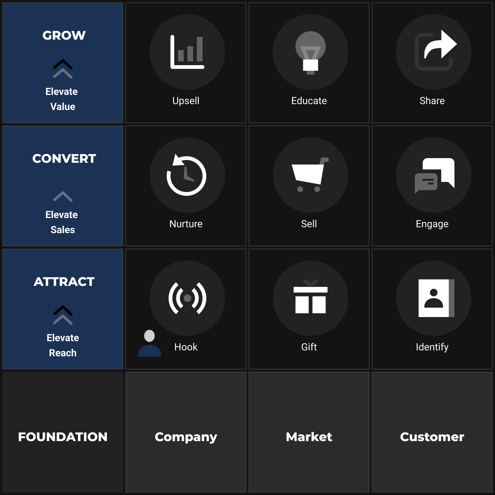

---
author: "Anthony O'Connell"
language: "en-GB"
publisher: "ONE Publishing"
rights: "© 2025 Anthony O'Connell. All rights reserved."
identifier:
  scheme: "ISBN-13"
  text: "978-1-916-12345-6"
creator: "Anthony O'Connell"
contributor: "ONE Team"
subject: "Ecommerce, AI, Business Growth, Digital Marketing"
css: "epub-style.css"
coverImage: "/assets/Playbook.png"
status: "published"
canonical: "https://one.ie/book"
metaTitle: "Elevate Playbook - Beyond Funnels: Architecting Your Predictable Ecommerce Growth System"
metaDescription: "A comprehensive guide to building a robust e-commerce growth system using the Elevate Framework."
metaKeywords:
  - "ecommerce"
  - "ai"
  - "business"
  - "growth"
  - "digital marketing"
  - "systems thinking"
openGraph:
  title: "Elevate Playbook - Beyond Funnels"
  description: "A comprehensive guide to building a robust e-commerce growth system using the Elevate Framework."
  image: "/assets/Playbook.png"
  type: "book"
twitter:
  card: "summary_large_image"
  title: "Elevate Playbook - Beyond Funnels"
  description: "A comprehensive guide to building a robust e-commerce growth system using the Elevate Framework."
  image: "/assets/Playbook.png"
title: "Beyond Funnels: Architecting Your Predictable Ecommerce Growth System"
description: "A comprehensive guide to building a robust e-commerce growth system using the Elevate Framework"
date: "2025-05-18"
tags:
  - "introduction"
  - "framework"
  - "system"
  - "strategy"
  - "ecommerce"
image: "/assets/Playbook.png"
chapter: 0

## The Elevate Framework: Your System Blueprint

This Playbook details that exact proven system, refined and adapted for today's dynamic e-commerce landscape powered by AI. The **Elevate Framework** is your blueprint for sustainable growth. It organises the complexities of the customer journey into three manageable levels – **ATTRACT**, **CONVERT**, and **GROW** – broken down into nine distinct, actionable steps:

1.  **HOOK:** Strategically capturing initial attention.
2.  **GIFT:** Offering value to build trust and interest.
3.  **IDENTIFY:** Converting interest into contactable leads.
4.  **ENGAGE:** Assisting conversions during crucial decision moments.
5.  **SELL:** Optimising the sales environment.
6.  **NURTURE:** Building relationships for long-term conversion and retention.
7.  **UPSELL:** Maximising immediate customer value.
8.  **UNDERSTAND:** Ensuring customer success and gathering vital insights.
9.  **SHARE:** Systematically generating advocacy and referrals.

This sequential process is fuelled by the critical insights gained in: FOUNDATION, where you achieve deep clarity on your **Company**, **Market**, and **Ideal Customer** – providing the strategic intelligence that makes the system truly effective.

## **Mastering the System**

The core focus of this book is teaching you to understand, architect, and implement the Playbook itself. This system provides immense strategic value and can drive significant growth using traditional execution methods. You will learn the principles, the steps, the interconnections, and the strategies that make it work.

It is very important to understand that this framework is designed for acceleration through Artificial Intelligence. This book is Part 1. In a series of 3.  **The Prompt Playbook**, exists to provide specific AI prompts and instructions tailored to execute tasks within each step much faster. Think of this book as teaching you **how to design and build the engine** (the essential system); the Prompt Playbook offers **performance-enhancing fuel injection** (the AI prompts) to unlock speed and efficiency. Part 3. Agentic Commerce uses AI agents to that implement your entire 

## This Book is For You If:

*   You believe in the power of **systems** to drive predictable results in your e-commerce business.
*   You're looking for a **strategic blueprint** that goes beyond basic sales funnels.
*   You feel your current marketing is effective in parts but lacks overall **cohesion and structure**.
*   You want a reliable, repeatable process for attracting, converting, and retaining customers.
*   You are seeking fundamental business strategy that *can be amplified* by AI, rather than being solely dependent on it.

This is more than just reading; it's about *building*. You will:

*   Gain a systems-thinking approach to e-commerce growth.
*   Master the principles and implementation of the 9-step Elevate Framework.
*   Develop deep strategic clarity through the Foundation module.
*   Learn to orchestrate the entire customer lifecycle effectively.
*   Build a fundamentally sound, scalable growth engine for your business.
*   Understand precisely how and where AI *could* fit in to accelerate your system.

## **Navigation**

We will proceed logically through the framework. 

- **Part 1 (FOUNDATION)** is your essential starting point – don't underestimate its power. 
- **Parts 2, 3, and 4** break down each of the 9 Steps (**HOOK** to **SHARE**). 
- **Part 5** looks at integrating the system fully. 

This book provides the strategic architecture and methodology. Focus on understanding and implementing this core system; the speed enhancements are a powerful next step.

Let's move beyond fragmented tactics and build the predictable, powerful e-commerce growth system your business deserves.

