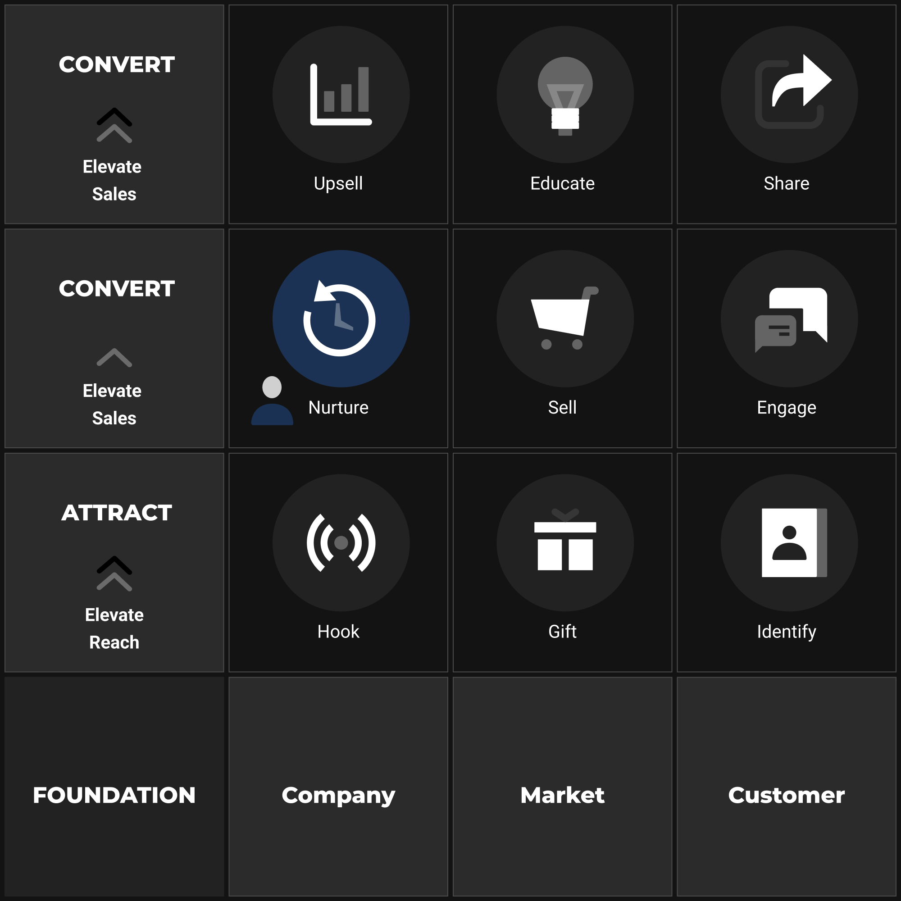

# Nurture

***Step 6: NURTURE – Building Relationships, Converting Over Time***

You've successfully navigated the initial stages of the Elevate Framework. You've **HOOKED** attention, offered a valuable **GIFT**, **IDENTIFIED** interested leads, optimised your **SELL** environment, and even implemented real-time **ENGAGE**ment tactics. Your system is attracting prospects and facilitating immediate conversions effectively.

However, a sad truth of marketing, especially online, is this: **the vast majority of interested prospects will not buy on their first interaction.** They might need more information, more time to consider, more trust to be built, or perhaps the timing simply wasn't right. Leaving these identified leads unattended is akin to investing heavily in farming only to let the harvested seeds wither in the silo.

This is where **Step 6: NURTURE** becomes arguably one of the most critical leverage points for sustained, profitable growth within the **CONVERT** level.

**The Objectives of This Step:** 1) To systematically cultivate relationships with identified leads who did *not* purchase immediately, by delivering consistent value, building authority, addressing underlying objections, and guiding them towards the **SELL** environment when *they* are ready. 2) To strategically **Retarget** anonymous visitors who demonstrated significant interest (e.g., viewed key pages, abandoned cart) but did not convert or identify themselves, bringing them back into your ecosystem.

## The Philosophy: Beyond the Transaction – Intent, Trust, and Timing

Effective NURTURE embraces the principles of relationship marketing and Intent-Based Branding (IBB). It acknowledges that conversion is often a process, not an event. The core tenets are:

1.  **Lead with Value, Consistently:** Just like the initial GIFT, continue providing valuable insights, tips, solutions, or relevant entertainment related to your niche and the prospect's original interest. Don't just pitch; *teach* and *help*.
2.  **Build Trust & Authority:** Position yourself as the credible, helpful expert in your space. Share success stories (case studies), demonstrate your unique perspective (connecting back to your Mechanism/Foundation), and showcase results.
3.  **Stay Top-of-Mind:** Regularly appearing in their inbox or feed (through retargeting) with relevant content keeps your brand present when the timing *does* become right for them to buy.
4.  **Segment for Relevance:** Recognise that not all leads are the same. Someone who downloaded a checklist on "reducing ad costs" needs different nurturing than someone who abandoned a cart containing a specific high-ticket item. Tailoring communication based on their initial interest or behaviour (using tags from IDENTIFY) dramatically increases effectiveness.
5.  **Shift Beliefs & Overcome Objections:** Use nurture content to gently address common misconceptions or underlying fears (identified in FOUNDATION) that might be preventing a purchase. Pre-frame your core offer as the logical solution *before* you directly ask for the sale again.

## The Primary Tools: Email Automation & Retargeting

1.  **Email Nurture Sequences:** This is the workhorse. Build automated sequences of emails triggered when a lead is tagged (IDENTIFY). These sequences deliver value over days or weeks, strategically building the relationship. Common types include:
    *   **Post-Gift Value Sequence:** Follows up the initial Gift with more related tips or insights.
    *   **Problem/Solution Sequence:** Deep dives into the core problem, explores failed common solutions, then introduces your unique approach.
    *   **Story/Rapport Building Sequence:** Shares relatable customer journeys, your brand origin story, or behind-the-scenes content.
    *   **Pre-Offer/Launch Sequence:** Builds anticipation and desire before presenting the core SELL offer explicitly.
    *   **Abandoned Cart Sequence:** A specific, urgent sequence designed to recover potentially lost sales.
2.  **Retargeting Campaigns:** Using advertising platforms (primarily Meta - Facebook/Instagram, and Google Ads - Display/YouTube), you show targeted ads *only* to specific segments of past website visitors:
    *   **Audience:** People who visited key **SELL** pages (product/sales page) but didn't buy.
    *   **Audience:** People who added items to cart but didn't complete checkout (**Cart Abandoners**).
    *   **Audience:** People who engaged with specific content (e.g., read certain blog posts) indicating high interest.
    *   **Message:** Retargeting ads should generally aim to remind, reinforce value, showcase proof, address likely objections, or gently call the prospect back to the relevant page – usually avoiding overly aggressive discounts unless strategically appropriate.

**Designing Your Nurture Strategy: Sequence & Content**

Effective nurturing isn't random emailing; it requires thoughtful planning:

*   **Segmentation:** Based on tags from IDENTIFY, define your key nurture segments. Start simple (e.g., one sequence per major GIFT).
*   **Sequence Goals:** What is the objective of *this specific sequence* for *this segment*? (e.g., Move 'Checklist Downloaders' towards understanding the core problem -> Click to Sales Page).
*   **Content Pillars:** What themes (value tips, stories, proof, offer intro) will you weave into the sequence? How often? (Refer to your Foundation: Customer pains/goals/objections, Company expertise/story).
*   **Flow & Cadence:** Map out the email sequence logic (e.g., Email 1: Value, Email 2: Empathy/Story, Email 3: Case Study/Proof, Email 4: Address Objection, Email 5: Soft Offer Intro...). Decide on appropriate timing between emails (don't overwhelm).
*   **Retargeting Message Mapping:** Align retargeting ad messages with the likely stage of the user (e.g., Cart Abandoner ads might be more direct than ads for general site visitors).

**Implementation: Setting Up Your Automated Systems**

1.  **ESP Setup:** Build your email sequences as automations within your chosen platform (Klaviyo, Mailchimp, etc.). Set up the correct triggers (tag applied). Write or paste your refined email copy. Ensure all links (to content, SELL pages) are correct.
2.  **Ad Platform Setup:** Create Custom Audiences in Meta/Google Ads based on your website visitor behaviour (requires correctly installed tracking pixels from IDENTIFY). Build specific campaigns targeting these audiences using your refined ad copy and relevant creative assets.
3.  **Tracking & Attribution:** Ensure you can track conversions (purchases) originating from your nurture emails (using UTM parameters or ESP integrations) and your retargeting ads (via ad platform conversion tracking).

**NURTURE's Role: Closing the Loop**

NURTURE acts as the intelligent follow-up engine of the Elevate Framework. It catches prospects who fall out of the immediate **HOOK -> GIFT -> IDENTIFY -> ENGAGE -> SELL** flow. It provides the necessary time, value, and trust-building to guide many of these leads back to the **SELL** environment when they are psychologically ready. Furthermore, data from NURTURE (e.g., which emails get high clicks, which retargeting ads convert) provides valuable feedback for optimising your Foundation assumptions and other framework steps.

**Conclusion: Building Assets for Long-Term Growth**

Step 6: NURTURE transforms your lead generation efforts from potentially leaky buckets into valuable pipelines. By systematically building relationships through automated email sequences informed by value and empathy, and strategically re-engaging interested non-buyers via retargeting, you dramatically increase the overall conversion rate of your initial attraction efforts.

You understand the principles of IBB, the different sequence types, the role of retargeting, and how to plan your approach.

With robust systems now in place for Attraction (**HOOK, GIFT, IDENTIFY**) and Conversion (**ENGAGE, SELL, NURTURE**), we have successfully converted leads into first-time customers. The journey, however, is far from over. The true potential for exponential growth lies in maximising the value of these *existing* customers. Continue to Step 7 – UPSELL.
