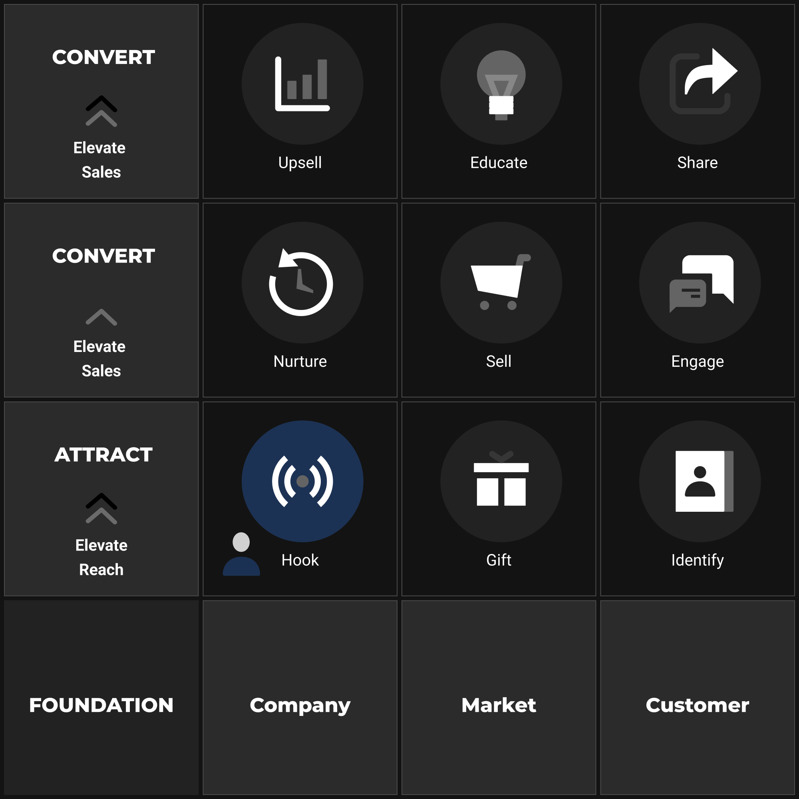

# Optimise

Congratulations! You have taken your customer on a journey with The Elevate Playbook. From laying the **FOUNDATION** to systematically executing the nine action steps across the **ATTRACT**, **CONVERT**, and **GROW** levels, you now possess the complete blueprint for building a predictable, scalable growth engine for your e-commerce business.

However, understanding the individual steps is only part of the equation. The true magic, the exponential power of the Elevate Framework, lies in understanding and optimising how these steps function together as a **cohesive, integrated system**. This chapter focuses on visualising that integration and ensuring all parts work in harmony to create a self-reinforcing cycle of growth.

## Beyond Linearity: The Compounding Growth Loop

While we've necessarily discussed the steps sequentially (HOOK -> GIFT -> ... -> SHARE), the reality of a well-functioning Elevate system isn't purely linear. It creates powerful feedback loops that compound results over time.

The most critical loop is the **Advocacy Loop**:

1.  **SHARE (Step 9):** Happy, successful customers generate positive reviews, testimonials, and referrals.
2.  **Boosts HOOK (Step 1) & SELL (Step 5):** This social proof becomes potent material integrated directly into your HOOK assets (ads mentioning high ratings, content featuring testimonials) and prominently displayed on your SELL pages. This dramatically increases Trust and Perceived Likelihood (PL) for *new* prospects.
3.  **Enhanced Conversion:** Higher trust and PL lead to better conversion rates throughout the ATTRACT and CONVERT levels.
4.  **More Successful Customers:** More conversions lead to more customers reaching the **EDUCATE (Step 8)** stage successfully.
5.  **More Advocates:** Successful customers are more likely to **SHARE** positively... completing and strengthening the loop.

A secondary, but vital, **Insight Loop** exists:

1.  **UNDERSTAND (Step 8):** Gathering feedback (surveys, support interactions, review analysis) provides deep insights into customer needs, product usage, and potential friction points.
2.  **Refines FOUNDATION:** These insights allow you to continuously update and sharpen your Customer Avatar profile, identify emerging Market trends or Pains, and potentially refine your Company positioning or Unique Mechanism.
3.  **Optimises Framework Execution:** A more accurate Foundation leads to more effective HOOKs, better GIFT alignment, more persuasive SELL copy, and more relevant NURTURE sequences.

Recognising and optimising these loops transforms the framework from a simple process into a dynamic, learning system that improves over time.

**Ensuring System Cohesion: Consistency is Key**

For these loops to function effectively, consistency across all touchpoints is paramount:

*   **Brand Voice & Personality (Foundation Pillar):** The tone defined in your **Company Context** must be applied consistently across *all* assets generated for *all* steps – from the initial HOOK ad, to the GIFT landing page, through nurture emails, ENGAGEments, SELL copy, EDUCATE onboarding, and SHARE requests. Inconsistency erodes trust and weakens brand identity. (Regularly auditing assets against your defined Voice adjectives is crucial.)
*   **Value Proposition Alignment:** The core promise articulated in your **Foundation** and presented on your **SELL** page must be congruent with the value delivered in your **GIFT**, reinforced during **NURTURE**, and ideally validated by customer success in **EDUCATE** and **SHARE**. Conflicting messages confuse prospects and undermine credibility.
*   **Visual Identity:** Maintaining consistent visual branding (logo, colours, fonts, imagery style) across all platforms and assets creates a professional, unified experience.
*   **Data Flow:** Ensure the technical integrations between steps (e.g., IDENTIFY to ESP for NURTURE, website tracking for retargeting audiences, feedback collection tools for UNDERSTAND) are robust and reliable. Broken data flows fragment the system.

**The Role of Continuous Improvement**

An effective system is never static. The market changes, customer expectations evolve, and new technologies advance rapidly. Building the Elevate system isn't a one-time project; it's the establishment of an *operating rhythm* that includes ongoing monitoring and optimisation:

*   **Measure Relentlessly:** Track the key metrics identified for each step (CTR for HOOK, Opt-in rate for GIFT, Conversion Rate for SELL, Open/Click rates for NURTURE, AOV for UPSELL, Retention for EDUCATE, Review Rate for SHARE).
*   **Identify Bottlenecks:** Where is the system underperforming? Are you attracting leads who don't convert (issue might be HOOK/GIFT relevance or SELL page effectiveness)? Are conversions high but LTV low (issue might be in UPSELL/EDUCATE/SHARE)?
*   **Hypothesise & Test:** Based on data and insights (especially from UNDERSTAND), form hypotheses about potential improvements (e.g., "Improving the HOOK's emotional resonance might attract more qualified leads"). A/B test changes systematically (e.g., test new headlines, refine email sequences, optimise checkout flow).
*   **Refine Foundation:** Periodically revisit your Foundation assumptions. Is your Customer Avatar still accurate? Have Market trends shifted? Is your Differentiation still sharp? Update your Strategic Blueprint as needed.

Mastering the Elevate Ecommerce Framework is about internalising this systemic way of thinking. It's about seeing your business not as a collection of disparate marketing tasks, but as an integrated engine designed to create value for your customers and, consequently, for your business.

You understand how each step influences the others, how feedback loops create momentum, and how consistency builds trust and efficiency. You know that strategic clarity (FOUNDATION) must precede tactical execution (the 9 Steps), and that continuous measurement and refinement are essential for sustained success.

## **Your Engine is Assembled**

You know how to lay the strategic Foundation, how to Attract leads, how to Convert them into customers, and how to Grow their long-term value and activate advocates for your brand. You see how these parts interconnect to form powerful growth loops. You now possess the complete blueprint.

The next step is to implement it for your company. Take action, adapt the framework to your unique business, and commit to continuous improvement. The Elevate Playbook is your guide—just follow the steps to attract, convert and grow your customers.

