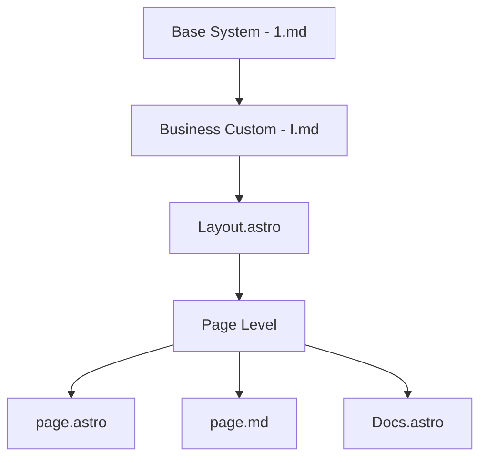

# AI Everywhere

ONE makes it easy to add AI into your app using markdown, yaml, and typescript. 
Add AI to any type of content - pages, docs, blog posts, lessons, videos. You can use eternal data from anywhere like Shopify, Wordpress or Notion.

## Hierarchy

The system follows a cascading inheritance pattern where configurations and prompts flow from base to specific implementations:

### 1. Core System Level (`src/1/1.md`)
- Here you will find the core system prompt to build the system
- Establishes fundamental AI behavior patterns
- Contains base feature explanations and agent characteristics

### 2. I (`src/1/I.md`)
- Appends business-specific instructions and knowledge
- Customizes AI behavior for specific use cases
- Allows for domain-specific rules and responses


3. Chat src/components/Chat.tsx 
Assembles prompt s

### 3. Layout Level (`src/layouts/Layout.astro`)
- Provides default chat configurations that fall ba
- Sets up standard UI components and behaviors
- Establishes baseline prompt settings

### 4. Page Level Configuration
- `page.astro`: Override layout settings when needed
- `page.md`: Custom content-specific configurations
- `Docs.astro`: Documentation-specific settings

## Configuration Flow



## Implementation Details

### 1. Base Configuration
```typescript
// Default chat configuration in Layout.astro
const defaultChatConfig = ChatConfigSchema.parse({
  provider: 'mistral',
  model: 'mistral-large-latest',
  systemPrompt: [{
    type: 'text',
    text: 'I am Agent ONE. How can I help you today?'
  }]
});
```

### 2. Page-Level Override
```astro
---
const chatConfig = ChatConfigSchema.parse({
  systemPrompt: [{
    type: "text",
    text: "Custom prompt for this page"
  }],
  welcome: {
    message: "Welcome to this section!",
    suggestions: []
  }
});
---

<Layout chatConfig={chatConfig}>
  <!-- Page content -->
</Layout>
```

## Best Practices

1. **Modular Configuration**
   - Keep base prompts focused and reusable
   - Use business customization for specific domains
   - Override only necessary settings at each level

2. **Inheritance Management**
   - Follow the configuration cascade
   - Document overrides clearly
   - Maintain consistent behavior patterns

3. **Performance Optimization**
   - Configure appropriate token limits
   - Set temperature based on use case
   - Choose suitable models for different scenarios

## Advanced Usage

### Custom Endpoints
```typescript
const config = {
  provider: 'custom',
  apiEndpoint: 'https://your-api.com',
  apiKey: process.env.API_KEY
};
```

### Runtime Selection
```typescript
const config = {
  runtime: 'edge', // or 'node'
  model: 'mistral-large-latest'
};
```

## Next Steps

1. Review the base system prompt in `src/1/1.md`
2. Customize business rules in `src/1/I.md`
3. Configure layout defaults in `Layout.astro`
4. Implement page-specific overrides as needed

