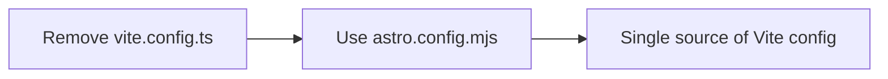
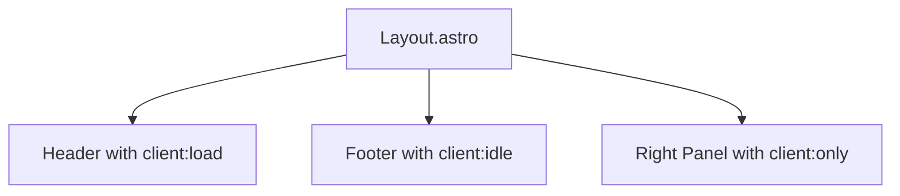
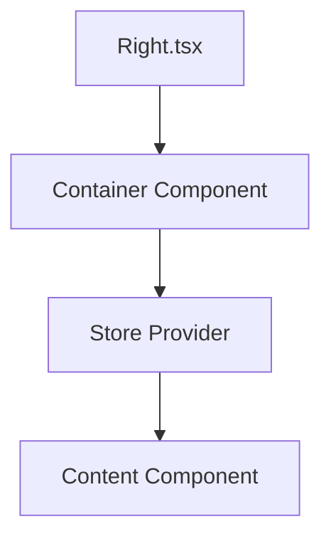
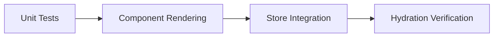

# Plan to Fix React/JSX Integration Issues

## 1. Configuration Cleanup

1. Remove vite.config.ts since it's conflicting with astro.config.mjs:


2. Verify astro.config.mjs configuration:
```typescript
import { defineConfig } from 'astro/config';
import react from '@astrojs/react';
import vercel from '@astrojs/vercel';
import mdx from '@astrojs/mdx';

export default defineConfig({
  integrations: [
    react({
      include: ['**/*.{jsx,tsx}'],
      experimentalReactChildren: true
    })
  ],
  vite: {
    ssr: {
      noExternal: ['@radix-ui/*', '@assistant-ui/*', 'lucide-react']
    },
    optimizeDeps: {
      include: ['react', 'react-dom']
    }
  }
});
```

## 2. Component Updates

1. Update Layout.astro hydration:


```astro
---
// Layout.astro
---
<Header client:load />
<main>
  <slot />
</main>
<Footer client:idle />
<Right 
  client:only="react"  // Ensure React context is fully available
  chatConfig={chatConfig}
  rightPanelMode={rightPanelMode}
/>
```

2. Update Right.tsx store initialization:
```typescript
// Right.tsx
import { StoreProvider } from '@nanostores/react';
import { layoutStore } from '../stores/layout';

export default function Right({ chatConfig, rightPanelMode }) {
  return (
    <StoreProvider store={layoutStore}>
      <RightContent 
        chatConfig={chatConfig}
        rightPanelMode={rightPanelMode}
      />
    </StoreProvider>
  );
}
```

3. Separate Right component logic:


## 3. Store Integration

1. Update store initialization:
```typescript
// stores/layout.ts
import { atom } from 'nanostores';

export const layoutStore = atom({
  mode: 'Quarter',
  isVisible: true
});

export const layoutActions = {
  setMode: (mode) => layoutStore.set({ ...layoutStore.get(), mode }),
  setVisible: (visible) => layoutStore.set({ ...layoutStore.get(), isVisible: visible })
};
```

2. Ensure proper store subscription:
```typescript
function RightContent({ chatConfig, rightPanelMode }) {
  const layout = useStore(layoutStore);
  useEffect(() => {
    // Store subscriptions
    return () => {
      // Cleanup subscriptions
    };
  }, []);
  // Rest of component logic
}
```

## 4. Testing Steps

1. Component Testing:


2. Integration verification:
- Test Header/Footer rendering
- Verify Right panel modes
- Check store state management
- Validate hydration sequences

## 5. Implementation Order

1. Configuration Updates:
- Remove vite.config.ts
- Update astro.config.mjs
- Verify tsconfig.json

2. Component Restructuring:
- Split Right.tsx into container/content
- Update store integration
- Fix hydration directives

3. Testing:
- Component rendering
- Store integration
- Full page hydration